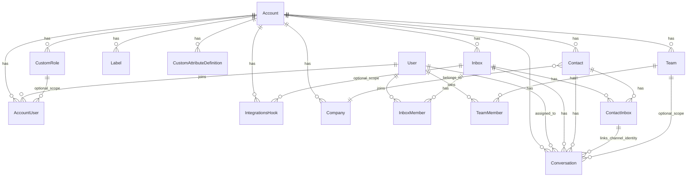
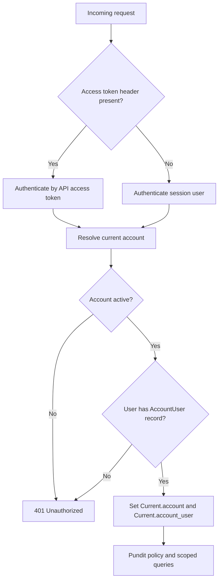
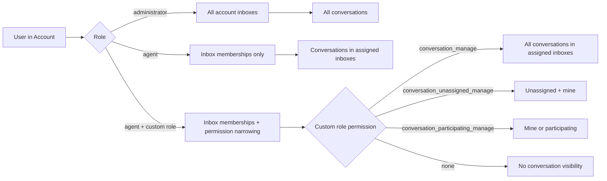
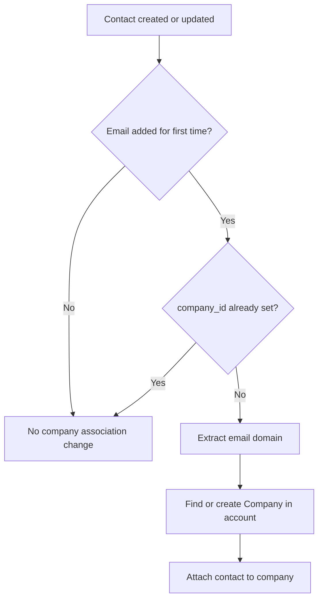
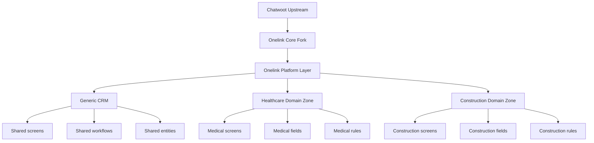
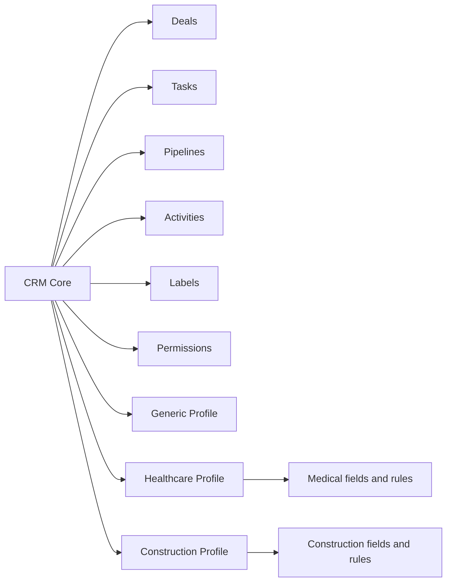
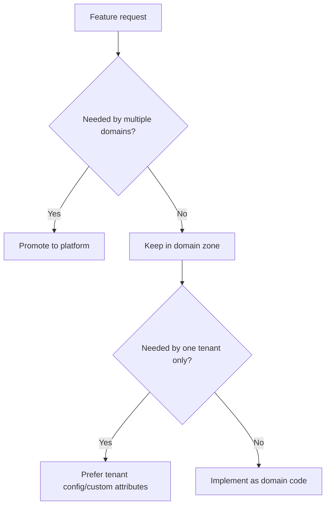

# Domain Access Architecture

## Status

- document type: current architecture plus extension rules
- source of truth: code for current behavior, this document for the intended mental model around access and native entity reuse
- target architecture sections are explicitly marked below

This document describes how the Onelink domain is structured around account boundaries, access control, visibility rules, and the main business entities involved in support operations.

It also captures the extension strategy for evolving Onelink beyond the current support-platform core without losing the native entity model already present in code.

The repository uses an account-scoped data model. Most entities that matter in day-to-day product behavior belong to an `Account` directly or indirectly. Access is then enforced through a combination of:

- account membership
- role or custom role permissions
- inbox membership
- team membership
- Pundit policies
- list-level filtering services

## Core Principles

1. `Account` is the primary isolation boundary.
2. `User` is global, but access inside an account is defined by `AccountUser`.
3. `Inbox` membership drives most agent visibility.
4. `Conversation` visibility is stricter than simple account membership.
5. The inherited `enterprise/` layer extends OSS access rules with `CustomRole`, and in Onelink these capabilities are part of the active product surface rather than a separate paid tier.
6. Labels and custom attributes are account-scoped metadata layers.

## High-Level Domain Model

## Account Boundary

`Account` is the main aggregate root for operational data. In practice it owns:

- inboxes
- contacts
- conversations
- labels
- hooks and integrations
- custom attribute definitions
- teams
- portals

This means that most lookups begin with `Current.account` and then resolve records inside that scope. A user may belong to several accounts, but each request is resolved against exactly one current account.

## Authentication And Account Resolution

The typical request flow for account-scoped APIs is:

The important implication is that account membership is checked before feature-level authorization. If a user is not linked through `AccountUser`, nothing else matters.

## Users, Roles, And Membership

### User

`User` is a global identity record. It can belong to multiple accounts through `AccountUser`. It also has direct links to:

- assigned conversations
- inbox memberships
- team memberships
- notification settings
- personal macros

### AccountUser

`AccountUser` is the real per-account identity. It stores:

- `role`: `agent` or `administrator`
- `availability`
- inviter
- `custom_role_id` implemented in the inherited `enterprise/` layer
- `agent_capacity_policy_id` implemented in the inherited `enterprise/` layer

In OSS, `permissions` are coarse:

- administrator => `administrator`
- agent => `agent`

In the inherited `enterprise/` code path, an agent may also carry a `CustomRole`, which replaces coarse access with a more granular permission set while still remaining an agent at the account level. In Onelink this should be treated as an active capability, not as a separate product tier.

### Custom Roles

The inherited `enterprise/` layer adds `CustomRole` with the following permission set:

- `conversation_manage`
- `conversation_unassigned_manage`
- `conversation_participating_manage`
- `contact_manage`
- `report_manage`
- `knowledge_base_manage`

The effective permission list exposed to the frontend includes `custom_role` plus the selected permission keys.

## Access Model

### OSS Access

The OSS rules are intentionally simple:

- administrators can access all inboxes in the current account
- agents can access only inboxes where they are members
- conversation visibility is allowed if the user has inbox access or team access

### Custom Role Access

The inherited `enterprise/` layer narrows agent visibility further when a `custom_role_id` is present:

- `conversation_manage` => all conversations from accessible inboxes
- `conversation_unassigned_manage` => unassigned conversations plus conversations assigned to self
- `conversation_participating_manage` => only conversations assigned to self or where the user is a participant

This happens in two places:

- list filtering
- record-level `show?` checks

## Visibility Matrix

## Inboxes And Channel Integrations

`Inbox` is the operational container for conversations. It belongs to an account and wraps a polymorphic `channel`.

Common channel families include:

- website widget
- API inbox
- email
- WhatsApp
- SMS and Twilio
- Telegram
- Line
- Facebook and Instagram
- TikTok
- Twitter

An inbox also owns:

- `inbox_members`
- conversations
- contact_inboxes
- inbox-level hooks
- assignment-related configuration

### Why Inbox Membership Matters

Inbox membership is the main visibility gate for agents. A user can be a valid member of the account and still be unable to see most conversations if they are not a member of the relevant inboxes.

## Contacts, Contact Inboxes, And Conversations

### Contact

`Contact` belongs to an account and stores:

- identity fields such as `email`, `phone_number`, `identifier`
- `additional_attributes`
- `custom_attributes`
- labels
- conversations

The model supports multiple communication surfaces through `contact_inboxes`.

### Company

`Company` is the account-scoped organization entity used to group business contacts under a shared customer or client company.

In the current codebase it already exists and should be treated as a valid shared CRM building block, not as an accidental one-off enterprise artifact.

It currently provides:

- one `Account` to many `Company`
- one `Company` to many `Contact`
- company fields such as `name`, `domain`, `description`, `avatar`, and `contacts_count`
- auto-association from a contact's business email domain
- company search, sorting, and a dedicated dashboard list view

Architecturally, `Company` should be reused whenever Onelink needs a B2B grouping axis such as:

- multiple contacts belonging to the same client organization
- future deals attached to an organization, not just a single contact
- domain workflows where the customer is structurally a company, clinic, contractor, developer, or buyer organization

This means the intended direction is:

- keep `Contact` as the person-level entity
- keep `Company` as the organization-level entity
- prefer linking future CRM entities such as `Deal` to `company_id` when the workflow is organization-centric
- use custom attributes to extend `Company` for domain needs instead of cloning separate organization models too early

`Company` should therefore be considered part of the shared platform CRM vocabulary for `generic`, `healthcare`, and `construction` domain profiles.

### ContactInbox

`ContactInbox` is the per-channel identity bridge:

- one contact can have many contact inboxes
- one inbox can have many contact inboxes
- `source_id` represents the external identity in that inbox

This is what lets the same business contact exist across widget, WhatsApp, email, or API channels while preserving channel-specific identity.

### Conversation

`Conversation` ties together:

- account
- inbox
- contact
- contact_inbox
- optional assignee
- optional team

It also stores:

- status
- priority
- additional attributes
- custom attributes
- labels

## Company Association Flow

Company association can be auto-inferred from a contact email domain when the email is first set.

## Labels

`Label` is an account-scoped taxonomy record. The actual attachment mechanism uses `acts_as_taggable_on :labels` through the shared `Labelable` concern.

That means labels are not limited to a single entity type. In this area they are used primarily on:

- contacts
- conversations

Important behavior:

- titles are normalized to lowercase
- label names are unique inside an account
- renaming a label triggers an async update for associated records

## Custom Attributes

Custom attributes are split into two layers:

1. schema: `CustomAttributeDefinition`
2. values: JSONB `custom_attributes` on `Contact` or `Conversation`

Supported definition targets:

- `conversation_attribute`
- `contact_attribute`

Supported field types include:

- text
- number
- currency
- percent
- link
- date
- list
- checkbox

The system prevents custom definitions from colliding with core built-in fields like `status`, `priority`, `email`, `phone_number`, and similar standard keys.

## Integrations

Integrations use two related concepts:

### `Integrations::App`

This is the app catalog and capability descriptor. It defines:

- app id
- action URL
- fields
- feature flag requirements
- hook type
- schema for settings

### `Integrations::Hook`

This is the installed integration instance. It belongs to an account and optionally to an inbox.

Hook characteristics:

- `hook_type`: `account` or `inbox`
- `status`: `enabled` or `disabled`
- optional encrypted `access_token`
- `settings` validated by JSON schema when applicable
- creation can trigger integration-specific setup jobs

## Native Platform Building Blocks

The current codebase already contains a strong set of reusable building blocks. Domain architecture should grow from these primitives instead of replacing them with parallel models too early.

### Workspace / Tenant

- `Account` is the actual workspace or tenant boundary
- use `Account` for domain profile selection, feature rollout, settings, limits, and data isolation
- do not introduce a second internal `Workspace` aggregate when `Account` already owns the platform surface

### Person And Organization Layer

- `Contact` is the person-level entity
- `Company` is the organization-level entity
- `Note` is already the native account-scoped way to store structured internal notes on contacts

Recommended use:

- healthcare: patient or related person => `Contact`
- construction: buyer or project stakeholder => `Contact`
- B2B customer, clinic, contractor, developer, or buyer organization => `Company`
- operator notes, qualification notes, domain observations => `Note`

### Communication And Ownership Layer

- `Conversation` is the communication thread
- `Inbox` is the channel boundary
- `Team` is the native group ownership and routing primitive
- `AccountUser` remains the per-account access identity

Recommended use:

- shared assignment and routing logic should continue to use inboxes and teams
- domain zones should not invent their own parallel ownership model unless the current team/assignee model becomes insufficient

### Classification And Variability Layer

- `Label` is the lightweight tagging and segmentation layer
- `CustomAttributeDefinition` plus JSONB values is the current variability layer for `Contact` and `Conversation`
- `additional_attributes` remains useful for imported/external/raw metadata

Recommended use:

- labels for fast operational classification and segmentation
- custom attributes for domain-specific and tenant-specific fields
- core columns for stable business identity, ownership, status, and relationships

### Automation And Repeatability Layer

- `Macro` already exists for reusable operational actions
- `AutomationRule` already exists for account-scoped workflow automation
- `Integrations::Hook` already exists for external system connections and app-level setup

Recommended use:

- macros for agent/operator shortcuts
- automation rules for shared event-driven flows
- hooks/custom tools/integrations for external system side effects instead of embedding integration logic into core entities

### AI And Knowledge Layer

- `Captain::Assistant` is the account-scoped assistant
- `Captain::Document` is the knowledge source layer
- `Captain::CustomTool` is the account-scoped action/tool layer
- `CopilotThread` is the operator-facing AI collaboration thread

Recommended use:

- treat Captain as the shared AI layer for all domain zones
- make Captain domain-aware through documents, prompts, tools, and scenarios
- do not use Captain as a substitute for core domain entities or business workflows

## Native-First Extension Strategy

When adding a new feature, prefer this order:

1. reuse an existing native entity
2. extend with labels, notes, custom attributes, settings, or Captain configuration
3. add domain service, policy, workflow, or UI composition
4. add a new shared platform entity only if the behavior is stable across domains
5. add a new domain entity only if the lifecycle and business semantics are truly distinct

In practical terms:

- do not create a new internal workspace model when `Account` already fits
- do not create parallel organization models before exhausting `Company`
- do not create vertical-specific person models before exhausting `Contact`
- do not encode critical workflow state only in labels
- do not force custom attributes to replace core columns or relations

## Target Direction Appendix

Everything in this appendix is planning guidance, not proof that the runtime architecture already exists.

## Domain-Zone Fit

The current recommended fit for domain zones is:

### Generic

- use shared `Account`, `Company`, `Contact`, `Conversation`, `Label`, `Note`, `Macro`, `Captain`
- allow flexible custom attributes and broad tenant configuration

### Healthcare

- reuse `Account` as workspace
- reuse `Company` for clinic, partner, insurer, employer, or referring organization
- reuse `Contact` for patient or person-level actor
- store healthcare-specific fields first through contact/conversation custom attributes
- use labels and notes for intake/operational segmentation
- use Captain documents/scenarios/tools for medical-domain guidance and handoff support

### Construction

- reuse `Account` as workspace
- reuse `Company` for developer, contractor, supplier, or buyer organization
- reuse `Contact` for buyer, manager, estimator, or stakeholder
- store construction-specific fields first through contact/conversation custom attributes
- use labels and notes for qualification and delivery segmentation
- use Captain documents/scenarios/tools for estimate/project knowledge and operator support

## Near-Term Plan

The near-term implementation plan should stay native to the repo:

1. keep `Account` as the workspace boundary and attach domain profile/config at account level
2. treat `Company` and `Contact` as mandatory shared CRM primitives
3. use notes, labels, and current custom attributes to cover early domain variance
4. use teams, macros, automation rules, and integrations as the native operational layer
5. use Captain as the shared AI layer with domain-specific documents, scenarios, and tools
6. only after that introduce shared CRM entities such as `Deal`, `Task`, and `Activity`
7. add domain-specific entities only when generic shared primitives stop matching the real lifecycle

## Policy Summary

The current policy behavior for the requested domains is roughly:

| Domain | Agent | Administrator | Custom role |
| --- | --- | --- | --- |
| Contacts | Can view/create/update/search/filter | Full, plus import/export/destroy | Same as agent unless extra enterprise policy added |
| Inboxes | Can view assigned inboxes | Full manage | Same inbox membership base |
| Conversations | Can view by inbox or team access | Full view, can destroy | Narrowed by custom role permissions |
| Labels | Can list | Can create/update/show/destroy | No special label permission layer by default |
| Hooks / Integrations | `process_event` only | Create/update/destroy | No custom hook permission layer by default |
| Companies | Implemented under inherited `enterprise/`, broad access except destroy | Full | No dedicated custom permission in current model |

## Architectural Notes

### What Drives Visibility

The practical order of visibility checks is:

1. account membership
2. inbox membership
3. team membership where relevant
4. role or custom role permissions
5. endpoint policy

### One Important Inconsistency

`CustomAttributeDefinitionsController` is account-scoped but does not currently perform an explicit policy check in the same way as contacts, labels, and hooks. That means access there is effectively gated by account membership rather than a dedicated authorization rule.

## Recommended Mental Model

When adding or changing features in this area, use this model:

- start from `Account`
- determine whether the actor is a `User`, `AgentBot`, or platform actor
- resolve `AccountUser`
- determine inbox visibility
- apply conversation or entity-specific policy checks
- only then apply business behavior

This keeps new work aligned with how the current codebase already reasons about access and data ownership.

## Platform Direction

Onelink should evolve as a layered product instead of a single fork with domain-specific conditionals spread across the codebase.

The intended layers are:

- `upstream/core`: the Chatwoot-compatible base and the smallest possible set of fork-specific patches
- `onelink platform`: shared branded product capabilities used by all customers
- `domain zones`: isolated vertical extensions such as healthcare and construction

The main rule is:

- shared product behavior goes into platform
- vertical-specific behavior goes into the matching domain zone
- tenant-specific variation should prefer configuration before new code

## CRM Layering

CRM should not be split into separate standalone products per vertical. It should be one shared engine with domain extensions.

Recommended structure:

- `core CRM`: deals, tasks, pipelines, stages, activities, ownership, labels, search, permissions
- `domain CRM`: healthcare-specific and construction-specific rules, fields, screens, workflows, reports, integrations
- `tenant config`: company-level overrides through settings, custom attributes, forms, dashboards, and automation configuration

`generic` should be treated as a first-class domain profile, not as an undefined fallback mode.

## Core vs Domain Responsibility

Short rule set:

- `core` owns stable shared entities and mechanics
- `domain` owns vertical vocabulary, validations, workflows, screens, and reports
- `custom attributes` extend entities but do not replace core entities

For CRM this means:

- `Deal` and `Task` should stay separate shared entities
- system-critical fields should be first-class columns or associations
- domain-specific fields can live in custom attributes
- tenant-only needs should prefer configuration and custom fields before new models

Examples:

- `deal stage`, `owner`, `status`, `pipeline`, `due date` belong in core entities
- `insurance_provider`, `doctor_name`, `project_area`, `site_address_notes` can be domain or tenant custom attributes

## Delivery Model For Domain Zones

Domain development should be isolated by ownership and compatibility checks.

Recommended model:

- one platform owner responsible for shared architecture and upstream sync
- one owner per domain zone
- changes in a domain zone should avoid modifying shared core unless the capability is reusable
- if a feature is needed by two or more domains, promote it into platform

## Development Guardrails

To keep the fork maintainable while domain logic grows:

- minimize direct patches in Chatwoot-like core code
- prefer extension points, services, concerns, and isolated routes/screens
- avoid scattering healthcare and construction conditionals throughout shared models and controllers
- treat `enterprise/` as a technical overlay, not as the product boundary
- keep plan gating separate from domain specialization

## Working Rule For Future CRM Work

When designing a new CRM feature, answer these in order:

1. Is this a shared platform capability or a domain-specific behavior?
2. Does it belong to a stable core entity or to custom attributes?
3. Can tenant configuration solve it before new code is added?
4. If code is needed, should it live in `core`, `platform`, or a specific domain zone?
