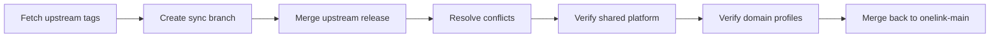

# Upstream Sync Strategy

Onelink is a fork of Chatwoot and should keep a disciplined sync process.

## Branching Model

- main working branch: `onelink-main`
- upstream sync branch: `sync/chatwoot-vX.Y.Z`
- feature branches from `onelink-main`
- writable remote for product work: `origin`
- upstream Chatwoot remote: `upstream`

## Daily GitHub Flow

For normal product changes, do not develop directly on `onelink-main`.

1. update local `onelink-main`
2. create a focused `feature/...`, `fix/...`, or `chore/...` branch from it
3. push that branch to `origin` over SSH
4. open a pull request into `onelink-main`
5. merge after review or maintainer verification

Use `sync/...` branches only for bringing Chatwoot changes into the fork.

## Stacked Feature Branches

When a task contains a reusable platform/base change plus an optional product feature, do not mix them in one delivery branch.

1. create the base branch from `onelink-main`
2. commit and push the shared/base work first
3. create the optional feature branch from that base branch
4. commit and push the feature branch separately
5. merge the base branch first, then decide whether the feature branch should merge

Use this pattern for work such as shared integration plumbing plus a single new integration, platform refactors plus a gated CRM surface, or any feature that may need to ship later than its technical base.

## Sync Process

## Guardrails

- minimize direct core patches
- prefer extension points and isolated overlays
- validate generic, healthcare, and construction assumptions after shared changes
- document intentional divergences from upstream
- do not push product changes to `upstream`
- do not use `develop` from this fork as the base branch for active work
