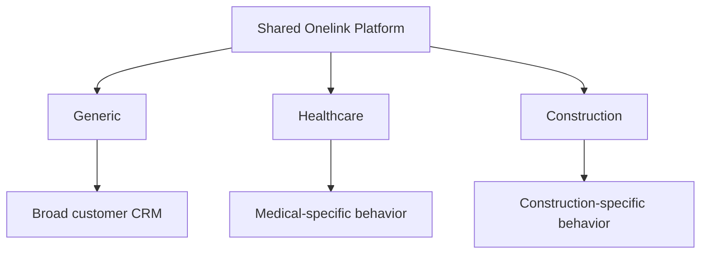
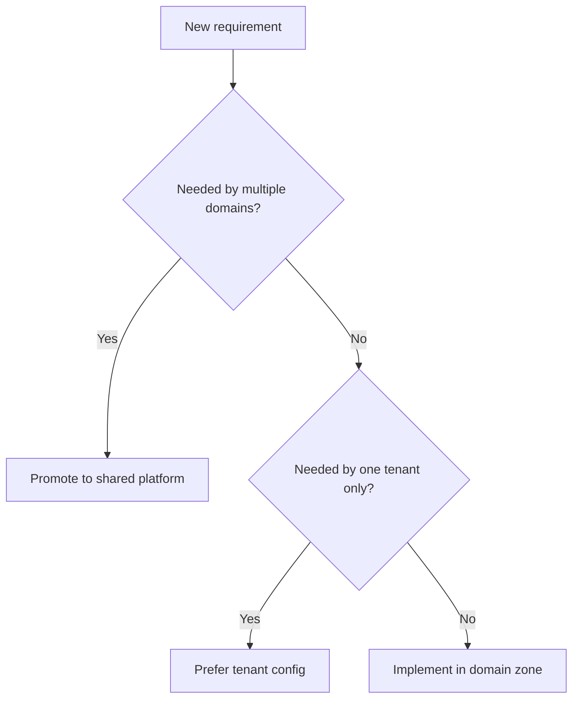

# Domain Profiles

## Status

- document type: target direction with current-state caveat
- current code reality: dedicated domain profiles are not yet implemented as clear runtime zones

## Current State

Today the repo does not yet contain a mature domain-profile runtime architecture for:

- `generic`
- `healthcare`
- `construction`

These profiles currently function as planning and decision-making concepts, not as a full set of namespaces, models, routes, and services in the runtime codebase.

## Target Direction

Onelink should support multiple domain profiles on top of one shared platform.

The starting profiles are:

- `generic`
- `healthcare`
- `construction`

## Domain Strategy

## What Belongs To A Domain

- specialized fields
- validations
- workflow rules
- reports
- UI sections and screen composition
- integrations specific to the vertical

## What Does Not Belong To A Domain

- account scoping
- shared permissions framework
- base inbox/contact/conversation lifecycle
- shared CRM entities
- shared UI shell

## Decision Rule

## Current Implementation Guidance

Until dedicated domain zones exist in code, prefer this implementation order:

1. reuse shared native entities
2. use settings, labels, notes, custom attributes, automations, and Captain configuration
3. add isolated domain services or UI composition where needed
4. only then introduce a true domain-scoped runtime layer
