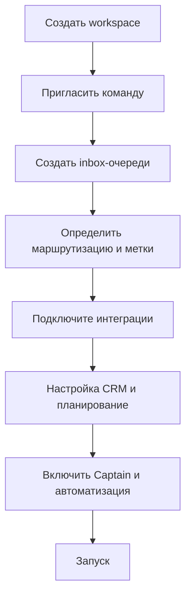

# Быстрый старт

Эта страница помогает быстро пройти путь от пустого workspace до рабочей операционной среды.

Базовый порядок запуска:

1. создать workspace
2. пригласить команду
3. настроить inbox-очереди и маршрутизацию
4. подключить интеграции
5. включить CRM, расписание, Captain и автоматизации

Это руководство предназначено для команд, которые хотят как можно быстрее перейти из документа workspace к рабочей настройке One Link Cloud.

## Во время запуска

## Минимальный контрольный список для ввода в приложение

1. Создайте workspace и подтвердите главного администратора.
2. Добавляйте пользователей и группируйте их в группу.
3. Хотя бы один inbox для каждого ключевого потока связи.
4. Определите правила владения, метки и ожидания ответа.
5. Подключите необходимые условия для запуска приготовления.
6. Настройте эффекты CRM, если команда отслеживает транзакцию или функцию.
7. Настройте планирование, если встречи или платежи являются частью потока.
8. Добавьте знания и настройте Captain, если требуется помощь AI.
9. Перед развертыванием проверьте отчеты и данные панели.

## Рекомендуемая первая конфигурация

### Для групповой поддержки

- создать inbox-очереди по каналу или очереди
- определение должностей и исполнителей
- добавить метки для эскалации и маршрутизации
- тревожные отчеты и обзор CSAT

### Для отделов продаж

- воронки и этапы
- определить поля сделки и задачи
- подключить соединение inbox-очереди к потоковым каналам
- добавить автоматизацию смены стадий и владельцев

### Для сервисных команд

- настройка ресурсов и сервисов
- правила оформления и исключения календаря
- определение процесса обработки денежных средств
- сохранение контактов с контактами и разговорами

## Роли на первой неделе

| Роль | Основная ответственность |
| --- | --- |
| владелец Workspace | Окончательные настройки, доступ, управление |
| Администратор | Inbox-очереди, интеграция, автоматизация, отчеты |
| Руководитель группы | Маршрутизация, SLA, этикетки, контроль качества |
| Агент или оператор | Ежедневная обработка разговоров, CRM и работ по планированию. |

## Что изучать дальше

- [Настройка рабочих комнат](/getting-started/workspace-setup)
- [Inbox-очереди и каналы](/user-guide/inboxes-and-channels)
- [Контакты и диалоги](/user-guide/contacts-and-conversations)
- [CRM и гибкая структура данных](/platform/crm-architecture)
- [Расписание и оплаты](/platform/scheduling-and-payments)
