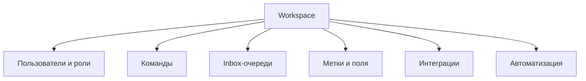

# Настройка рабочего пространства

Настройка workspace определяет, как единое ядро One Link Cloud будет работать именно для вашей организации.

Основные слои настройки:

- пользователи и роли
- команды и membership
- inbox-очереди
- метки и кастомные поля
- интеграции
- автоматизации

Настройка workspace определяет, как общее ядро One Link Cloud будет работать в вашей организации. Продукт остаётся общим, а ваша операционная модель формируется через доступы, структуру данных, маршрутизацию и подключённые системы.

## Слои настройки workspace

## Шаг 1. Добавьте пользователей

Создайте пользователей для всех, кто будет работать внутри workspace:

- администраторы
- тимлиды
- агенты
- Операторы CRM
- операторы планирования

Пользователи внутри одного workspace могут иметь разные роли, права и зоны ответственности.

## Шаг 2. Определите команды

Команды полезны, когда у workspace более одной рабочей группы.

Примеры:

- поддержка
- продажи
- адаптация
- удержание
- регистратура клиники
- служба поддержки

Команды помогают с маршрутизацией, отчётностью и распределением ответственности без разделения данных между разными инструментами.

## Шаг 3. Создайте inbox-очереди

Каждый inbox обычно соответствует одной рабочей точке входа:

- виджет сайта
- электронная почта
- WhatsApp
- Instagram
- Telegram
- Канал на базе API

Создавайте inbox-очереди по тому, как должна маршрутизироваться работа, а не только по количеству подключённых каналов.

## Шаг 4. Настройте доступ

Доступ может быть организован следующими способами:

- права администратора
- membership в inbox
- membership в команде
- кастомные роли для более детальных разрешений
- дополнительные политики назначения и нагрузки, если они нужны

## Шаг 5. Добавьте структуру данных

Платформа персонализируется следующим образом:

- метки
- примечания
- кастомные атрибуты контактов и диалогов
- управляемые поля для сделок, задач и встреч

Используйте этот уровень для настройки под требования клиента вместо запроса отдельного варианта продукта.

## Шаг 6. Подключите системы

Перед go-live подключите системы, которые нужны вашей команде в первую очередь:

- инструменты для обмена сообщениями и совместной работы
- CRM или ERP-системы
- knowledge-системы и инструменты документации
- webhook consumers
- AI actions и custom tools

## Шаг 7. Добавьте правила

Правила автоматизации и macros помогают стандартизировать работу:

- автоматическая маршрутизация
- обновление этапов или статусов
- webhook-уведомления
- повторяющиеся действия оператора

## Типовые модели workspace

### Бережливая команда

- один администратор
- один или два inbox
- базовые метки
- минимальная автоматизация

### Многофункциональная команда

- несколько команд
- несколько inbox-очередей
- CRM и планирование включено
- отчёты и Captain активны

### Настройка контролируемого предприятия

- кастомные роли
- доступ на уровне inbox
- политики назначения
- правила нагрузки
- несколько уровней интеграции и автоматизации

## Следующие шаги

- [Рабочее пространство и доступ](/platform/workspace-and-access)
- [Inbox-очереди и каналы](/user-guide/inboxes-and-channels)
- [Автоматизация и макросы](/user-guide/automation-and-macros)
