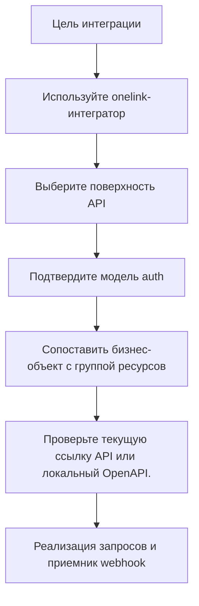

# Agent Skills для интеграторов

Для внешних API-потребителей подготовлен отдельный skill bundle.

Сейчас поддержаны два варианта:

- skill для Codex
- skill для Claude Code

Они помогают выбирать API-поверхность, модель auth, path family и event-driven сценарий интеграции.

Группы технических клиентов и партнеры могут установить специальную функцию интеграции One Link для работы с One Link Cloud API извне.

Набор навыков доступен в двух вариантах:

- навык Codex
- навык Claude Code

Оба варианта предназначены для внешних потребителей API. Они помогают:

- выбор правильной поверхности API
- выбор подходящей модели authentication
- сопоставление бизнес-объектов с группами ресурсов One Link.
- планирование интеграций на основе webhook
- поиск вероятных семейств путей перед реализацией

## Для чего нужен навык

Используйте этот навык, когда вашей команде необходимо:

- подключить внешнюю систему CRM, ERP, PM, финансовую или операционную систему
- создать собственный чат-клиент или встроенный интерфейс обмена сообщениями
- запланируйте синхронизацию event-driven с помощью webhooks.
- нанять нового инженера на модель One Link API

## Для чего не нужен этот навык

Навык не заменяет текущую ссылку API.

Используйте его, чтобы рассуждать, выбирать правильную поверхность и планировать реализацию. Используйте текущую ссылку One Link API или файлы OpenAPI для точных контрактов запросов и ответов.

## Установка

### Codex

1. Скопируйте папку навыков `onelink-integrator` в каталог навыков Codex:

```bash
mkdir -p ~/.codex/skills
cp -R .codex/skills/onelink-integrator ~/.codex/skills/onelink-integrator
```

2. Перезапустите Codex, чтобы он загрузил новый навык.

3. Начните использовать его с таких подсказок, как:

```text
Use $onelink-integrator to choose the right One Link API surface for our customer portal messaging flow.
```

### Claude Code

1. Скопируйте папку навыков `onelink-integrator` в каталог навыков Claude Code:

```bash
mkdir -p ~/.claude/skills
cp -R .claude/skills/onelink-integrator ~/.claude/skills/onelink-integrator
```

2. Перезапустите Claude Code, чтобы он загрузил новый навык.

3. Вызовите его напрямую с помощью:

```text
/onelink-integrator choose the right One Link API surface for our customer portal messaging flow
```

## Дополнительный пакет OpenAPI

Этот навык работает только со встроенным руководством, но он становится более точным, если ваша команда также хранит текущие файлы One Link OpenAPI локально.

Рекомендуемые места:

```bash
~/.codex/skills/onelink-integrator/references/openapi/
~/.claude/skills/onelink-integrator/references/openapi/
```

Поддерживаемые имена файлов:

- `application_swagger.json`
- `client_swagger.json`
- `platform_swagger.json`
- `other_swagger.json`

Вы также можете указать навык в другом каталоге, установив:

```bash
export ONE_LINK_OPENAPI_DIR=/path/to/openapi
```

## Поиск локального контракта

Навык поставляется со сценарием локального поиска:

```bash
python ~/.codex/skills/onelink-integrator/scripts/search_openapi.py conversation
python ~/.codex/skills/onelink-integrator/scripts/search_openapi.py message --surface client
python ~/.codex/skills/onelink-integrator/scripts/search_openapi.py account --surface platform

python ~/.claude/skills/onelink-integrator/scripts/search_openapi.py conversation
python ~/.claude/skills/onelink-integrator/scripts/search_openapi.py message --surface client
python ~/.claude/skills/onelink-integrator/scripts/search_openapi.py account --surface platform
```

Используйте его, когда вам нужно найти наиболее вероятное семейство путей или сводку операций перед написанием кода.

## Рекомендуемый рабочий процесс



## Шаблоны подсказок

Используйте подсказки в этой форме:

- `Use $onelink-integrator to design a webhook-driven sync between One Link and our ERP for contacts, companies, and appointment completion.`
- `Use $onelink-integrator to explain whether our mobile app should use the Client API or the Application API.`
- `Use $onelink-integrator to draft initial cURL requests for creating a contact and opening a conversation in a workspace.`
- `Use $onelink-integrator to identify the likely path family for appointment payments and tell me what to verify in the current OpenAPI files.`

Примеры Claude Code:

- `/onelink-integrator design a webhook-driven sync between One Link and our ERP for contacts, companies, and appointment completion`
- `/onelink-integrator explain whether our mobile app should use the Client API or the Application API`
- `/onelink-integrator draft initial cURL requests for creating a contact and opening a conversation in a workspace`
- `/onelink-integrator identify the likely path family for appointment payments and tell me what to verify in the current OpenAPI files`

## Лучшие результаты

Этот навык наиболее полезен, если вы также предоставляете:

- ваша цель интеграции
- идет ли поток на стороне оператора или на стороне клиента
- нужен ли вам доступ только для чтения или доступ для записи
- является ли интеграция синхронной или event-driven

## Похожие руководства

- [Справочник API One Link Cloud](/api-reference/introduction)
- [Аутентификация и модель API](/integrators/authentication-and-api-model)
- [Карта API-ресурсов](/integrators/api-resource-map)
- [Webhooks и события](/integrators/webhooks-and-events)
