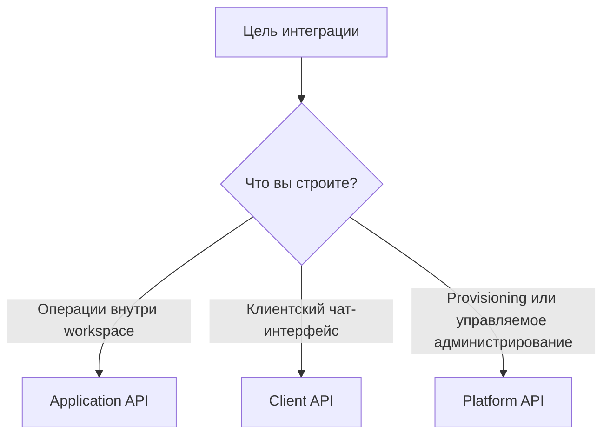

# Аутентификация и модель API

Интеграции с One Link Cloud работают на разных уровнях доверия, поэтому у платформы несколько API-поверхностей.

Выбирать нужно по роли интеграции:

- операторский или системный процесс внутри workspace
- клиентский чат-интерфейс
- provisioning и платформенное администрирование

One Link Cloud использует разные API-поверхности, потому что интеграции работают на разных уровнях доверия.

## Выбор поверхности

## Application API

Используйте это, когда ваша интеграция действует внутри workspace.

Типичные случаи использования:

- синхронизировать контакты и диалоги
- создавать или обновлять записи CRM
- взаимодействовать с планирующими потоками
- управлять интеграциями и автоматизацией
- создавать внутренние операционные инструменты

Модель аутентификации:

- токен доступа на уровне пользователя

## Client API

Используйте это, когда создаете систему обмена сообщениями для конечных пользователей.

Типичные случаи использования:

- пользовательский виджет чата на сайте
- встроенный обмен сообщениями внутри вашего собственного продукта
- мобильный клиент, привязанный к разговорам One Link Cloud

Модель аутентификации:

- идентификаторы клиентов на уровне канала
- удостоверение на уровне контакта, установленное в клиентском потоке

## Platform API

Используйте это только в том случае, если интеграция требует администрирования или обеспечения более высокого уровня.

Типичные случаи использования:

- настройка управляемого аккаунта
- контролируемое администрирование платформы
- партнерские или операционные потоки обеспечения

Модель аутентификации:

- токен уровня платформы

## Правила выбора

1. Начните с Application API, если вам явно не нужна другая поверхность.
2. Используйте Client API только для общения с клиентами в чате.
3. Используйте Platform API только для управляемого административного контроля.

## Контрольный список планирования интеграции

- определить, относится ли интеграция к workspace-слою или к platform-слою
- решить, будет ли она интерактивной или фоновой
- определить, какими записями она будет владеть или управлять
- определить, нужны ли webhooks для синхронизации событий
- подтвердить модель безопасности и владения токеном

## Похожие руководства

- [Справочник API One Link Cloud](/api-reference/introduction)
- [Webhooks и события](/integrators/webhooks-and-events)
- [Паттерны интеграции](/integrators/integration-patterns)
- [Agent Skills для интеграторов](/integrators/agent-skills-for-integrators)
