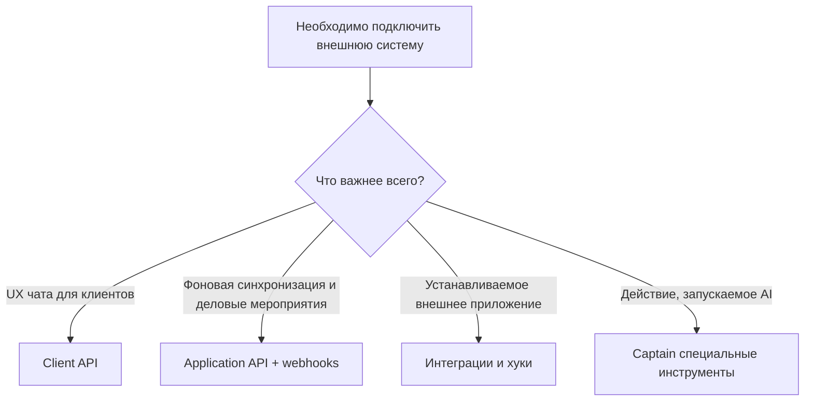

# Паттерны интеграции

Разные интеграционные задачи требуют разных паттернов подключения.

Основные варианты:

- workspace sync
- клиентский messaging surface
- connected app lifecycle
- AI action surface через Captain custom tools

Разные цели интеграции требуют разных шаблонов подключения. Один и тот же продукт может поддерживать облегченный webhooks, полнофункциональные приложения, инструменты AI и интеграцию обмена сообщениями с клиентом.

## Обзор шаблонов

| Узор | Лучшее для | Основные строительные блоки |
| --- | --- | --- |
| Синхронизация Workspace | Поддерживайте соответствие внешних систем оперативным данным | Application API, webhooks |
| Клиент канала | Создайте свой собственный чат | Client API |
| Подключенное приложение | Настройка внешнего приложения на уровне учетной записи или inbox | Интеграции, хуки, настройки |
| Действие инструмента AI | Пусть Captain вызывает внешние действия | Captain специальные инструменты |

## Шаблон 1. Синхронизация Workspace

Используйте, когда вашей системе необходим операционный контекст из One Link Cloud.

Примеры:

- синхронизировать контакты или компании с другой системой
- синхронизировать сделки и задачи с инструментом CRM или PM.
- зеркально отражать события встреч во внешней системе планирования или финансов.

## Шаблон 2. Поверхность обмена сообщениями с клиентом

Используйте, если вам нужен собственный пользовательский интерфейс, ориентированный на клиента, сохраняя при этом One Link Cloud в качестве серверной части разговора.

Примеры:

- встроенное веб-приложение
- родной мобильный клиент
- опыт обмена сообщениями с клиентом portal

## Шаблон 3. Жизненный цикл связанного приложения

Используйте, когда интеграция требует:

- порядок установки
- аккаунт или владение inbox
- сохраненные настройки
- управление токенами
- дополнительные задания по настройке или синхронизации

Примеры:

- инструменты для совместной работы
- инструменты документирования
- внешние бизнес-системы

## Паттерн 4. AI Рабочая поверхность

Используйте специальные инструменты Captain, когда:

- помощник должен вызвать внешний API
- действие является частью рабочего процесса AI, а не отдельного жизненного цикла приложения.
- для workspace требуется поверхность инструмента с областью действия учетной записи.

## Руководство по выбору узора

## Похожие руководства

- [Аутентификация и модель API](/integrators/authentication-and-api-model)
- [Webhooks и события](/integrators/webhooks-and-events)
- [Captain AI](/platform/captain-ai)
- [Agent Skills для интеграторов](/integrators/agent-skills-for-integrators)
