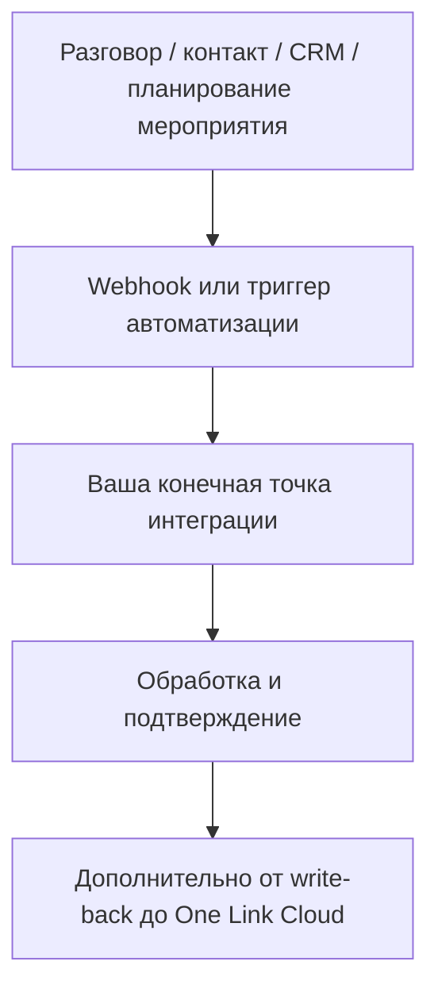

# Webhooks и события

Если внешняя система должна реагировать на изменения внутри One Link Cloud, основной механизм интеграции — это webhooks и event-driven automation.

Этот слой подходит для:

- общей потоковой синхронизации
- selective event routing
- write-back сценариев во внешние системы

Если вашей системе необходимо реагировать на изменения внутри One Link Cloud, автоматизация webhooks и event-driven является основным уровнем интеграции.

## Поток событий

## Аккаунт Webhooks

Учетная запись webhooks лучше всего подходит для широкой интеграции на уровне workspace. Их можно использовать для таких мероприятий, как:

- разговор создан
- разговор обновлен
- изменен статус разговора
- контакт создан
- контакт обновлен
- сообщение создано
- сообщение обновлено
- inbox создан
- inbox обновлен

## Доставка событий на основе автоматизации

Правила автоматизации также можно использовать в качестве триггеров интеграции, включая CRM и планирование событий.

Примеры:

- сделка создана
- изменен этап сделки
- изменен статус задачи
- встреча завершена
- встреча отменена

Это полезно, когда интеграция должна реагировать только на отфильтрованное бизнес-состояние, а не на каждое необработанное событие.

## Совет по интеграции

### Используйте обычный Webhooks, когда

- вам нужен широкий поток событий
- фильтрация происходит в вашей собственной системе
- вам нужен универсальный конвейер синхронизации

### Использовать автоматический запуск Webhooks, когда

- имеют значение только отдельные случаи
- триггер зависит от меток, статуса, полей или бизнес-условий
- вы хотите, чтобы One Link Cloud workspace управлял логикой маршрутизации

## Рекомендации по проектированию приемника

- сделать обработку идемпотентной
- регистрировать исходное событие и полезную нагрузку
- изолировать повторы от бизнес-логики
- проверять подписи или общие секреты при настройке
- отделить прием от тяжелой последующей обработки

## Похожие руководства

- [Аутентификация и модель API](/integrators/authentication-and-api-model)
- [Автоматизация и макросы](/user-guide/automation-and-macros)
- [Автоматизации и интеграции](/platform/integrations-architecture)
