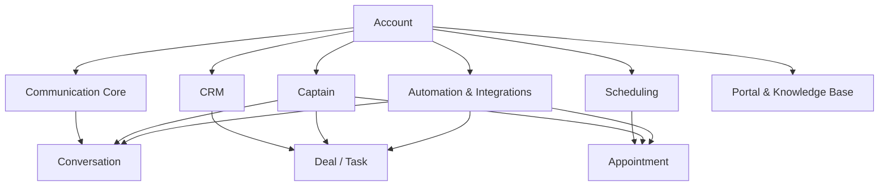

# Internal Architecture Overview

## Current Product Shape

The codebase currently operates as:

- a Rails monolith with multiple frontend entrypoints
- an account-scoped cloud product
- a shared communication platform around inboxes, conversations, and messages
- an implemented CRM layer with contacts, companies, deals, tasks, pipelines, statuses, and custom fields
- an implemented scheduling layer with resources, services, appointments, payments, and expenses
- an implemented AI layer under Captain
- an integrations and automation platform built around hooks, webhooks, macros, and rules

## High-Level Runtime Map

## Key Runtime Surfaces

### Communication Core

- `app/models/inbox.rb`
- `app/models/contact.rb`
- `app/models/contact_inbox.rb`
- `app/models/conversation.rb`
- `app/models/message.rb`

### CRM

- `app/models/crm/pipeline.rb`
- `app/models/crm/stage.rb`
- `app/models/crm/deal.rb`
- `app/models/crm/task_status.rb`
- `app/models/crm/task.rb`
- `app/models/crm/field_definition.rb`
- `enterprise/app/models/company.rb`

### Scheduling

- `app/models/scheduling/resource.rb`
- `app/models/scheduling/service.rb`
- `app/models/scheduling/appointment.rb`
- `app/models/scheduling/payment.rb`
- `app/models/scheduling/expense.rb`

### Captain

- `enterprise/app/models/captain/assistant.rb`
- `enterprise/app/models/captain/document.rb`
- `enterprise/app/models/captain/scenario.rb`
- `enterprise/app/models/captain/custom_tool.rb`
- `enterprise/app/models/copilot_thread.rb`
- `enterprise/app/models/copilot_message.rb`

### Integrations And Automation

- `app/models/automation_rule.rb`
- `app/models/macro.rb`
- `app/models/integrations/app.rb`
- `app/models/integrations/hook.rb`
- `app/models/webhook.rb`

### Portal And Content

- `app/models/portal.rb`
- `app/models/category.rb`
- `app/models/folder.rb`
- `app/models/article.rb`

## Internal Rule

One Link Cloud should be documented as one shared product core. Customer adaptation should be described through:

- access and membership
- custom fields
- automation
- Captain configuration
- integrations

It should not be documented as separate domain-zone runtimes.
