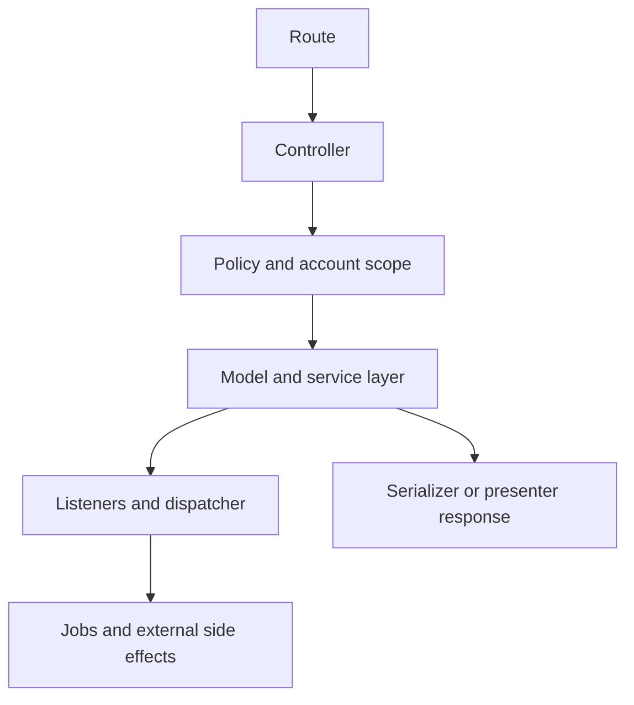

# Internal Backend Architecture

## Backend Shape

The backend is a Rails monolith with a service-heavy execution model. Request handling does not stop at controllers and models; most meaningful work passes through services, listeners, jobs, and policy checks.

## Request And Runtime Flow

## Main Layers

### Controllers

Controllers are concentrated under:

- `app/controllers/api/`
- `app/controllers/public/`
- `app/controllers/platform/`
- callback and integration controllers such as `webhooks/`, `twilio/`, `instagram/`, `microsoft/`, `linear/`

The dominant runtime surface is the account-scoped API under `Api::V1::Accounts`.

### Models

Models define first-class entities and associations. The codebase relies on explicit models rather than a generic record abstraction.

### Services

Service objects implement business logic across:

- conversations
- contacts
- CRM
- scheduling
- automation
- integrations
- messages
- mailbox processing
- reporting

### Jobs

Jobs are used for:

- notifications
- external sync
- webhook delivery
- indexing
- automation side effects
- integration processing
- AI processing

### Listeners

Listeners sit behind the dispatcher and handle event fan-out beyond the initiating model or controller.

### Policies

Policies and permission checks constrain access by role, custom permissions, and account scope. CRM and Captain have dedicated policy namespaces.

## Implementation Style

The codebase tends to use these patterns:

- account-scoped validation at model and service level
- explicit service objects for write-heavy flows
- event dispatch after state changes
- jobs for slow or external work
- policy checks close to controller entry

## Important Backend Subsystems

| Subsystem | Main locations |
| --- | --- |
| Communication | `app/models/conversation.rb`, `app/models/message.rb`, `app/services/conversations/`, `app/services/messages/` |
| CRM | `app/models/crm/`, `app/services/crm/`, `app/policies/crm/` |
| Scheduling | `app/models/scheduling/`, `app/services/scheduling/` |
| Automation | `app/models/automation_rule.rb`, `app/services/automation_rules/` |
| Integrations | `app/models/integrations/`, `app/services/integrations/`, callback controllers |
| Captain | `enterprise/app/models/captain/`, `enterprise/app/services/captain/`, `enterprise/app/jobs/captain/` |

## Backend Rules For New Work

1. Reuse an existing account-scoped model if the lifecycle already exists.
2. Keep business logic in a service when the flow spans validation, mutation, and side effects.
3. Push slow or external side effects into jobs.
4. Use the dispatcher when multiple downstream reactions should happen from one domain event.
5. Preserve account isolation in validations, queries, and associations.
