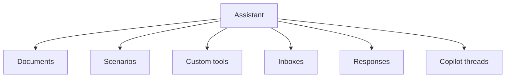

# Internal Captain Runtime

## Runtime Foundation

Captain now runs on a project-native runtime built directly on `ruby_llm`.

The AI stack is standardized around:

- `ruby_llm` for chat execution, tool calling, schemas, provider access, and multimodal messages
- `Captain::Runtime` for assistant orchestration, handoff flow, run context, and tracing callbacks
- `Captain::PromptRegistry` for file-backed prompt lookup and shared Liquid rendering
- `Llm::ChatClient` and `Llm::ChatRequestRunner` for the common request path used by Captain assistant, Copilot, and task helpers

Key runtime guarantees:

- assistant runs can create a scoped `RubyLLM::Context` so account-level provider credentials and API base overrides do not leak into global configuration
- each handoff rebuilds a fresh `RubyLLM::Chat`, so agent-specific `schema`, `temperature`, `headers`, and `params` are reapplied cleanly without cross-agent bleed
- persisted history can restore assistant tool calls and tool results, including multimodal content and both symbol-keyed and string-keyed payloads
- Copilot thread messages can retain richer runtime metadata such as `agent_name`, `tool_calls`, `usage`, `captain_trace`, and `thinking`

`ai-agents` is no longer part of the runtime dependency graph for Captain.

## Core Entities

| Entity | Role |
| --- | --- |
| `Captain::Assistant` | Configured assistant |
| `Captain::Document` | Knowledge source |
| `Captain::Scenario` | Structured handoff or workflow behavior |
| `Captain::CustomTool` | Callable custom action |
| `Captain::AssistantResponse` | Generated response artifact |
| `CopilotThread` / `CopilotMessage` | Interactive operator-side AI flow |

## Captain Runtime Map

## Runtime Components

The native Captain runtime lives under `enterprise/lib/captain/runtime/`.

Key objects:

- `Captain::Runtime::Agent`
- `Captain::Runtime::RunContext`
- `Captain::Runtime::ToolContext`
- `Captain::Runtime::Runner`
- `Captain::Runtime::Result`
- `Captain::Runtime::TracingCallbacks`

This keeps orchestration inside the product codebase while leaving provider and chat behavior to `ruby_llm`.

## Context Model

Assistants can read context from:

- conversation
- contact
- deal
- task
- appointment

This is resolved through context field definitions and prompt-state rendering.

## Documents

Documents support:

- remote URLs
- PDFs
- uploaded files
- crawl and resync flows
- metadata for ingestion state

## Tools

The runtime supports:

- built-in tools
- custom account-scoped tools
- copilot-oriented lookup tools
- external action tools

Custom HTTP tools still use account-defined Liquid templates, but they now render through the shared Captain Liquid path instead of a separate template implementation.
Built-in tool metadata now has a single runtime source of truth in `enterprise/lib/captain/tool_registry.rb`; the old `config/agents/tools.yml` file has been removed.

## Prompts

Captain prompt files live under `enterprise/lib/captain/prompts/`.

Current prompt families:

- root prompts for assistant and scenario agents
- `llm/` prompts for assistant, copilot, onboarding, and helper services
- `tasks/` prompts for rewrite, summary, labels, reply suggestions, follow-up, translation, and conversation completion
- `snippets/` for shared context fragments

The old `lib/integrations/openai/openai_prompts` fallback is no longer part of the Captain runtime path.

Assistant configuration can now restrict tool access in two scopes:

- `agent`: live assistant runtime and scenario-agent tool access
- `assistant`: operator-side copilot tool access, including built-in copilot lookup tools and enabled custom HTTP tools

If `tool_access` is not configured, the direct assistant runtime keeps its legacy default tool subset while scenario validation still uses the broader available agent tool catalog.

Prompt-facing context now comes only from explicit `context_access` selection. Legacy implicit `additional_attributes` fallback is no longer part of the Captain prompt contract.

Built-in tools are now described through a shared metadata registry instead of separate agent and copilot catalogs. Each built-in tool definition carries:

- scope support (`agent`, `assistant`, or both)
- required account features
- required operator permissions for copilot execution
- risk level metadata for the settings UI
- confirmation and idempotency flags for future-safe mutation flows

Current runtime behavior:

- live `agent` and `scenario` runtimes register tools from `tool_access`, then apply the shared tool policy for feature, high-risk, and confirmation checks
- capability tools exposed in assistant settings (`faq_lookup`, `handoff`, contact note, private note, cancel response) are controlled by their checkboxes, not by the agent permissioned-tool runtime list
- prompt `tool://...` references can still expose non-capability tools, but they do not auto-enable capability tools whose checkbox is off
- `copilot` only instantiates tools that pass both assistant `tool_access` and the shared tool policy for the current operator
- create-oriented shared operations for `company`, `deal`, `task`, and `appointment` now use a short-lived idempotency cache to suppress accidental duplicate writes during repeated tool calls
- tool execution now emits audit log entries when the account has the `audit_logs` feature enabled

## Jobs And Services

Captain uses dedicated services and jobs for:

- assistant chat
- copilot chat
- document crawling and parsing
- response building
- tool execution
- embeddings and knowledge processing

The execution path is now intentionally narrow:

- services build normalized messages and tool lists
- `Llm::ChatRequestRunner` builds or resumes the `ruby_llm` chat
- `Captain::Runtime::Runner` handles assistant orchestration when handoff and tool state are required

For assistant v2 specifically:

- `Captain::Assistant::AgentRunnerService` builds the Captain business state and scoped `RubyLLM::Context`
- `Captain::Runtime::AgentRunner` selects the current agent from restored history
- `Captain::Runtime::Runner` rebuilds the per-agent chat, restores history, executes tools, and persists the updated conversation state

### Response Cancellation

Captain response cancellation has two entry points:

- manager-side stop control in the conversation UI, which writes a short-lived Redis cancellation state for the active conversation and turns the assistant typing indicator off
- native `cancel_response` capability tool, which stores `pending_response_cancellation` in the runtime context and halts the current tool run

`Captain::Conversation::ResponseBuilderJob` treats both entry points as silent cancellation signals. It checks cancellation before generation, after generation, before message creation, inside runtime typing callbacks, and in late error handling. When cancellation matches the current buffer token or latest incoming message, the job clears the current buffer state, clears the cancellation state, keeps the conversation pending, and does not create an outgoing message, private note, handoff, or response-usage increment. Token usage may still be recorded when a provider response already returned usage data.

## Design Rules

1. Keep Captain attached to shared runtime entities, not parallel AI-only records.
2. Use documents and tools before introducing feature-specific AI data stores.
3. Keep assistant behavior account-scoped and explicitly configured.
