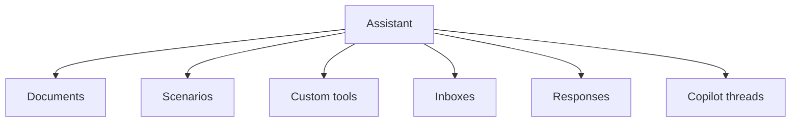

# Internal Captain Runtime

## Core Entities

| Entity | Role |
| --- | --- |
| `Captain::Assistant` | Configured assistant |
| `Captain::Document` | Knowledge source |
| `Captain::Scenario` | Structured handoff or workflow behavior |
| `Captain::CustomTool` | Callable custom action |
| `Captain::AssistantResponse` | Generated response artifact |
| `CopilotThread` / `CopilotMessage` | Interactive operator-side AI flow |

## Captain Runtime Map

## Context Model

Assistants can read context from:

- conversation
- contact
- deal
- task
- appointment

This is resolved through context field definitions and prompt-state rendering.

## Documents

Documents support:

- remote URLs
- PDFs
- uploaded files
- crawl and resync flows
- metadata for ingestion state

## Tools

The runtime supports:

- built-in tools
- custom account-scoped tools
- copilot-oriented lookup tools
- external action tools

Assistant configuration can now restrict tool access in two scopes:

- `agent`: live assistant runtime and scenario-agent tool access
- `assistant`: operator-side copilot tool access, including built-in copilot lookup tools and enabled custom HTTP tools

If `tool_access` is not configured, the direct assistant runtime keeps its legacy default tool subset while scenario validation still uses the broader available agent tool catalog.

Built-in tools are now described through a shared metadata registry instead of separate agent and copilot catalogs. Each built-in tool definition carries:

- scope support (`agent`, `assistant`, or both)
- required account features
- required operator permissions for copilot execution
- risk level metadata for the settings UI
- confirmation and idempotency flags for future-safe mutation flows

Current runtime behavior:

- live `agent` and `scenario` runtimes only register tools that pass the shared tool policy for the current assistant account
- `copilot` only instantiates tools that pass both assistant `tool_access` and the shared tool policy for the current operator
- create-oriented shared operations for `company`, `deal`, `task`, and `appointment` now use a short-lived idempotency cache to suppress accidental duplicate writes during repeated tool calls
- tool execution now emits audit log entries when the account has the `audit_logs` feature enabled

## Jobs And Services

Captain uses dedicated services and jobs for:

- assistant chat
- copilot chat
- document crawling and parsing
- response building
- tool execution
- embeddings and knowledge processing

## Design Rules

1. Keep Captain attached to shared runtime entities, not parallel AI-only records.
2. Use documents and tools before introducing feature-specific AI data stores.
3. Keep assistant behavior account-scoped and explicitly configured.
