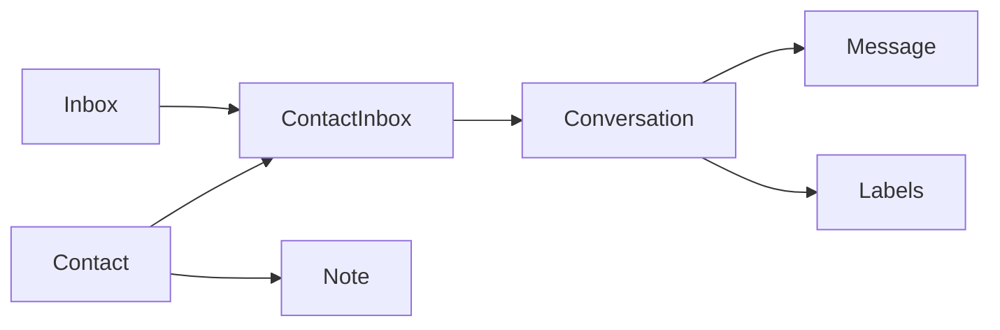

# Internal Communication Core

## Core Entities

| Entity | Role |
| --- | --- |
| `Contact` | Person-level customer record |
| `ContactInbox` | Contact identity inside a specific inbox or channel |
| `Conversation` | Main operational thread |
| `Message` | Atomic communication event |
| `Note` | Internal note on a contact |
| `Label` | Tag-based conversation and contact classification |

## Runtime Graph

## Key Behaviors

### Contacts

Contacts are reused across the platform and can carry:

- identification fields
- company link
- custom attributes
- additional attributes
- notes and labels

### Contact Inboxes

`ContactInbox` represents the channel identity for a contact and is the bridge from a raw source identifier to a conversation thread.

### Conversations

Conversations carry:

- account
- inbox
- contact
- assignee
- team
- campaign
- status
- priority
- custom attributes

### Messages

Messages are polymorphic by sender and support:

- incoming
- outgoing
- activity
- template

They also support content types, attachments, webhook payload generation, and downstream indexing.

## Status Model

Conversations use:

- `open`
- `resolved`
- `pending`
- `snoozed`

Messages use:

- `sent`
- `delivered`
- `read`
- `failed`

## Side Effects

The communication core triggers many downstream reactions:

- notifications
- reporting
- automation
- webhooks
- integrations
- AI behavior

This is why conversation and message changes should be treated as high-fan-out operations.

## Design Rules

1. Do not replace `Conversation` with a domain-specific communication model.
2. Reuse `Contact` as the customer identity before introducing parallel person records.
3. Treat labels and notes as adjunct operational context, not full workflow state.
