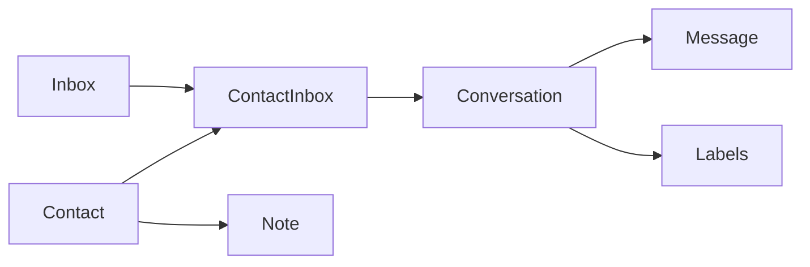

# Internal Communication Core

## Core Entities

| Entity | Role |
| --- | --- |
| `Contact` | Person-level customer record |
| `ContactInbox` | Contact identity inside a specific inbox or channel |
| `Conversation` | Main operational thread |
| `Message` | Atomic communication event |
| `Note` | Internal note on a contact |
| `Label` | Tag-based conversation and contact classification |

## Runtime Graph

```mermaid
flowchart LR
    A[Inbox] --> B[ContactInbox]
    C[Contact] --> B
    B --> D[Conversation]
    D --> E[Message]
    C --> F[Note]
    D --> G[Labels]
```

## Key Behaviors

### Contacts

Contacts are reused across the platform and can carry:

- identification fields
- company link
- custom attributes
- additional attributes
- notes and labels

### Contact Inboxes

`ContactInbox` represents the channel identity for a contact and is the bridge from a raw source identifier to a conversation thread.

### Conversations

Conversations carry:

- account
- inbox
- contact
- assignee
- team
- campaign
- status
- priority
- custom attributes

### Messages

Messages are polymorphic by sender and support:

- incoming
- outgoing
- activity
- template

They also support content types, attachments, webhook payload generation, and downstream indexing.

## Status Model

Conversations use:

- `open`
- `resolved`
- `pending`
- `snoozed`

Messages use:

- `sent`
- `delivered`
- `read`
- `failed`

## Shared Unread State

Staff unread state uses the shared `Conversation.agent_last_seen_at` cursor. Existing `conversation_user_read_states` records are retained, but no longer control staff unread counts, filters, first-unread positions or read broadcasts. Personal assignment and mention notifications remain separate.

Reads and manual unread actions update the shared cursor and broadcast state to authorized recipients. A communication thread aggregates only the conversation links visible to its recipient; reading accessible links must not clear unread state in inaccessible inboxes. Account, inbox and team policies still constrain list results and realtime payloads.

## Official WhatsApp Usage

The account-admin usage endpoint reports UTC calendar months, not inferred Meta billing periods. An idempotent delivery ledger records provider delivery timestamps and a minimal pricing allowlist for matching public outgoing Cloud API messages. App-origin echoes, history imports, incoming/private/failed messages and duplicate delivery callbacks do not add usage. Ledger entries survive message deletion.

`pricing.billable` is authoritative. The service subtotal is explicit billable service deliveries multiplied by the owner-selected approximate rate of KZT 8; never subtract the 1,000 allowance again. Meta applies that allowance per business phone in the messaging account timezone. Templates and unknown pricing are excluded from this subtotal and exposed separately. Missing historical delivery timestamps and collector activation after a month begins make coverage incomplete; do not reconstruct delivery time from message creation or last update.

The compact banner is limited to account administrators with official Cloud phones, clears stale data on account/access changes, and persists dismissal in browser local storage by account and UTC month. It refreshes while visible and reappears in a new UTC month.

Primary sources verified on 2 October 2026: [Meta WhatsApp pricing](https://developers.facebook.com/documentation/business-messaging/whatsapp/pricing/) and [business-app coexistence](https://developers.facebook.com/documentation/business-messaging/whatsapp/embedded-signup/onboarding-business-app-users/). The published Kazakhstan service rate from 1 October 2026 is USD 0.018, so KZT 8 is an estimate rather than a fixed Meta KZT tariff.

## Side Effects

The communication core triggers many downstream reactions:

- notifications
- reporting
- automation
- webhooks
- integrations
- AI behavior

This is why conversation and message changes should be treated as high-fan-out operations.

## Design Rules

1. Do not replace `Conversation` with a domain-specific communication model.
2. Reuse `Contact` as the customer identity before introducing parallel person records.
3. Treat labels and notes as adjunct operational context, not full workflow state.
