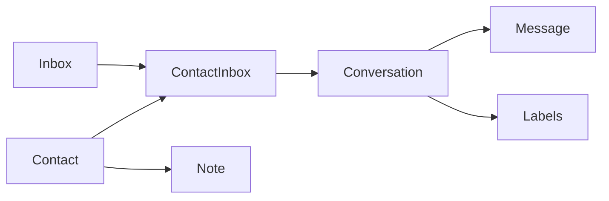

# Internal Communication Core

## Core Entities

| Entity | Role |
| --- | --- |
| `Contact` | Person-level customer record |
| `ContactInbox` | Contact identity inside a specific inbox or channel |
| `Conversation` | Main operational thread |
| `Message` | Atomic communication event |
| `Note` | Internal note on a contact |
| `Label` | Tag-based conversation and contact classification |

## Runtime Graph

```mermaid
flowchart LR
    A[Inbox] --> B[ContactInbox]
    C[Contact] --> B
    B --> D[Conversation]
    D --> E[Message]
    C --> F[Note]
    D --> G[Labels]
```

## Key Behaviors

### Contacts

Contacts are reused across the platform and can carry:

- identification fields
- company link
- custom attributes
- additional attributes
- notes and labels

### Contact Inboxes

`ContactInbox` represents the channel identity for a contact and is the bridge from a raw source identifier to a conversation thread.

### Conversations

Conversations carry:

- account
- inbox
- contact
- assignee
- team
- campaign
- status
- priority
- custom attributes

### Messages

Messages are polymorphic by sender and support:

- incoming
- outgoing
- activity
- template

They also support content types, attachments, webhook payload generation, and downstream indexing.

## Status Model

Conversations use:

- `open`
- `resolved`
- `pending`
- `snoozed`

Messages use:

- `sent`
- `delivered`
- `read`
- `failed`

## Shared Unread State

Staff unread state uses the shared `Conversation.agent_last_seen_at` cursor. Existing `conversation_user_read_states` records are retained, but no longer control staff unread counts, filters, first-unread positions or read broadcasts. Personal assignment and mention notifications remain separate.

Reads and manual unread actions update the shared cursor and broadcast state to authorized recipients. A communication thread aggregates only the conversation links visible to its recipient; reading accessible links must not clear unread state in inaccessible inboxes. Account, inbox and team policies still constrain list results and realtime payloads.

## Official WhatsApp Usage

The account-admin usage endpoint reports UTC calendar months, not inferred Meta billing periods. An idempotent delivery ledger records provider delivery timestamps and a minimal pricing allowlist for matching public outgoing Cloud API messages. App-origin echoes, history imports, incoming/private/failed messages and duplicate delivery callbacks do not add usage. Ledger entries survive message deletion.

For a delivery, `pricing.billable` from Meta is authoritative: only `true` deliveries contribute to the monetary estimate, and `false` deliveries do not. Never subtract the 1,000 service-message allowance a second time; Meta has already classified free deliveries. The allowance is per business phone and resets in the WhatsApp messaging account timezone, which is distinct from OneLink's UTC reporting month.

The approved estimate is the sum of each billable delivery's official Meta USD base rate by recipient market and category, converted to KZT with the National Bank of Kazakhstan (NBK) USD/KZT rate selected for the first day of the same UTC month. Categories are `service`, `utility`, `marketing`, `authentication`, and `authentication_international`; this includes billable template deliveries under their Meta category. Meta's raw webhook value is `authentication_international` (underscore), while the rate-card label and internal normalized category use “authentication-international”; map those forms explicitly. Derive the recipient market from `status.recipient_id` only as needed for lookup, and retain only the resulting country/market, not the raw recipient phone identifier.

The Meta rate catalogue is versioned for 1 October through 31 December 2026. Do not extrapolate it to later months or use a stale/nearest rate: a future period or unknown recipient market/category/rate is incomplete. October 2026 Kazakhstan examples from the Meta catalogue are USD 0.018 for service, utility and authentication; USD 0.0604 for marketing; and USD 0.16 for `authentication_international` (the rate-card label is Authentication-International). These are source USD rates, not KZT constants.

Fetch one global NBK USD/KZT rate snapshot for the month's first day and keep that selected snapshot immutable for the month and common to all accounts. Do not hardcode an FX fallback. If the selected-date rate is missing, the KZT amount is unavailable; do not treat it as zero or silently substitute another date. Exclude Meta volume-tier discounts, taxes and provider markup from this base-rate estimate, and label it an estimate rather than an invoice total.

Expose counts by category and cost only where the underlying country, category, Meta rate and monthly FX are known. Show unknown pricing separately as incomplete, and preserve explicit partial-count/history coverage when delivery timestamps are missing or collection started after the UTC month began. Never infer delivery time from message creation or last update.

The compact banner is limited to OneLink Cloud account administrators with official Cloud phones, clears stale data on account/access changes, and persists X dismissal in browser local storage by account and UTC month. It refreshes while visible and reappears in a new UTC month.

This method is prepared for review and has not yet been released to OneLink Cloud. The earlier KZT 8 service-only estimate is superseded.

Primary sources: [Meta WhatsApp pricing and rate card](https://developers.facebook.com/documentation/business-messaging/whatsapp/pricing/), [Meta business-app coexistence](https://developers.facebook.com/documentation/business-messaging/whatsapp/embedded-signup/onboarding-business-app-users/), [NBK dated official exchange-rates service](https://nationalbank.kz/ru/page/rss), and [NBK daily official exchange rates](https://nationalbank.kz/en/exchangerates/ezhednevnye-oficialnye-rynochnye-kursy-valyut). The NBK RSS page documents the dated rates endpoint with a `DD.MM.YYYY` date parameter; select the UTC month's first calendar day.

## Side Effects

The communication core triggers many downstream reactions:

- notifications
- reporting
- automation
- webhooks
- integrations
- AI behavior

This is why conversation and message changes should be treated as high-fan-out operations.

## Design Rules

1. Do not replace `Conversation` with a domain-specific communication model.
2. Reuse `Contact` as the customer identity before introducing parallel person records.
3. Treat labels and notes as adjunct operational context, not full workflow state.
