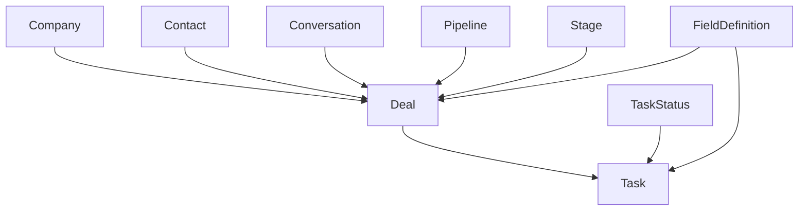

# Internal CRM Runtime

## CRM Entity Set

| Entity | Role |
| --- | --- |
| `Company` | Organization-level record |
| `Crm::Pipeline` | Deal flow container |
| `Crm::Stage` | Stage inside a pipeline |
| `Crm::Deal` | Commercial record |
| `Crm::TaskStatus` | Task status catalog |
| `Crm::Task` | Follow-up work item |
| `Crm::FieldDefinition` | Managed field definition for deal, task, and appointment |

## Relationship Map

## Runtime Characteristics

### Deals

Deals support:

- company
- contacts through join records
- originating conversation
- owner, creator, and team
- pipeline and stage
- currency, amount, expected close, probability
- archiving
- comments and timeline events
- custom attributes

### Tasks

Tasks support:

- deal link
- originating conversation
- assignee, creator, and team
- priority
- dates and completion state
- archiving
- comments and timeline events
- custom attributes

### Field Definitions

`Crm::FieldDefinition` is the managed schema layer for:

- `deal`
- `task`
- `appointment`

It protects built-in fields and defines:

- type
- label
- key
- options
- rules
- required state

## Services

Core services in `app/services/crm/` handle:

- write flows
- archive and transition logic
- payload building
- custom field cleanup
- timelines
- required field inspection
- external CRM integrations

## Design Rules

1. Treat deals and tasks as separate first-class entities.
2. Use field definitions for customer-specific structure before adding new hard-coded columns.
3. Preserve account ownership checks on all related records.
4. Keep conversation linkage explicit when CRM work originates from communication.
