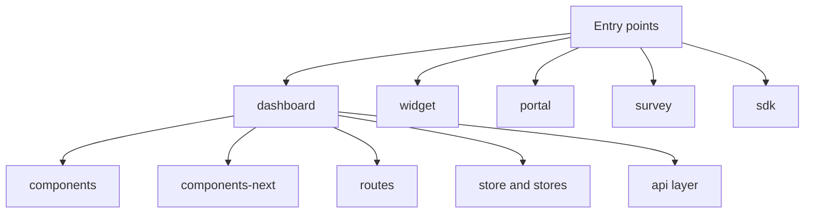

# Internal Frontend Architecture

## Frontend Stack

The frontend is built with:

- Vue 3
- Vite
- Vue Router
- Vuex and Pinia
- Tailwind and legacy SCSS
- Histoire for component development
- Vitest for JS and Vue tests

## Entry Points

The app has several frontend runtimes, not one single shell:

- `dashboard`
- `widget`
- `portal`
- `survey`
- `sdk`
- `superadmin_pages`

## Frontend Layout

## Important Directories

| Path | Role |
| --- | --- |
| `app/javascript/dashboard/routes/` | Page routing and high-level product surfaces |
| `app/javascript/dashboard/api/` | HTTP clients for dashboard features |
| `app/javascript/dashboard/components/` | Existing shared components |
| `app/javascript/dashboard/components-next/` | Newer shared UI layer |
| `app/javascript/dashboard/store/` | Vuex modules |
| `app/javascript/dashboard/stores/` | Pinia stores |
| `app/javascript/shared/` | Reusable code across entrypoints |
| `app/javascript/design-system/` | Shared design assets and primitives |

## State Model

The dashboard is in transition:

- older areas use Vuex
- newer or isolated surfaces use Pinia
- both coexist in the current runtime

Scheduling is one of the clearer newer module patterns with dedicated routes, stores, helpers, and next-generation components.

## Build And Tooling Model

`vite.config.mts` drives the JS build. The app uses:

- `vite-plugin-ruby` for Rails integration
- dedicated SDK library build mode
- Vitest for frontend testing
- Histoire for component preview and docs-like development

## Frontend Design Rules

The repo already reflects these realities:

- incremental modernization, not a full rewrite
- shared utilities in `shared/`
- route-driven module composition
- new work increasingly using the newer component layer

## Useful Internal References

- [Repository Structure](/internal/repository-structure)
- [Testing And Tooling](/internal/testing-and-tooling)
- [Communication Core](/internal/communication-core)
