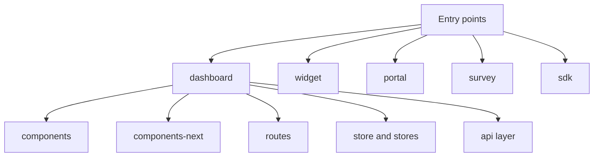

# Internal Frontend Architecture

## Frontend Stack

The frontend is built with:

- Vue 3
- Vite
- Vue Router
- Vuex and Pinia
- Tailwind and legacy SCSS
- Histoire for component development
- Vitest for JS and Vue tests

## Entry Points

The app has several frontend runtimes, not one single shell:

- `dashboard`
- `widget`
- `portal`
- `survey`
- `sdk`
- `superadmin_pages`

## Frontend Layout

```mermaid
flowchart TD
    A[Entry points] --> B[dashboard]
    A --> C[widget]
    A --> D[portal]
    A --> E[survey]
    A --> F[sdk]

    B --> G[components]
    B --> H[components-next]
    B --> I[routes]
    B --> J[store and stores]
    B --> K[api layer]
```

## Important Directories

| Path | Role |
| --- | --- |
| `app/javascript/dashboard/routes/` | Page routing and high-level product surfaces |
| `app/javascript/dashboard/api/` | HTTP clients for dashboard features |
| `app/javascript/dashboard/components/` | Existing shared components |
| `app/javascript/dashboard/components-next/` | Newer shared UI layer |
| `app/javascript/dashboard/store/` | Vuex modules |
| `app/javascript/dashboard/stores/` | Pinia stores |
| `app/javascript/shared/` | Reusable code across entrypoints |
| `app/javascript/design-system/` | Shared design assets and primitives |

## State Model

The dashboard is in transition:

- older areas use Vuex
- newer or isolated surfaces use Pinia
- both coexist in the current runtime

Scheduling is one of the clearer newer module patterns with dedicated routes, stores, helpers, and next-generation components.

### Account-Scoped Inbox List Cache

The dashboard's inbox store loads through `InboxesAPI.get(true)`, using
`CacheEnabledApiClient`.
It compares the account's inbox cache version with IndexedDB and can return a
nonempty saved list without requesting the inbox index again. A page reload
does not by itself discard this saved list.

Normal Inbox model changes invoke `AccountCacheRevalidator` after commit.
The callback exits early when `Current.suppress_runtime_events` is set.
`account.update_cache_key('inbox')` updates the account's inbox version for 72
hours and emits `account.cache_invalidated`. The physical Redis key is
`alfred:idb-cache-key-account-<account_id>-inbox`; the `alfred:` namespace comes
from the application's Redis wrapper. The dashboard revalidates its cached
list when it receives the new version.

An operator recovery performed with direct SQL bypasses this callback. After
committing an inbox visibility change, invalidate the affected account's inbox
version and trigger frontend revalidation or a fresh client load. Changing
only `inboxes.updated_at` leaves the browser's list version unchanged. Keep
the invalidation step resumable if it fails after the database commit.

Verify the result with the affected user's account and role. Restoring an inbox
to the list does not establish provider authorization or message delivery;
those require separate checks. Cache invalidation must preserve the channel,
credentials, members, conversations, and messages.

### Returning To An Open Conversation

`ReconnectService` refreshes the current list with its complete first page.
An `updatedWithin` response contains only recently changed conversations and
must not replace the full list. Reconnect keeps the current applied filters or
saved-folder query and its route-scoped CRM, label, team, unread, and sort
parameters. Communication-thread routes use the thread list, detail, and
message APIs throughout the refresh.

The active route can refer to a quiet conversation outside the first page or
current list filter. If that record is missing after refresh, fetch its detail
through the normal permission-checked endpoint before restoring selection.
Retain the same selected entity's loaded messages, fetch state, history-end
flag, and first-unread cursor. Resuming the existing route does not apply the
cursor and history resets used when opening another conversation. Reply
drafts remain in the separate draft store.

List, detail, and message responses carry an expected route `fullPath` through
the relevant store actions. Recheck it after each network response and before
committing, so a delayed response cannot restore data after a conversation,
filter, or account switch. Match both entity ID and conversation type: a
communication thread and a legacy conversation can have the same numeric ID.
Permission failure must not reinsert the cached active record.

Regression coverage uses the real Vuex conversation actions and mutations
with mocked network APIs. It exercises a quiet selected conversation omitted
from page one, a saved-folder thread route, and a delayed detail response after
an account switch, plus denial of the active detail request. Mobile browser
resume and visual scroll-position checks
still belong in release verification.

## Build And Tooling Model

`vite.config.mts` drives the JS build. The app uses:

- `vite-plugin-ruby` for Rails integration
- dedicated SDK library build mode
- Vitest for frontend testing
- Histoire for component preview and docs-like development

## Frontend Design Rules

The repo already reflects these realities:

- incremental modernization, not a full rewrite
- shared utilities in `shared/`
- route-driven module composition
- new work increasingly using the newer component layer

## Useful Internal References

- [Repository Structure](/internal/repository-structure)
- [Testing And Tooling](/internal/testing-and-tooling)
- [Communication Core](/internal/communication-core)
