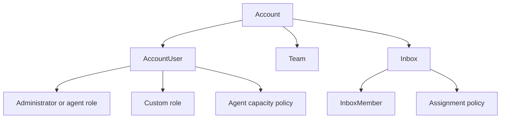

# Internal Permissions And Access

## Access Layers

## Core Access Entities

### `Account`

The workspace boundary. All runtime access logic begins with account scope.

### `AccountUser`

The per-account identity record. It carries:

- role
- availability
- optional custom role
- optional agent capacity policy

### `InboxMember`

Controls direct user access to an inbox.

### `Team`

Groups users and can be used for ownership, visibility, and reporting.

## Permission Models

### Base Roles

The base role model is simple:

- administrator
- agent

### Custom Roles

Advanced permission tokens come from `custom_roles`. Current permissions include:

- conversation management scopes
- contact management
- CRM deal and task view/manage
- CRM settings view/manage
- report management
- knowledge base management

### Assignment Policies

Assignment policies bind inboxes to routing strategy. They currently define:

- assignment order
- conversation priority strategy
- fairness window
- fairness limits

### Agent Capacity Policies

Capacity policies constrain how much inbox load an agent should carry, optionally per inbox through `inbox_capacity_limits`.

## Access Resolution Pattern

1. Request resolves current account.
2. Current account resolves current account user.
3. Base role and optional custom role permissions are merged.
4. Inbox membership and team context narrow operational visibility.
5. Policy classes apply additional rules by subsystem.

## Why This Matters

This layered model is what allows One Link Cloud to stay one shared product while still supporting:

- simple teams
- admin-controlled visibility
- granular CRM permissions
- knowledge base access
- controlled assignment behavior
