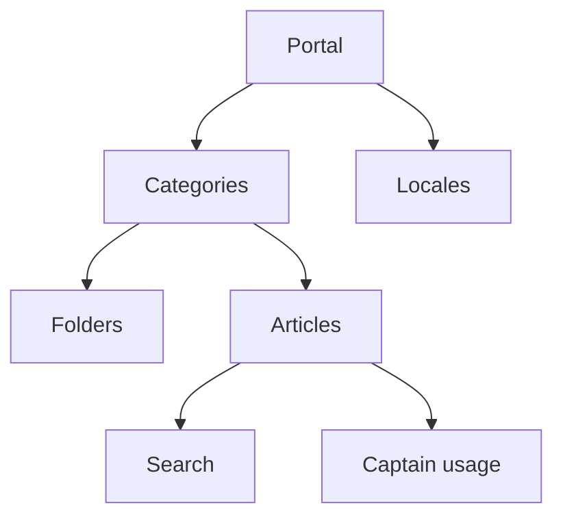

# Internal Reporting And Knowledge

## Reporting Surfaces

Current dashboard report routes cover:

- account overview
- conversation reports
- agent reports
- inbox reports
- team reports
- label reports
- SLA reports
- CSAT responses
- bot reports

These surfaces are route-driven in the dashboard settings/reporting module and pull from reporting events plus operational data.

## Knowledge Subsystem

The knowledge subsystem is built around:

- `Portal`
- `Category`
- `Folder`
- `Article`

It supports:

- multi-portal setup per account
- locale configuration
- draft locales
- article lifecycle states
- category ordering
- article ordering
- optional widget linkage

## Knowledge Runtime Map

## Operational Fit

Knowledge is used in three ways:

1. public-facing or shared help content
2. internal operator reference via search and article access
3. AI context through Captain documents and lookup tooling

## Internal Rule

When a feature needs structured reusable knowledge, prefer reusing the portal and article subsystem before building a new document repository.
