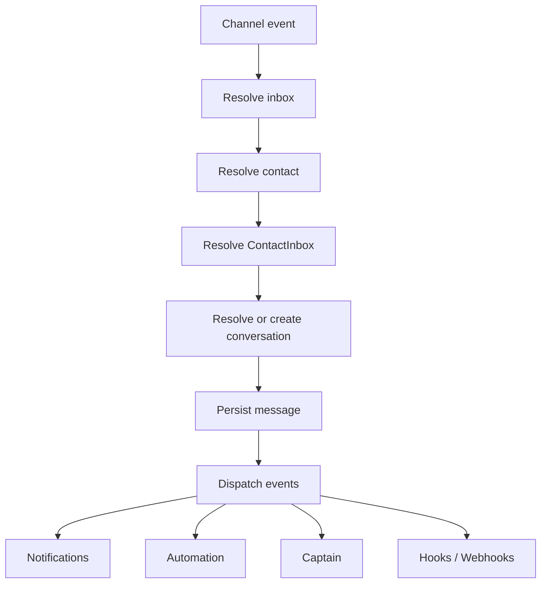
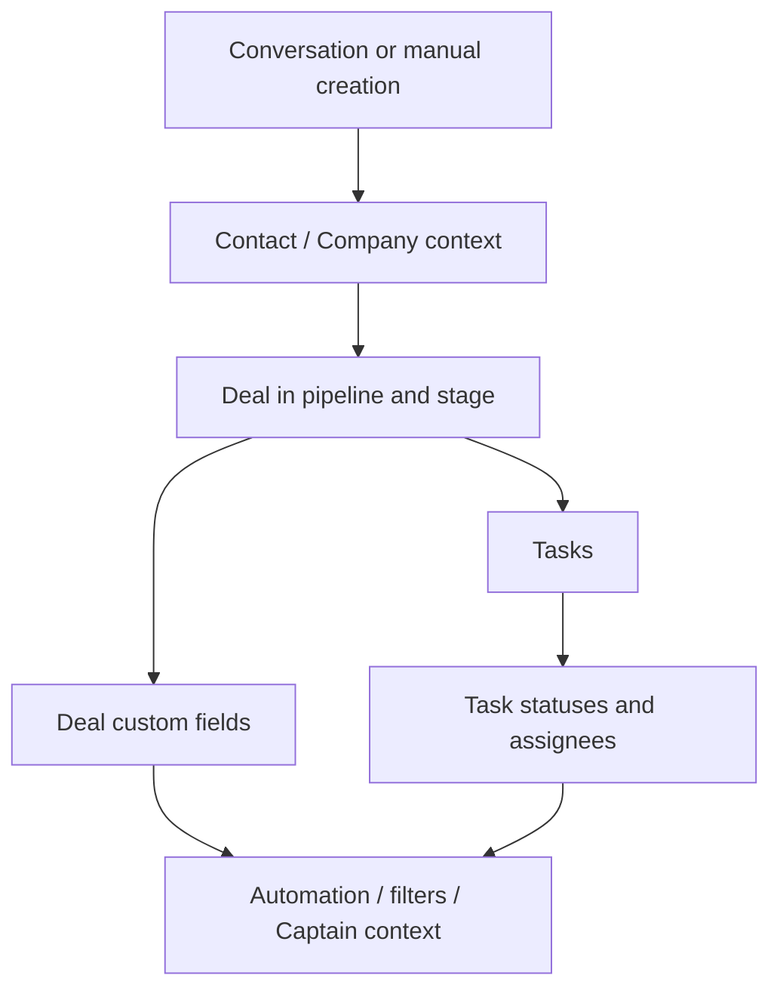
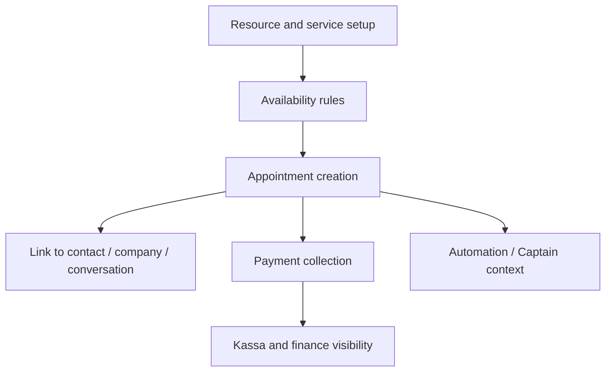
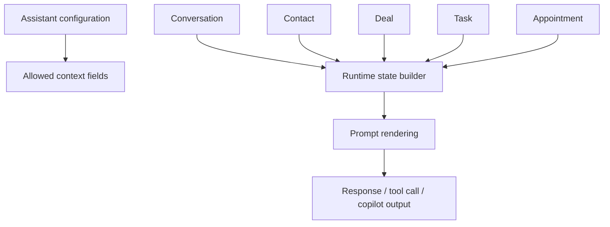
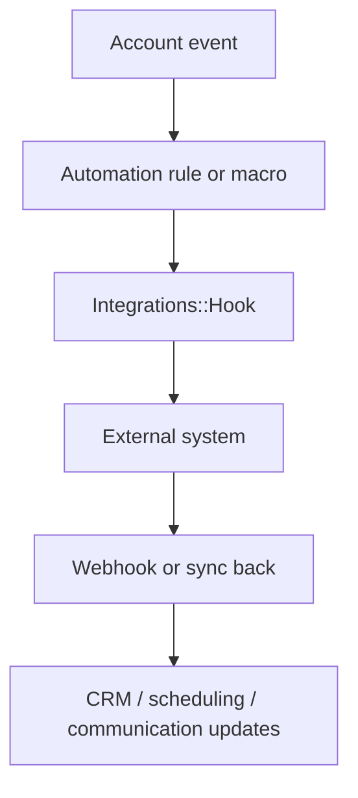

# Internal Runtime Flows

## Inbound Message Flow

```mermaid
flowchart TD
    A[Channel event] --> B[Resolve inbox]
    B --> C[Resolve contact]
    C --> D[Resolve ContactInbox]
    D --> E[Resolve or create conversation]
    E --> F[Persist message]
    F --> G[Dispatch events]
    G --> H[Notifications]
    G --> I[Automation]
    G --> J[Captain]
    G --> K[Hooks / Webhooks]
```

## CRM Progression Flow

```mermaid
flowchart TD
    A[Conversation or manual creation] --> B[Contact / Company context]
    B --> C[Deal in pipeline and stage]
    C --> D[Deal custom fields]
    C --> E[Tasks]
    E --> F[Task statuses and assignees]
    D --> G[Automation / filters / Captain context]
    F --> G
```

## Scheduling Flow

```mermaid
flowchart TD
    A[Resource and service setup] --> B[Availability rules]
    B --> C[Appointment creation]
    C --> D[Link to contact / company / conversation]
    C --> E[Payment collection]
    E --> F[Kassa and finance visibility]
    C --> G[Automation / Captain context]
```

## Captain Context Flow

```mermaid
flowchart TD
    A[Assistant configuration] --> B[Allowed context fields]
    C[Conversation] --> D[Runtime state builder]
    E[Contact] --> D
    F[Deal] --> D
    G[Task] --> D
    H[Appointment] --> D
    D --> I[Prompt rendering]
    I --> J[Response / tool call / copilot output]
```

## Integration Execution Flow

```mermaid
flowchart TD
    A[Account event] --> B[Automation rule or macro]
    B --> C[Integrations::Hook]
    C --> D[External system]
    D --> E[Webhook or sync back]
    E --> F[CRM / scheduling / communication updates]
```
