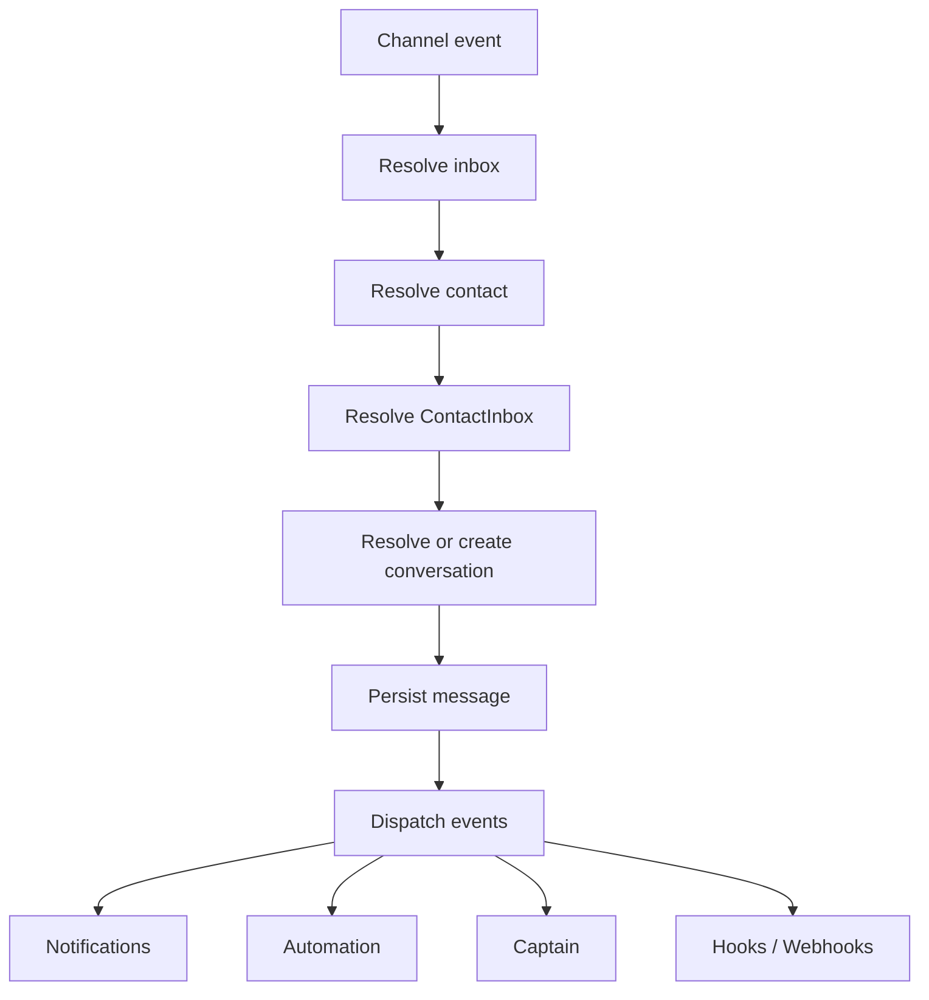
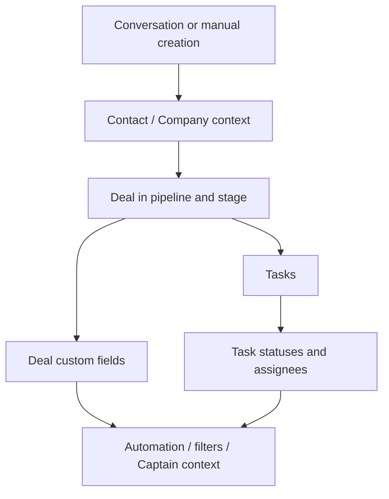
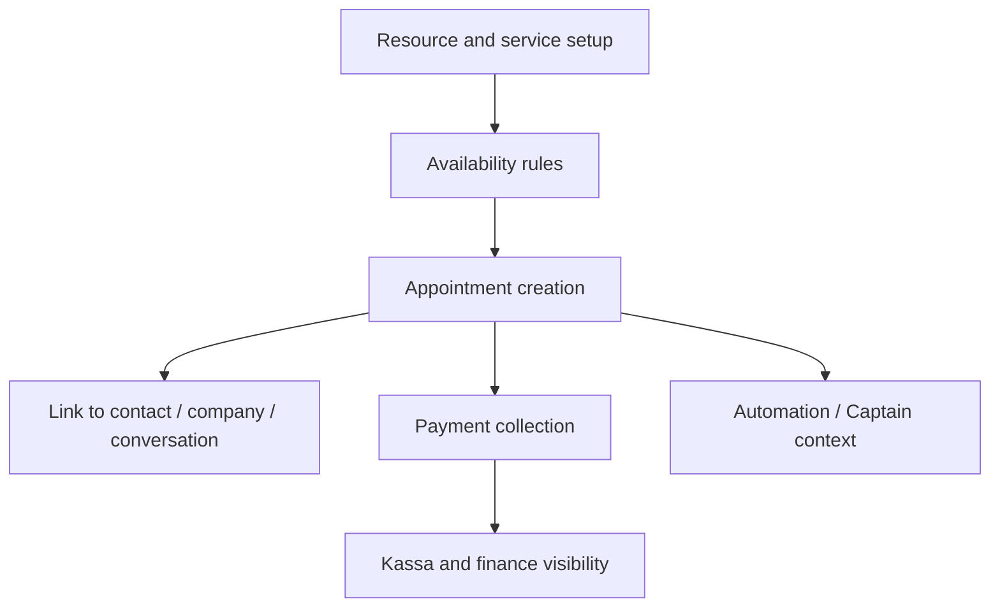
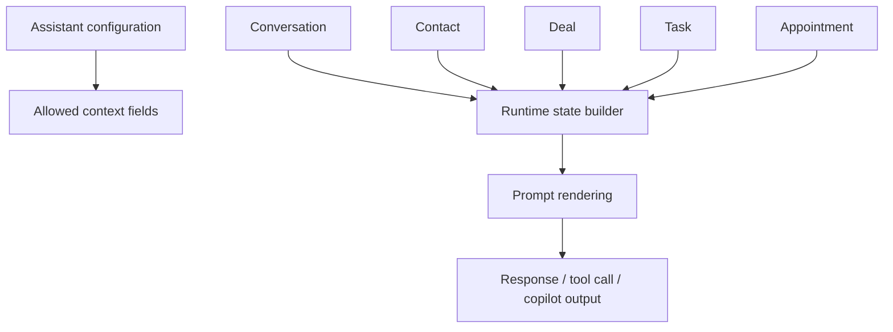
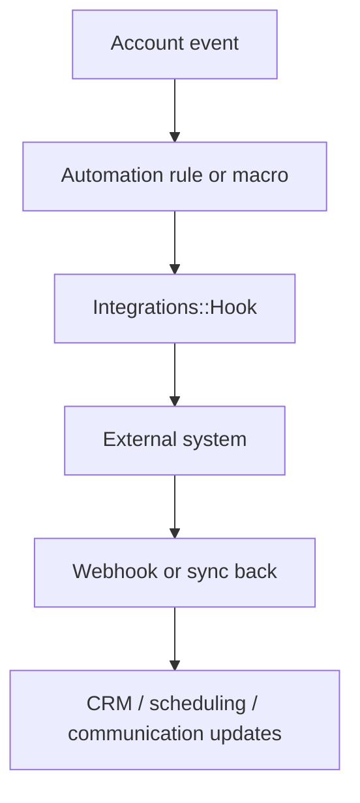

# Internal Runtime Flows

## Inbound Message Flow

## WhatsApp Retained-Channel Recovery

Embedded Signup reauthorization must distinguish the physical phone number and owning business from Meta's replaceable WABA and phone object IDs. An identity migration is restricted to an existing account-scoped channel, a freshly exchanged token with the required grants, and a unique matching number in the same owner business. An explicit selection of a different asset, incomplete enumeration, ambiguity, or another local owner must fail closed.

The final write is serialized by the sorted old/new WABA locks and a row recheck. Provider validation runs before the short database write, and callback calls run outside the database transaction. Retained-channel migration preserves the inbox identity, name, members, phone, connection mode, and existing coexistence sync metadata. It does not register or deregister the number, purge conversations, or restart a terminal history/contact synchronization. The callback must be confirmed before the authorization recovery is considered complete; a failed callback must retain a recovery anchor and validated credentials. Final authorization cleanup compares the credential and failure-state snapshot so a new provider error during callback setup cannot be erased by the earlier reconnect attempt.

Inbox deletion tears down the WhatsApp channel before purging its conversations. A classified teardown failure before any local purge may restore visibility with a separate safe deletion-failure state. A failure after destructive cleanup begins must not resurrect the inbox as a healthy channel. This local recovery must not restore child inboxes while their parent account is being deleted. A confirmed reconnect may resolve a current failed-deletion warning and retain its prior failure details; it cannot resolve or cancel a newly pending deletion generation.

The existing account-wide deletion path purges conversations and contacts before destroying inboxes. A late channel-teardown failure can therefore occur after partial account cleanup; account deletion requires a separate teardown-preflight design and must not be presented as preserving all account data on failure.

Each recoverable deletion attempt stores its generation in the nullable native `inboxes.deletion_attempt_id` field so the intent survives channel teardown. Queued work from a recovered or superseded attempt cannot start a new deletion. A new user-requested deletion creates a fresh attempt. Duplicate job deliveries are serialized by a separate inbox advisory lock, with a fresh intent check inside the lock; the lock spans teardown, restoration, and purge without holding a database transaction over the network call. A partial-purge retry must use the same lock even after the channel row is gone.

Rollout must apply the nullable-column migration before running the new code and update all deletion workers before enabling the new controller's enqueue signature. Legacy three-argument jobs may adopt an already marked pre-upgrade deletion, with a stable retry identity across deliveries. They cannot create a new deletion intent for an active or recovered WhatsApp inbox.

Account cache versions are opaque unique strings. The inbox version must change even when marking and recovering an inbox happen within the same second, and the browser must refetch the restored entry after reconciling an asynchronous deletion response.

## CRM Progression Flow

## Scheduling Flow

## Captain Context Flow

## Integration Execution Flow

