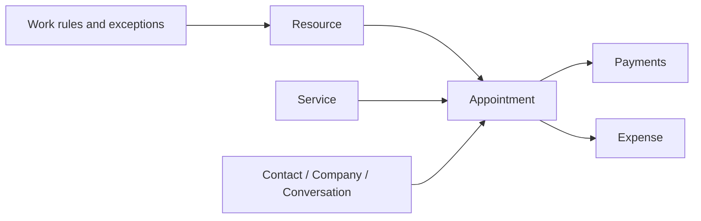

# Internal Scheduling Runtime

## Scheduling Entity Set

| Entity | Role |
| --- | --- |
| `Scheduling::Resource` | Bookable person or unit |
| `Scheduling::Service` | Service catalog item |
| `Scheduling::WorkRule` | Regular work hours |
| `Scheduling::BreakRule` | Regular breaks |
| `Scheduling::Holiday` | Calendar exception |
| `Scheduling::WorkdayOverride` | Date-specific override |
| `Scheduling::TimeOff` | Resource-specific unavailability |
| `Scheduling::Appointment` | Scheduled customer event |
| `Scheduling::Payment` | Money received |
| `Scheduling::Expense` | Finance-side outgoing record |

## Runtime Graph

## Appointment Model

Appointments are richer than simple calendar records. They include:

- resource
- service
- contact
- company
- conversation
- created_by
- status and source
- client snapshot fields
- service and compensation snapshots
- payment status and payment methods
- custom attributes

## Finance Logic

Scheduling keeps finance close to operations:

- prepayment and settlement amounts live on the appointment
- individual payment records are tracked separately
- expense records allow operational payout visibility

This design keeps service execution and money flow close together while still preserving first-class entities.

## Service And Availability Model

Resource availability is built from:

- default work rules
- break rules
- holidays
- workday overrides
- time off

## Services

`app/services/scheduling/` includes:

- appointment upsert
- finance sync
- availability calculation
- calendar view generation
- payload building
- filter helpers for custom fields

## Design Rules

1. Keep scheduling account-scoped and linked to shared customer context.
2. Preserve appointment snapshots when historical service and compensation values matter.
3. Use managed field definitions for workspace-specific scheduling fields.
