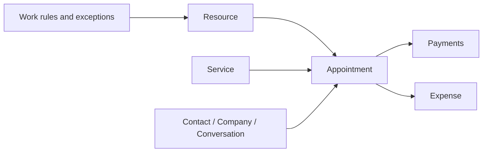

# Internal Scheduling Runtime

## Scheduling Entity Set

| Entity | Role |
| --- | --- |
| `Scheduling::Resource` | Bookable person or unit |
| `Scheduling::Service` | Service catalog item |
| `Scheduling::WorkRule` | Regular work hours |
| `Scheduling::BreakRule` | Regular breaks |
| `Scheduling::Holiday` | Calendar exception |
| `Scheduling::WorkdayOverride` | Date-specific override |
| `Scheduling::TimeOff` | Resource-specific unavailability |
| `Scheduling::Appointment` | Scheduled customer event |
| `Scheduling::Payment` | Money received |
| `Scheduling::Expense` | Finance-side outgoing record |

## Runtime Graph

```mermaid
flowchart LR
    A[Resource] --> D[Appointment]
    B[Service] --> D
    C[Contact / Company / Conversation] --> D
    D --> E[Payments]
    D --> F[Expense]
    G[Work rules and exceptions] --> A
```

## Appointment Model

Appointments are richer than simple calendar records. They include:

- resource
- service
- contact
- company
- conversation
- created_by
- status and source
- client snapshot fields
- service and compensation snapshots
- payment status and payment methods
- custom attributes

## Separate Patient Identity And Shared Phones

`Scheduling::Appointment.contact_id` remains the communication contact; nullable `patient_contact_id` identifies the separate patient card. `Integrations::Medelement::PatientContactBinding` resolves server-recorded provider identities within the account and records a shared phone instead of taking another contact's primary number. Self-declared widget/public API identity values do not select the patient card. Existing legacy bindings are not rewritten by these expand migrations.

`AppointmentPatientBindingSnapshot` freezes the patient binding in provider command snapshots. Upserts, merges and provider write fences reject a binding change while a write is in progress or awaits verification. Unverified contact writers cannot alter server-owned patient/share attributes, and automatic phone merges do not absorb patient cards.

`Reminders::PatientSubjectGuard` computes the notification route without changing appointment ownership or stealing a `ContactInbox`: the patient's own phone, a verified shared-number holder route, or the recorded booking chat. Chatless imported appointments require a phone-identified holder channel and fail closed when none exists. A reply from another patient or shared-number holder does not release the patient's auto-cancel touches.

Three installation configs default to false: `ONELINK_SHARED_PHONE_AUTO_PROMOTION`, `ONELINK_SHARED_PHONE_MANUAL_PROMOTION`, and `ONELINK_SHARED_PHONE_HISTORY_TRANSFER`. Missing or unreadable values keep the capabilities off; no environment/account override enables them. The shared-phone core remains active with all three off.

Apply the four patient-contact expand migrations in order: nullable bigint, separate NOT VALID foreign key with bounded lock retries, concurrent index, then foreign-key validation. Retain the column and constraints during an application rollback; do not run destructive down migrations as part of a rolling release.

## MedElement Local Cancellation

The integration setting `remove_reception_on_cancel` defaults to false. With it off, `Scheduling::Appointments::CancelService` cancels locally through `ProviderLocalCancellationService`, preserves the MedElement reception/reference, cancels local reminders and reconciles finance. A durable local-cancellation marker prevents an unchanged active provider import from reopening the appointment. Explicit provider outcomes keep their existing precedence; a provider rebooking clears the marker and restores the previous payment state.

With the setting on, cancellation follows the existing confirmed provider removal command. The executor reloads the hook and checks the setting under the hook lock before publishing the write phase. A queued removal is blocked when the setting has been switched off; an already-started provider removal can finish. The interface exposes the expected cancellation mode, and a changed mode requires the user to refresh/confirm rather than silently choosing another operation. Local cancellation is blocked while an unresolved provider command could still change the reception.

## Finance Logic

Scheduling keeps finance close to operations:

- prepayment and settlement amounts live on the appointment
- individual payment records are tracked separately
- expense records allow operational payout visibility

This design keeps service execution and money flow close together while still preserving first-class entities.

## Service And Availability Model

Resource availability is built from:

- default work rules
- break rules
- holidays
- workday overrides
- time off

## Services

`app/services/scheduling/` includes:

- appointment upsert
- finance sync
- availability calculation
- calendar view generation
- payload building
- filter helpers for custom fields

## Design Rules

1. Keep scheduling account-scoped and linked to shared customer context.
2. Preserve appointment snapshots when historical service and compensation values matter.
3. Use managed field definitions for workspace-specific scheduling fields.
