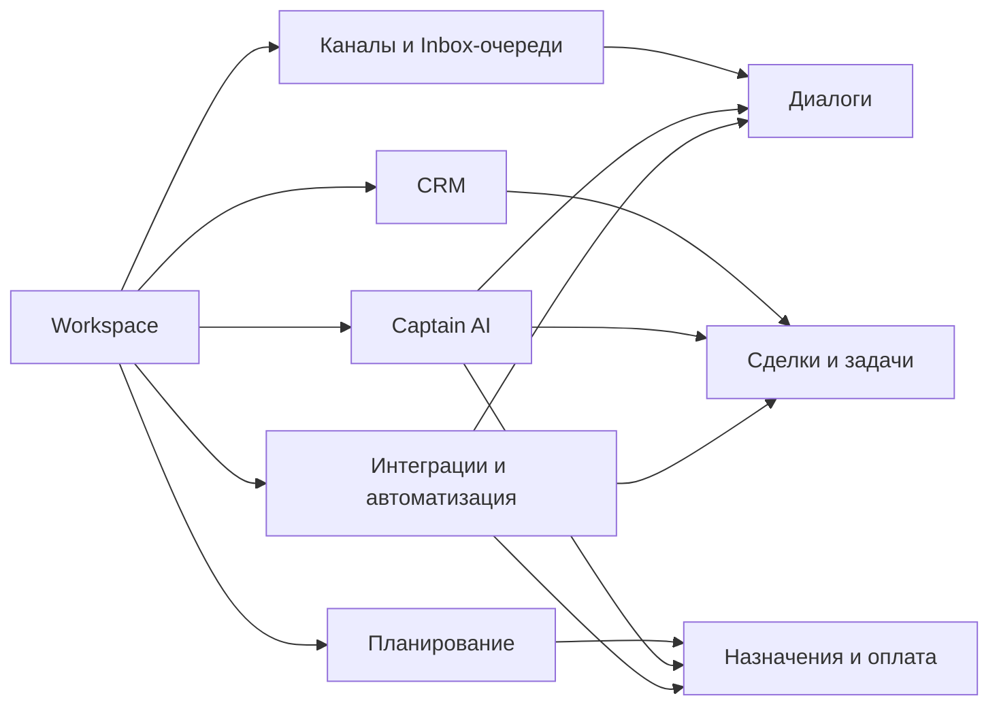

# One Link Cloud

One Link Cloud — это единое облачное рабочее пространство для клиентских коммуникаций и операционной работы.

В одном продукте объединены:

- каналы и inbox-очереди
- CRM и гибкие поля
- расписание, записи и оплаты
- Captain AI
- автоматизация и интеграции

One Link Cloud объединяет коммуникации, CRM, расписание, оплаты, AI и интеграции внутри одного общего workspace.

## Карта продукта

## Что вы можете сделать в One Link Cloud

- получать запросы клиентов из нескольких каналов в одном workspace
- организовывать общение по inbox-очередям, командам, исполнителям и приоритетам
- управлять контактами, компаниями, сделками, задачами и пользовательскими данными
- планировать встречи, ресурсы, услуги и платежи
- использовать Captain AI для подсказок, copilot, сводок и управляемых сценариев
- подключать внешние системы через интеграции, webhooks, автоматизации и API

## Основной принцип

One Link Cloud использует одно общее функциональное ядро, а поведение конкретного клиента определяется через:

- доступ и настройки workspace
- определения полей и кастомные поля
- автоматизации и macros
- интеграции и webhooks
- Captain assistants, tools и knowledge

## Типичные случаи использования

### Служба поддержки клиентов

- маршрутизировать сообщения с сайта, мессенджеров и email в один workspace
- распределять работу между агентами и командами
- закрывать диалоги с полным контекстом клиента

### Управление продажами и лидами

- превращать диалоги в структурированную CRM-работу
- вести сделки по воронке и этапам
- управлять задачами, сроками, владельцами и последующими действиями

### Услуги доставки

- оформлять записи и встречи
- связывать их с клиентами и историей диалогов
- учитывать предоплаты, расчёты и операционные платежи

### AI-операции

- использовать assistants для первой линии
- использовать copilot для операторов
- использовать documents, knowledge, scenarios и tools для управляемого выполнения

## Начните здесь

- [Обзор платформы](/platform/overview)
- [Ключевые сущности](/platform/entity-matrix)
- [Рабочее пространство и доступ](/platform/workspace-and-access)
- [Коммуникационные процессы](/platform/communication-workflows)
- [Справочник API One Link Cloud](/api-reference/introduction)
