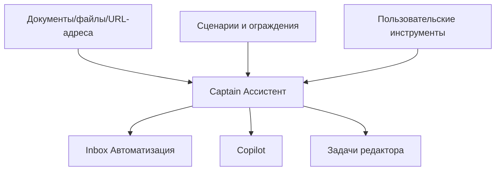
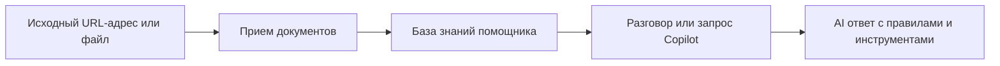

# Captain AI

Captain — это AI-слой внутри One Link Cloud. Он не заменяет продуктовую модель, а работает поверх общих сущностей платформы.

Captain использует:

- документы и знания
- сценарии и guardrails
- кастомные инструменты
- copilot-процессы
- связь с диалогами, CRM и расписанием

Captain — это слой AI внутри One Link Cloud. Оно не заменяет действующую модель продукта. Вместо этого он работает поверх общих объектов, таких как диалоги, контакты, сделки, задачи и встречи.

## Captain Строительные блоки

## Основные сущности

| Сущность | Роль | Практическое использование |
| --- | --- | --- |
| `Captain::Assistant` | Настроен помощник AI | Автоответы, управляемое управление, помощь inbox |
| `Captain::Document` | Источник знаний | Сайт, файл, PDF, политика, каталог, инструкции |
| `Captain::Scenario` | Правило структурированного поведения | Передача обслуживания, ветвление потока, логика эскалации |
| `Captain::CustomTool` | Вызываемое действие на уровне учетной записи | Действие HTTP, внутренние операции, интеграция рабочих процессов |
| `CopilotThread` / `CopilotMessage` | Интерактивное сотрудничество AI | Оператор copilot и работа под руководством |

## Общий контекст

Captain может работать с контекстом тех же объектов workspace, которые команда уже использует:

- разговор
- контакт
- сделка
- задача
- встреча

Это важно, поскольку ответы AI могут быть сопоставлены с реальным рабочим состоянием, а не с изолированным текстом подсказки.

## Что может Captain

### Inbox Помощь

- отвечать на диалоги
- передать человеку при необходимости
- использовать сценарии и ограждения
- работа с настроенным inbox-очереди

### Задачи редактора

- переписывать черновики сообщений
- подводить итоги длинных тем
- предложить ярлыки
- предложить дальнейшие действия

### Copilot

- отвечать на вопросы оператора
- поиск знаний workspace
- помогать ориентироваться в статьях, контактах и беседах

## Доступ к контексту и тулзам

Для каждого `Captain::Assistant` можно отдельно настраивать:

- какие поля контекста AI видит в диалогах
- какие тулзы доступны live AI-агенту и scenario-агентам
- какие built-in и custom HTTP тулзы доступны внутреннему copilot-ассистенту

В каталоге тулзов теперь показываются:

- тип тулзы: built-in или custom
- уровень риска действия
- метаданные будущего confirmation flow для более чувствительных действий

`Ассистент / copilot` использует superset-каталог: он включает общий набор agent-тулзов, глобальные read/search тулзы по workspace и включенные custom HTTP tools. `Live agent` и scenario-агенты получают только тот поднабор, который разрешен scope `agent`.

Это позволяет держать знания, контекст и действия под явным контролем на уровне аккаунта и конкретного ассистента.

## Поток знаний

## Типичные случаи использования

### Более быстрый ответ агента

- помощник читает контекст разговора
- использует проверенные знания и правила
- предлагает или генерирует ответ для оператора

### Управляемое обслуживание или поток продаж

- сценарии определяют, когда задавать вопросы, передавать на более высокий уровень или передавать их
- помощники могут использовать специальные инструменты и инструкции для клиентов

### Workspace Уровень знаний

- Политика продукта, часто задаваемые вопросы, прайс-листы и документация по процессам загружаются один раз.
- затем эти знания поддерживают как автоматизированную обработку, так и человеческие потоки copilot.

## Принцип проектирования

Captain распространяется на учетную запись и настраивается. Разные клиенты адаптируют его с помощью помощников, документов, сценариев, контекстного доступа и инструментов, при этом базовая модель продукта остается общей.
