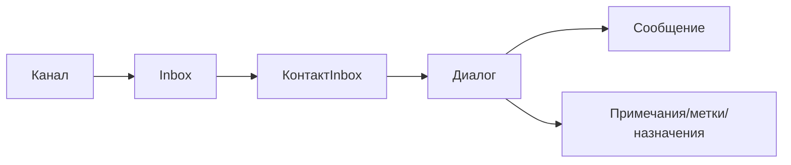
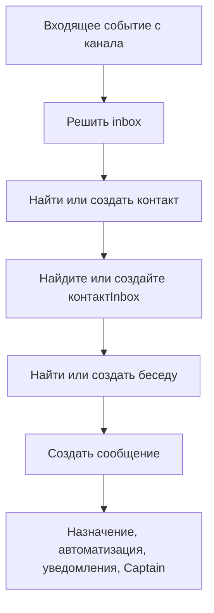

# Коммуникационные процессы

Коммуникации — это центральная операционная поверхность One Link Cloud.

Независимо от источника, все каналы сводятся к общей модели:

- канал
- inbox
- contact inbox
- conversation
- message

Это позволяет работать из одного интерфейса, а не переключаться между разрозненными системами.

Связь является оперативным центром One Link Cloud. Каждый канал в конечном итоге превращается в одну и ту же модель общего разговора, поэтому команда может работать с одним workspace вместо переключения между разрозненными инструментами.

## Основная цепочка для общения

## Основные выводы

| Сущность | Цель | Типичные примеры |
| --- | --- | --- |
| `Inbox` | Пункт пропуска оперативного вмешательства | Виджет сайта, WhatsApp, электронная почта, Telegram, Instagram |
| `Contact` | Запись о человеке | Заказчик, руководитель, пациент, покупатель, заявитель |
| `ContactInbox` | Идентификатор канала контакта | Номер телефона, сеанс виджета, социальная идентичность |
| `Conversation` | Рабочая нить | Заявка в сервисную поддержку, диалог о продажах, последующее обслуживание |
| `Message` | Отдельное событие внутри разговора | Входящее сообщение, ответ агента, системное событие |
| `Note` | Внутренний комментарий | Примечание о квалификации, комментарии к разработкам, передаче деталей |
| `Label` | Легкая классификация | VIP, горячие лиды, эскалация, сопровождение |

## Входящий поток

## Жизненный цикл диалога

Разговор — это операционная суть, которая хранит:

- контакт и контекстный канал
- ответственный и командный
- статус и приоритет
- этикетки и примечания
- полная история сообщений
- AI и автоматизация событий
- связанный CRM и планирование контекста

Стандартный жизненный цикл:

1. приходит сообщение или разговор создается вручную
2. разговор перенаправляется inbox, ответственному лицу или службе.
3. операторы получают сообщения, включают заметки, метки или задачи.
4. средства автоматизации и Captain помогут классифицировать, обобщать или реагировать.
5. Разговор решен, отложен или оставлен в ожидании следующего действия.

## Статус и право собственности

Диалоги применяются к практической модели рабочего состояния:

- `open` для активной работы
- `pending`, когда следующий шаг заблокирован или делегирован
- `snoozed`, когда следующее действие зависит от времени
- `resolved`, когда взаимодействие завершено

Они также могут сказать:

- приоритет
- правопреемник
- команда команды
- произвольные поля

## Как коммуникация связана с полной частью продукта

Данные диалоги не изолированы. Он может кормить:

- Квалификация CRM создание и сделка
- задача
- история встреч
- отчетность
- знания и контекст AI
- руководители и webhooks

## Типичные случаи использования

### Поддержка разрешения

- пишет клиент через любой подключенный канал
- направляющая платформы направляет сообщение в правый inbox
- агент отвечает, включает примечания, применяет ярлыки и разрешает разговор

### Квалификация продавца

- лид начинается в разговоре
- оператор обогащает контакт и контекст компании
- разговор может привести к сделке, проблемам и автоматизации действий.

### Жизненный цикл службы

- клиент подтверждает или меняет встречу по той же теме
- Контекст встречи остается в связи со сложившимся общением.
- платежи и действия после оказания услуг видимыми для команды
