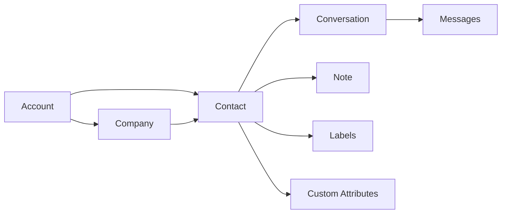
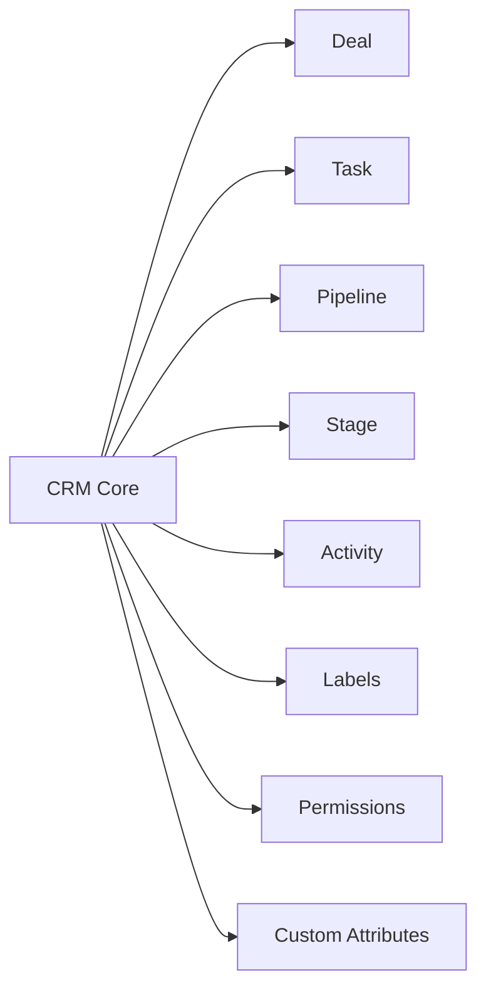
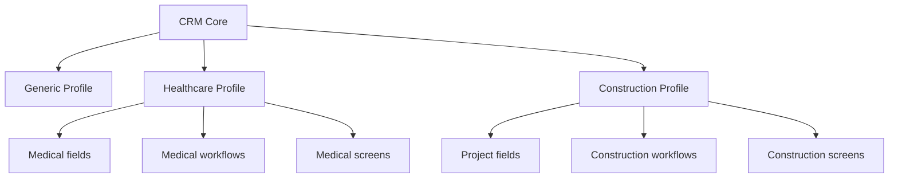

# CRM Architecture

## Status

- document type: current state plus target direction
- source of truth for current implementation: code
- source of truth for future shape: planning direction

## Current Implemented State

The current codebase does not yet implement a full shared CRM engine.

What exists today:

- `Contact` as the person-level record
- `Company` as the organization-level record
- `Note` for internal contact notes
- `Label` for lightweight classification
- `CustomAttributeDefinition` plus JSONB values for `Contact` and `Conversation`
- conversation history, search, reporting, and help center around the support platform

What does not yet exist as first-class shared CRM runtime entities:

- `Deal`
- `Task`
- `Pipeline`
- `Stage`
- normalized `Activity`

## Current CRM-Adjacent Model

## Core Principle

- build one shared CRM engine, not separate CRM products for each vertical
- keep current support-platform primitives reusable while CRM grows
- treat target CRM entities as roadmap until implemented in code

## Target Shared CRM Model

Onelink should implement one shared CRM engine on top of the current person, organization, and communication layers.

## Shared CRM Model

## Domain Extension Model

## Entity Guidance

### Shared Core Entities

Current shared CRM-adjacent entities:

- `Contact`
- `Company`
- `Note`
- `Label`
- `CustomAttributeDefinition`

Planned shared CRM entities:

- `Deal`
- `Task`
- `Pipeline`
- `Stage`
- `Activity`

`Deal` and `Task` should remain separate business entities because they have different lifecycle, reporting, permissions, and UX when CRM work is implemented.

### Custom Attributes

Use custom attributes for:

- domain-specific fields
- tenant-specific fields
- experimental or configurable fields

Do not use custom attributes to replace:

- core relationships
- ownership
- primary status/state
- pipeline and stage logic

## Design Rule

- stable shared business state => first-class model fields and associations
- variable domain/tenant metadata => custom attributes

## Recommended Build Order

1. keep reusing `Contact`, `Company`, `Conversation`, `Note`, `Label`, and `CustomAttributeDefinition`
2. add shared CRM entities only when the lifecycle is stable across multiple domains
3. keep `Deal` and `Task` separate when they are introduced
4. add domain-specific screens, workflows, and validations only after the shared entity model is clear

For delivery sequencing, use [Implementation Roadmap](/platform/implementation-roadmap).
