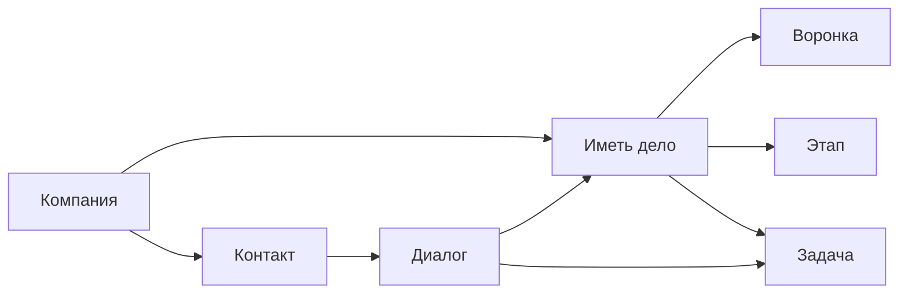

# CRM и гибкая структура данных

В One Link Cloud CRM встроена в основной продукт и работает поверх общей модели данных.

Базовые сущности:

- контакт
- компания
- сделка
- воронка и этап
- задача
- кастомные поля

Платформа не делится на отдельные доменные CRM. Различия закрываются конфигурацией и структурой данных.

One Link Cloud имеет базовую модель CRM, встроенную в основной продукт. Он предназначен для работы с различными клиентскими процессами без разделения платформы на среду выполнения домена.

## CRM Структура

## Что реализовано

### Записи клиентов

- `Contact` для записей на уровне человека.
- `Company` для записей на уровне организации.
- `Note` и `Label` для рабочего контекста.

### Отслеживание продаж и процессов

- `Crm::Pipeline` и `Crm::Stage`
- `Crm::Deal`
- `Crm::TaskStatus`
- `Crm::Task`

### Гибкие данные

- `CustomAttributeDefinition` для контактов и разговора
- `Crm::FieldDefinition` для сделок на полях, задач и встреч.

## Логика проектирования данных

Платформа использует четкое разделение между стабильным бизнес-состоянием и настраиваемыми метаданными:

- Основные поля жизненного процесса остаются в полях и аналогичны первоклассной модели.
- изменчивость, зависящая от клиента или процесса, учитывается в определениях полей и значений JSONB.

Это позволяет нам адаптировать продукт, не преобразовывая данные модели в копию.

## Почему это важно

### Контакты и компании остаются общими

Один и тот же идентификатор клиента может использоваться:

- Связь inbox
- сделка и задание
- встречи
- воспринимать
- контекст Captain

### Сделки и задачи видимые

Сделки и задачи, но не произошло:

- сделка отслеживает коммерческий прогресс
- задача отслеживает работу по выполнению

Это обеспечивает понятность рабочего процесса для операторов и надежность отчетности.

### Пользовательские поля находятся под контролем

Продукт опор гибкие поля, но не заменяет основную бизнес-модель:

- контакты и диалоги используют пользовательские определения атрибутов
- сделки, задачи и встречи по определению управляемых месторождений.
- встроенные поля остаются зарезервированными и защищенными

## Варианты использования

### Квалификация ведущего

- в разговоре появляется новый контакт
- производит разработку в правильном воронке
- изменения этапов отражают коммерческий прогресс

### Структурировано после следующего наблюдения

- задачи прохождения для владельцев или команды
- Статусы задач показывают незавершенную работу, состояние выполнения и состояние архива.
- может противостоять обвинению в сделке или разговоре

### Модель данных, специфичная для клиента

- одному клиенту нужны дополнительные поля для соответствия
- нужные поля коммерческого подсчета или ввода
- оба по-прежнему используют одни и те же продукты с одинаковыми свойствами

## Модель персонализации

One Link Cloud не создает индивидуальный CRM для каждой отрасли. Поведение, ориентированное на клиента, должно осуществляться следующим образом:

- определение полей
- обязательные поля
- правила автоматизации
- контекст Captain
- воспринимать

Это позволяет сохранить общий источник CRM, каждый из которых workspace формирует свою собственную операционную модель.
