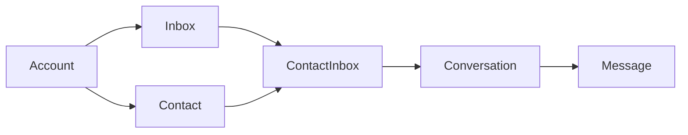
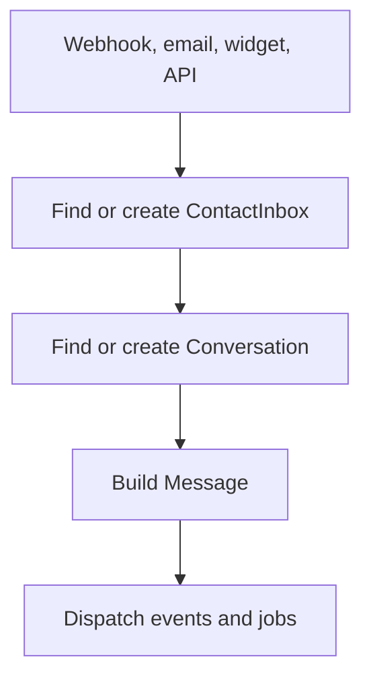
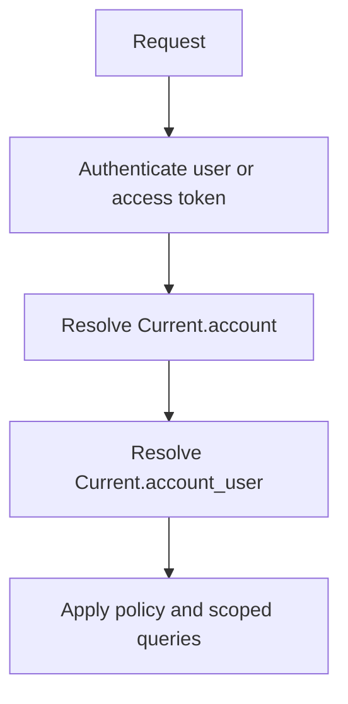
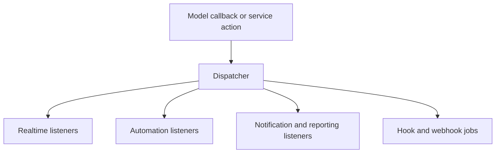

# Current Architecture

## Status

- document type: current state
- source of truth: code in `app/`, `enterprise/`, `config/`, and `db/`
- use this page before reading target architecture pages

## Current Product Shape

The current codebase is primarily:

- an account-scoped omnichannel support platform
- a Rails monolith with a Vue 3/Vite frontend split into dashboard, widget, portal, survey, and SDK entrypoints
- a shared communication core around `Account`, `Inbox`, `ContactInbox`, `Conversation`, and `Message`
- an inherited `enterprise/` technical split under `enterprise/`; in Onelink this is an implementation layer, not a separate product/paywall boundary, because enterprise capabilities are currently opened for the project
- a set of CRM-adjacent primitives such as `Contact`, `Company`, `Note`, `Label`, and `CustomAttributeDefinition`
- a native shared scheduling and kassa capability under `app/models/scheduling`, `app/services/scheduling`, and `app/javascript/dashboard/routes/dashboard/scheduling`
- an event-driven application with listeners, jobs, hooks, reporting, automations, and AI/Captain features around the conversation core

## Frontend Runtime

The implemented frontend shape today is:

- `Vue 3 + Vite` attached to the Rails monolith rather than a separate Nuxt-style app shell
- multiple entrypoints such as dashboard, widget, portal, survey, and SDK
- incremental frontend modernization with both `Vuex` and `Pinia` active in the dashboard
- a newer shared UI layer in `app/javascript/dashboard/components-next/`
- older shared UI layers and route-local composition still present across the dashboard
- a native scheduling dashboard module using `Pinia` stores, `dashboard/api/scheduling/*`, and `components-next/Scheduling/*`
- Tailwind preferred for new work, while SCSS and scoped styles remain in older surfaces
- `Histoire` and `Vitest` already available for component development and verification

Use [Frontend Implementation Guide](/platform/frontend-implementation) when the task is specifically about frontend structure, component sourcing, state management, or library choices.
Use [Backend Agent Playbook](/contributing-guide/backend-agent-playbook) when the task is a backend implementation task and the agent needs an execution workflow rather than only architecture context.
Use [Implementation Examples Map](/contributing-guide/implementation-examples-map) when the task needs concrete code references for an existing pattern.

## Repository Control Surfaces

Beyond runtime code, the working project currently includes:

- the main application repository under `onelink`
- the docs repository mounted as the `docs/` git submodule
- the local Codex skill library under `$CODEX_HOME/skills`

Use [Repository Map](/platform/repository-map) when the task depends on knowing which repo or directory should own the change.

## Core Runtime Graph

This is the main operational path in the repo today.

## Implemented Bounded Contexts

### Account And Access

Core records:

- `Account`
- `User`
- `AccountUser`
- `InboxMember`
- `Team`
- `TeamMember`
- `CustomRole` implemented in the inherited `enterprise/` tree

Key behavior:

- `Account` is the tenant boundary
- `User` is global
- `AccountUser` is the per-account identity
- inbox membership and policies drive most day-to-day visibility
- custom roles from the inherited `enterprise/` tree narrow conversation visibility further in active Onelink code paths

### Communication Core

Core records:

- `Inbox`
- `Channel::*`
- `Contact`
- `ContactInbox`
- `Conversation`
- `Message`
- `Attachment`

Key behavior:

- all inbound channels normalize into the same conversation model
- `Conversation` is the main operational aggregate
- `Message` creation fans out to replies, notifications, reporting, automations, and hooks

### Automation And Eventing

Core records and services:

- `AutomationRule`
- `Macro`
- `Webhook`
- `Integrations::Hook`
- dispatcher/listener pipeline

Key behavior:

- models emit domain events
- sync listeners handle realtime and immediate side effects
- async listeners and jobs handle automation, reporting, CSAT, and external hooks

### Help Center And Public Surfaces

Core records:

- `Portal`
- `Category`
- `Folder`
- `Article`

Key behavior:

- public knowledge base is a real implemented subsystem
- dashboard and public portal share this content model

### AI / Captain

Core records:

- `Captain::Assistant`
- `Captain::Document`
- `Captain::CustomTool`
- `Captain::Scenario`
- `CopilotThread`
- `CopilotMessage`

Key behavior:

- Captain is a real implemented subsystem
- it provides assistant, copilot, document, tool, and scenario flows
- it extends the support platform rather than replacing core entities

### CRM-Adjacent Layer

Implemented today:

- `Contact`
- `Company`
- `Note`
- `Label`
- `CustomAttributeDefinition`

Important limit:

- this is not yet a full shared CRM engine
- `Deal`, `Task`, `Pipeline`, `Stage`, and normalized `Activity` are not implemented as first-class runtime entities

### Scheduling And Kassa

Implemented today:

- `Scheduling::Resource`
- `Scheduling::Service`
- `Scheduling::Appointment`
- `Scheduling::WorkRule`
- `Scheduling::BreakRule`
- `Scheduling::Holiday`
- `Scheduling::WorkdayOverride`
- `Scheduling::TimeOff`
- `Scheduling::Payment`
- `Scheduling::Expense`
- native dashboard module under `app/javascript/dashboard/routes/dashboard/scheduling/`

Key behavior:

- scheduling is implemented as a shared platform capability, not a healthcare-only subsystem
- backend is account-scoped and reuses `Account`, `Contact`, `Company`, `Conversation`, and `User`
- dashboard surfaces already exist for calendar, resources, services, exceptions, and kassa
- finance behavior is native to the module and exposed through scheduling endpoints rather than an iframe app

## Primary Runtime Flows

### Inbound Message Flow

### Access Resolution Flow

### Event Fan-Out Flow

## Native Entities To Reuse First

When adding features, check these before introducing new models:

- `Account`
- `Contact`
- `Company`
- `Inbox`
- `Conversation`
- `Message`
- `Note`
- `Label`
- `CustomAttributeDefinition`
- `Team`
- `Macro`
- `AutomationRule`
- `Integrations::App`
- `Integrations::Hook`
- `Captain::*`
- `Scheduling::Resource`
- `Scheduling::Service`
- `Scheduling::Appointment`

## Not Implemented Yet

These appear in planning docs but should not be treated as existing runtime layers unless code is added:

- dedicated `generic`, `healthcare`, and `construction` runtime zones
- shared CRM entities such as `Deal`, `Task`, `Pipeline`, `Stage`, and normalized `Activity`
- a fully separated domain architecture beyond the current shared code plus inherited `enterprise/` technical split

## How To Use This Page

- use this page for current architecture questions
- use `frontend-implementation` for frontend stack, component sourcing, and implementation rules
- use `backend-agent-playbook` for backend execution workflow
- use `implementation-examples-map` for concrete code references
- use `implementation-roadmap` for delivery sequencing
- use `overview`, `crm-architecture`, and `domains/overview` for target direction
- if docs and code disagree, trust the code
