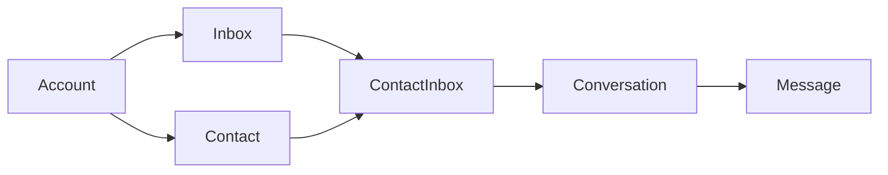
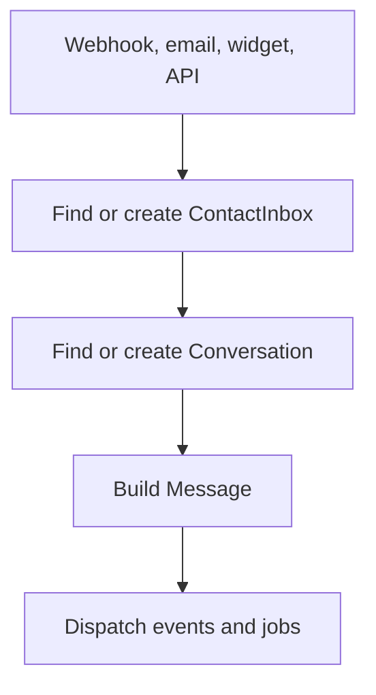
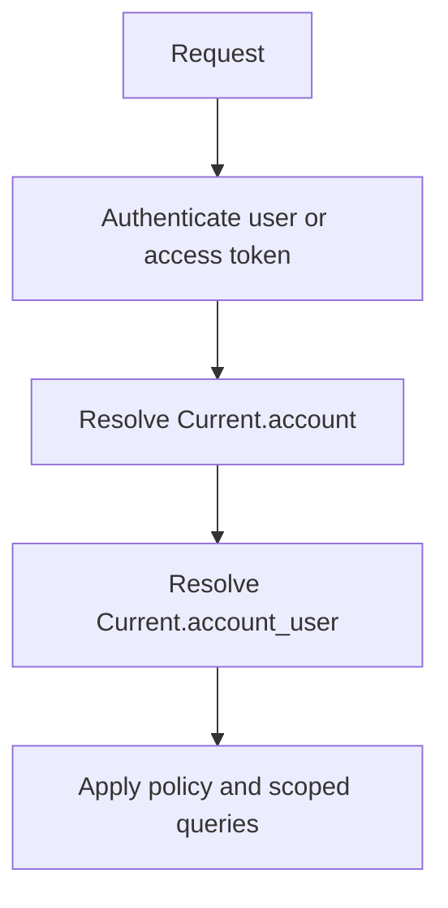
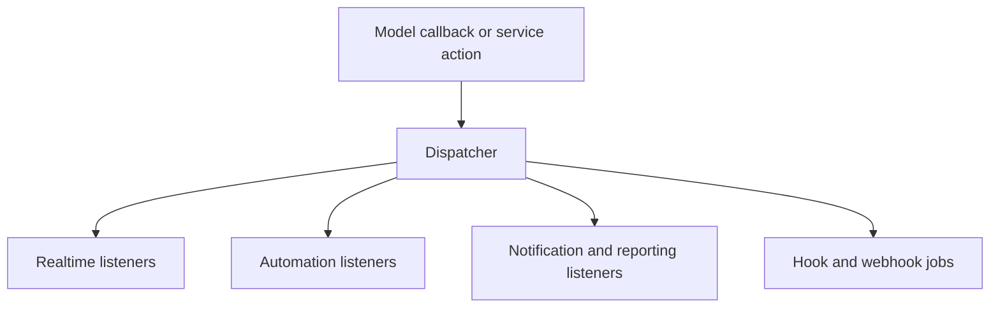

# Current Architecture

## Status

- document type: current state
- source of truth: code in `app/`, `enterprise/`, `config/`, and `db/`
- use this page before reading target architecture pages

## Current Product Shape

The current codebase is primarily:

- an account-scoped omnichannel support platform
- a Rails monolith with a Vue 3/Vite frontend split into dashboard, widget, portal, survey, and SDK entrypoints
- a shared communication core around `Account`, `Inbox`, `ContactInbox`, `Conversation`, and `Message`
- an inherited `enterprise/` technical split under `enterprise/`; in Onelink this is an implementation layer, not a separate product/paywall boundary, because enterprise capabilities are currently opened for the project
- a first-class, account-scoped CRM subsystem with deals, pipelines, stages, task catalogs, field definitions, events, and comments, built around shared records such as `Contact`, `Company`, `Note`, and `Label`
- account-scoped storage accounting and administrator cleanup workflows, with local call recording compression and retention
- a native shared scheduling and kassa capability under `app/models/scheduling`, `app/services/scheduling`, and `app/javascript/dashboard/routes/dashboard/scheduling`
- an event-driven application with listeners, jobs, hooks, reporting, automations, and AI/Captain features around the conversation core

## Frontend Runtime

The implemented frontend shape today is:

- `Vue 3 + Vite` attached to the Rails monolith rather than a separate Nuxt-style app shell
- multiple entrypoints such as dashboard, widget, portal, survey, and SDK
- incremental frontend modernization with both `Vuex` and `Pinia` active in the dashboard
- a newer shared UI layer in `app/javascript/dashboard/components-next/`
- older shared UI layers and route-local composition still present across the dashboard
- `VueUse` already active as the shared frontend utility layer through `@vueuse/core` and `@vueuse/components`
- a native scheduling dashboard module using `Pinia` stores, `dashboard/api/scheduling/*`, and `components-next/Scheduling/*`
- Tailwind preferred for new work, while SCSS and scoped styles remain in older surfaces
- `Histoire` and `Vitest` already available for component development and verification

Use [Frontend Implementation Guide](/platform/frontend-implementation) when the task is specifically about frontend structure, component sourcing, state management, or library choices.
Use [Account Storage And Recording Lifecycle](/platform/account-storage-and-audio), [Captain AI Runtime](/platform/captain-ai-runtime), and [Managed Account Trials](/platform/managed-trials) for the current operational behavior in those areas.
Use [Backend Agent Playbook](/contributing-guide/backend-agent-playbook) when the task is a backend implementation task and the agent needs an execution workflow rather than only architecture context.
Use [Implementation Examples Map](/contributing-guide/implementation-examples-map) when the task needs concrete code references for an existing pattern.

## Repository Control Surfaces

Beyond runtime code, the working project currently includes:

- the main application repository under `onelink`
- the docs repository mounted as the `docs/` git submodule
- shared OneLink Hermes skill definitions are loaded from the runtime skill directory outside the application repository; they are not versioned under `.codex/skills`
- the external `onelink-integrator` Claude Code bundle under `.claude/skills/onelink-integrator`

Use [Repository Map](/platform/repository-map) when the task depends on knowing which repo or directory should own the change.

## Core Runtime Graph

```mermaid
flowchart LR
    A[Account] --> B[Inbox]
    A --> C[Contact]
    B --> D[ContactInbox]
    C --> D
    D --> E[Conversation]
    E --> F[Message]
```

This is the main operational path in the repo today.

## Implemented Bounded Contexts

### Account And Access

Core records:

- `Account`
- `User`
- `AccountUser`
- `InboxMember`
- `Team`
- `TeamMember`
- `CustomRole` implemented in the inherited `enterprise/` tree

Key behavior:

- `Account` is the tenant boundary
- `User` is global
- `AccountUser` is the per-account identity
- inbox membership and policies drive most day-to-day visibility
- custom roles from the inherited `enterprise/` tree narrow conversation visibility further in active Onelink code paths

### Communication Core

Core records:

- `Inbox`
- `Channel::*`
- `Contact`
- `ContactInbox`
- `Conversation`
- `Message`
- `Attachment`

Key behavior:

- all inbound channels normalize into the same conversation model
- `Conversation` is the main operational aggregate
- `Message` creation fans out to replies, notifications, reporting, automations, and hooks

### Automation And Eventing

Core records and services:

- `AutomationRule`
- `Macro`
- `Webhook`
- `Integrations::Hook`
- dispatcher/listener pipeline

Key behavior:

- models emit domain events
- sync listeners handle realtime and immediate side effects
- async listeners and jobs handle automation, reporting, CSAT, and external hooks

### Help Center And Public Surfaces

Core records:

- `Portal`
- `Category`
- `Folder`
- `Article`

Key behavior:

- public knowledge base is a real implemented subsystem
- dashboard and public portal share this content model

### AI / Captain

Core records:

- `Captain::Assistant`
- `Captain::Document`
- `Captain::CustomTool`
- `Captain::Scenario`
- `CopilotThread`
- `CopilotMessage`

Key behavior:

- Captain provides assistant, copilot, document, tool, and scenario flows around the conversation core.
- Assistant configuration is per account and per assistant. The selected model is stored in the assistant config and validated against the supported assistant model catalog.
- The existing `external_agent` and `internal_assistant` modes use separate `agent` and `assistant` tool-access scopes. The mode is configuration on the current assistant model, not a new account role.
- Follow-up configuration supports a list of static-message or AI-objective steps and uses the native Reminder model for delivery. Outcome reason settings use the same assistant config.
- Model, tool, follow-up, and outcome reason changes share the existing account-scoped assistant update API. See [Captain AI Runtime](/platform/captain-ai-runtime) for the implemented fields and limits.

This describes current code and API behavior; it does not declare a separate internal-assistant activation workflow.

The assistant form keeps the existing `external_agent` and `internal_assistant` usage modes and groups controls for customer context, tools, and voice. `AssistantBasicSettingsForm.vue` and `AssistantUsageModeSelector.vue` present these existing settings; `toolAccessDefaults.js` supplies defaults for the supported usage modes. The headings are display groupings backed by `Captain::Assistant` configuration:

- Customer context: FAQ and memory settings use `feature_faq` and `feature_memory`.
- Tools: citations and web access use `feature_citation` and `feature_web`; `tool_access` keeps separate `agent` and `assistant` scopes for notes, web search and page reading, FAQ lookup, and human handoff.
- Voice: external-agent audio transcription uses `use_audio_transcriptions` when that capability is available.

Internal-assistant mode uses its existing `assistant` tool-access scope. The form hides external-agent-only customer-context, web, FAQ-lookup, handoff, and voice controls in that mode. These controls do not add Captain models or permission roles.

### CRM

Implemented today:

- `Contact`
- `Company`
- `Note`
- `Label`
- `CustomAttributeDefinition`

- `Crm::Deal`, `Crm::Pipeline`, and `Crm::Stage`
- `Crm::Task` and `Crm::TaskStatus`
- `Crm::FieldDefinition`, `Crm::Event`, and `Crm::Comment`

The CRM is a first-class, account-scoped subsystem, not only a layer adjacent to contacts and companies. The dashboard provides deal and task workspaces. Tasks have list, calendar, and due-date planning-board presentations. The board uses rolling local-time boundaries: overdue, today, tomorrow, through the start of the day eight days after today, through the same calendar date next month (clamped to that month's last day), later, and unscheduled. It hides completed and archived tasks. The list and calendar presentations remain available.

Pipeline settings support ordered stages, default-stage configuration, transition and closing reasons, and atomic stage-list updates. The current CRM reports screen is under Settings → Reports, with Activity as one section of the deal reporting page. Its component is `CRMActivityReports.vue`; it reads the report rows from `data.payload.rows`. See [CRM Architecture](/platform/crm-architecture) for report semantics, legacy data behavior, and the current API contract.

### Scheduling And Kassa

Implemented today:

- `Scheduling::Resource`
- `Scheduling::Service`
- `Scheduling::Appointment`
- `Scheduling::WorkRule`
- `Scheduling::BreakRule`
- `Scheduling::Holiday`
- `Scheduling::WorkdayOverride`
- `Scheduling::TimeOff`
- `Scheduling::Payment`
- `Scheduling::Expense`
- native dashboard module under `app/javascript/dashboard/routes/dashboard/scheduling/`

Key behavior:

- scheduling is implemented as a shared platform capability, not a healthcare-only subsystem
- backend is account-scoped and reuses `Account`, `Contact`, `Company`, `Conversation`, and `User`
- dashboard surfaces already exist for calendar, resources, services, exceptions, and kassa
- finance behavior is native to the module and exposed through scheduling endpoints rather than an iframe app

## Primary Runtime Flows

### Inbound Message Flow

```mermaid
flowchart TD
    A[Webhook, email, widget, API] --> B[Find or create ContactInbox]
    B --> C[Find or create Conversation]
    C --> D[Build Message]
    D --> E[Dispatch events and jobs]
```

### Access Resolution Flow

```mermaid
flowchart TD
    A[Request] --> B[Authenticate user or access token]
    B --> C[Resolve Current.account]
    C --> D[Resolve Current.account_user]
    D --> E[Apply policy and scoped queries]
```

### Event Fan-Out Flow

```mermaid
flowchart TD
    A[Model callback or service action] --> B[Dispatcher]
    B --> C[Realtime listeners]
    B --> D[Automation listeners]
    B --> E[Notification and reporting listeners]
    B --> F[Hook and webhook jobs]
```

## Native Entities To Reuse First

When adding features, check these before introducing new models:

- `Account`
- `Contact`
- `Company`
- `Inbox`
- `Conversation`
- `Message`
- `Note`
- `Label`
- `CustomAttributeDefinition`
- `Team`
- `Macro`
- `AutomationRule`
- `Integrations::App`
- `Integrations::Hook`
- `Captain::*`
- `Scheduling::Resource`
- `Scheduling::Service`
- `Scheduling::Appointment`
- `Crm::Deal`
- `Crm::Task`
- `Crm::TaskStatus`
- `Crm::Pipeline`
- `Crm::Stage`
- `Crm::FieldDefinition`
- `Crm::Event`
- `Crm::Comment`

## Not Implemented Yet

These appear in planning docs but should not be treated as existing runtime layers unless code is added:

- dedicated `generic`, `healthcare`, and `construction` runtime zones
- a normalized cross-entity `Activity` model that replaces or unifies the existing CRM task, event, comment, and scheduling records
- a fully separated domain architecture beyond the current shared code plus inherited `enterprise/` technical split

## How To Use This Page

- use this page for current architecture questions
- use `frontend-implementation` for frontend stack, component sourcing, and implementation rules
- use `backend-agent-playbook` for backend execution workflow
- use `implementation-examples-map` for concrete code references
- use `implementation-roadmap` for delivery sequencing
- use `overview`, `crm-architecture`, and `domains/overview` for target direction
- if docs and code disagree, trust the code
