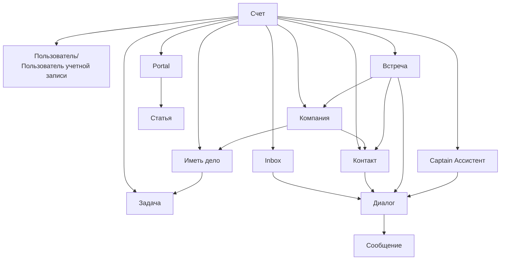

# Ключевые сущности

Все операционные объекты в One Link Cloud живут внутри общей account-модели.

Это позволяет связывать между собой:

- клиентов и компании
- диалоги и сообщения
- сделки и задачи
- записи и оплаты
- AI-контекст и базы знаний

One Link Cloud работает, поскольку все основные операционные объекты контролируются внутри одной общей модели workspace. Одна и та же запись клиента, разговора, контекста CRM, встречи и изменения AI могут работать вместе без дублирования между продуктами.

## Карта отношений сущностей

## Ссылка на сущность

| Сущность | Что это собой представляет | Подключено к |
| --- | --- | --- |
| `Account` | Workspace / арендатор | Все остальное в продукте |
| `User` + `AccountUser` | Человек-оператор внутри workspace | Команды, inbox-очереди, диалоги, сделки, задачи, встречи |
| `Team` | Оперативная группа | Пользователи, диалоги, сделки, задачи |
| `Inbox` | Канал или поворот | Контакты, беседы, задания, идеи |
| `Contact` | Запись клиента на уровне человека | Диалоги, сделки, встречи, заметки |
| `Company` | Запись клиентов на уровне организации | Контакты, Товары, встречи |
| `Conversation` | Нить связи | Inbox, контакты, сообщения, заметки, метки, Captain |
| `Message` | Единое коммуникационное мероприятие | Разговор |
| `Deal` | Коммерческая или конвейерная запись | Воронка, сцена, компания, контакты, задачи, беседа |
| `Task` | Следующий рабочий элемент | Статус, правопреемник, сделка, разговор |
| `Appointment` | Запланированное сервисное мероприятие | Ресурс, услуги, контакт, компания, разговор, платежи |
| `Captain::Assistant` | Настроен помощник AI | Документы, inbox-очереди, сценарии, ответы |
| `Captain::Document` | AI источник знаний | Ассистент |
| `Integrations::Hook` | Подключенная внешняя система | Аккаунт или inbox |
| `Portal` / `Article` | Знания portal и содержание | Аккаунт, категории, папки, статьи |

## Как читать модель

### Общение — это центр

Диалоги и сообщения — это живой оперативный поток. Они подключились к тому же контакту и контексту workspace, которые использовали CRM, планирование, автоматизацию и AI.

### CRM внедрить структурированный коммерческий контекст

Сделки и задачи относятся к одной и той же клиентской базе:

- передача через воронки и этапы
- задачи отслеживают выполнение и контролируют выполнение
- настраиваемые поля расширяют модель там, где это необходимо.

### Планирование включения контекста выполнение службы

Встречи связывают операции с реальными услугами:

- кто предоставляет услугу
- какая услуга заказана
- какому клиенту он принадлежит
- что заплатили

### Captain использует общее состояние

Captain является самым важным, поскольку он может использовать и те же операционные объекты вместо работы с изолированным текстом подсказки.

## Типичные случаи использования

### Единая временная шкала для клиентов

- показывает цепочку коммуникации
- контакт и компания указывают личность
- сделки, задачи и встречи включают в себя рабочее состояние

### Передача продаж с доставкой

- лид начинается в разговоре
- разрабатывает разработки и задачи команды
- тот же клиент позже включается в поток обслуживания

### Настраиваемые данные клиента

- стандартные поля остаются первоклассными
- переменные требования, специфичные для клиента, обрабатываются с помощью настраиваемых полей и полей определений.
