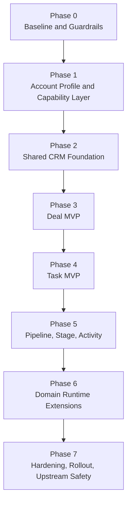

# Implementation Roadmap

## Status

- document type: implementation plan
- source of truth for current baseline: code plus `/platform/current-architecture`
- source of truth for delivery order: this page
- use this page when the question is "what should we build next, in what order, and under which constraints?"

## Goal

Evolve Onelink from the current account-scoped omnichannel support platform into a shared CRM and domain-aware platform without breaking the existing conversation engine, integrations, help center, Captain, or inherited `enterprise/` code paths that remain active in the product.

## Current Baseline

The codebase already has:

- `Account` as the workspace and data-isolation boundary
- `Inbox`, `ContactInbox`, `Conversation`, and `Message` as the communication core
- `Contact`, `Company`, `Note`, `Label`, and `CustomAttributeDefinition` as CRM-adjacent primitives
- event-driven automation, hooks, notifications, reporting, and Captain/AI around the conversation model
- an inherited `enterprise/` mechanism under `enterprise/`; in Onelink this is a technical split with enterprise capabilities currently opened for the project

The codebase does not yet have:

- shared CRM entities such as `Deal`, `Task`, `Pipeline`, `Stage`, or normalized `Activity`
- mature runtime domain zones for `generic`, `healthcare`, and `construction`
- a delivery sequence that turns the current architecture direction into an implementation plan

## Delivery Principles

- protect the current support engine first
- reuse native entities before introducing new ones
- keep implementation additive and backward compatible by default
- put shared logic in shared platform code before creating domain-specific runtime layers
- treat account-level domain/profile configuration as earlier and cheaper than hard runtime splits
- keep `Deal` and `Task` separate when CRM entities are introduced
- use feature flags, account settings, and gradual rollout for every new CRM surface
- treat `enterprise/` as a technical extension mechanism, not the conceptual home of new domain architecture or a product/paywall boundary for Onelink

## Cross-Cutting Frontend Delivery Rules

Frontend delivery should follow these constraints across all phases:

- keep `Rails + Vue 3 + Vite` as the application shell for dashboard work
- use `app/javascript/dashboard/components-next/` as the preferred shared UI layer for new reusable dashboard components
- default new feature state to `Pinia`, bridging to existing `Vuex` only where needed
- source component ideas in this order:
  1. existing `components-next` components and stories
  2. similar route screens already implemented in `onelink`
  3. `reka-ui` for headless accessible primitives
  4. `shadcn-vue` for recipes and component patterns
  5. `Inspira UI` for visual inspiration only
- wrap third-party primitives in local components instead of letting external libraries become the public UI API of the app
- use `Histoire` for reusable components and `Vitest` for targeted frontend verification

For the detailed frontend implementation policy, use [Frontend Implementation Guide](/platform/frontend-implementation).
For the step-by-step execution workflow, use [Frontend Agent Playbook](/contributing-guide/frontend-agent-playbook).
For package adoption decisions, use [Frontend Dependency Policy](/contributing-guide/frontend-dependency-policy).
For the default module shape, use [Dashboard Feature Template](/contributing-guide/dashboard-feature-template).
For concrete reference implementations, use [Implementation Examples Map](/contributing-guide/implementation-examples-map).
For verification depth, use [Testing Strategy For Agents](/contributing-guide/testing-strategy-for-agents).

## Non-Goals

This roadmap does not recommend:

- replacing `Conversation` with a domain-specific communication model
- creating separate CRM stacks for healthcare and construction
- creating parallel person or organization entities before exhausting `Contact` and `Company`
- moving every feature into a new domain namespace before the shared entity model is stable

## Phase Map

## Phase 0: Baseline And Guardrails

### Objective

Make the current system explicit enough that future CRM and domain work does not fork from false assumptions.

### Scope

- lock down the current architecture, current entity model, and implementation order in docs
- ensure agent-facing instructions distinguish `current state` from `target direction`
- formalize the reuse order for native entities and extension points

### Primary Surfaces

- `AGENTS.md`
- `docs/platform/current-architecture.mdx`
- `docs/platform/overview.mdx`
- `docs/platform/decision-matrix.mdx`
- `docs/contributing-guide/domain-access-architecture.md`
- `~/.codex/skills/onelink-builder/SKILL.md`

### Exit Criteria

- humans and agents can answer "what exists now?" from one current-state page
- humans and agents can answer "what should we build next?" from one roadmap page
- planning docs no longer imply that runtime domain zones or full CRM entities already exist

## Phase 1: Account Profile And Capability Layer

### Objective

Introduce a minimal runtime mechanism for profile-aware behavior without prematurely splitting the product into hard domain zones.

### Why This Comes First

You need an account-level configuration surface before building domain-aware CRM or UI behavior. Without it, every later phase risks baking implicit assumptions into shared code.

### Scope

- define account-level profile or capability configuration
- expose that configuration consistently to backend policies, serializers, and frontend boot payloads
- keep the first version intentionally thin: configuration first, runtime zone second

### Recommended Implementation

Backend:

- use `Account` settings or a dedicated lightweight account-level field/config entry as the source of profile selection
- keep the representation explicit, for example `generic`, `healthcare`, `construction`
- centralize profile resolution behind a service or concern instead of scattering string checks

API:

- expose the resolved profile and capabilities in account/bootstrap payloads
- keep contracts backward compatible for clients that do not care about profile data

Frontend:

- add account settings UI or a super-admin/account bootstrap surface to inspect profile selection
- gate profile-aware screens and behaviors via capability checks, not hardcoded route forks

### Likely Code Areas

- [account.rb](/Users/akhanbakhitov/Documents/zeroprompt/onelink/app/models/account.rb)
- account serializers and bootstrap endpoints under `app/controllers/api/v1/accounts`
- dashboard boot/init stores in `app/javascript/dashboard`

### Risks

- turning profile selection into hard licensing logic
- encoding domain-specific validations directly into shared models too early
- exposing profile flags to frontend without a backend capability contract

### Verification

- targeted model/service specs for account profile resolution
- targeted controller/request specs for account payload changes
- frontend smoke checks for boot payload consumption

### Exit Criteria

- one clear account-level profile/capability source exists
- shared code can ask for capabilities without knowing specific vertical internals
- no runtime domain zone fork is required yet

## Phase 2: Shared CRM Foundation

### Objective

Stabilize the shared person, organization, classification, note, and variability layer before introducing `Deal` and `Task`.

### Why This Comes Before New CRM Entities

If `Contact`, `Company`, notes, labels, and custom attributes are not stable, every later CRM entity will duplicate missing foundations.

### Scope

- formalize `Company` as the default organization-level axis for B2B and domain-aware workflows
- improve shared access, search, filtering, and UI consistency around `Contact` and `Company`
- decide whether `Company` needs parity features such as custom attributes, notes, labels, or ownership before CRM entities arrive
- keep everything native-first and additive

### Recommended Implementation

Data model:

- keep `Contact` at person level
- keep `Company` at organization level
- keep `contact.company_id` as the default relationship for organization-centric workflows
- extend via custom attributes only where state is genuinely variable

API and policies:

- make company access, listing, filtering, and mutation rules explicit and consistent
- avoid hidden inherited-`enterprise/` assumptions if `Company` is intended as a shared primitive

Frontend:

- strengthen `Contact` and `Company` discovery, linking, and context views
- surface company context where it materially improves routing or operator understanding

### Likely Code Areas

- [contact.rb](/Users/akhanbakhitov/Documents/zeroprompt/onelink/app/models/contact.rb)
- [company.rb](/Users/akhanbakhitov/Documents/zeroprompt/onelink/enterprise/app/models/company.rb)
- [contact.rb](/Users/akhanbakhitov/Documents/zeroprompt/onelink/enterprise/app/models/enterprise/concerns/contact.rb)
- company/contact API controllers and dashboard components

### Risks

- treating `Company` as shared in docs but leaving it trapped in inherited `enterprise/`-only contracts
- overusing custom attributes for state that should become first-class once CRM entities exist
- adding parallel organization semantics for domain-specific cases

### Verification

- model specs for company association and search
- controller/request specs for company CRUD and relation surfaces
- dashboard verification for contact-company linking flows

### Exit Criteria

- `Contact` and `Company` are stable enough to support CRM entities
- company-aware workflows do not require parallel organization models
- permissions and UI behavior are explicit rather than accidental

## Phase 3: Deal MVP

### Objective

Introduce the first true shared CRM entity with the smallest coherent lifecycle.

### Scope

- add `Deal` as a first-class shared entity
- start without full pipeline complexity if simple state is enough for MVP
- anchor deals to existing shared entities instead of inventing a parallel customer graph

### Recommended MVP Shape

Core fields:

- `account_id`
- `company_id` optional but preferred for organization-centric workflows
- `contact_id` optional when the deal is person-centric
- `title`
- `status` such as `open`, `won`, `lost`
- `owner_id` or assignee
- `amount` and `currency` if needed for shared reporting
- `custom_attributes`

Relationships:

- belongs to `Account`
- optionally belongs to `Company`
- optionally belongs to `Contact`
- optionally references the originating `Conversation`

### Implementation Rules

- keep `Deal` separate from `Task`
- do not hide primary lifecycle state in labels
- keep the first workflow small enough to ship and verify

### Likely Code Areas

- new model/controller/policy/service files under `app/models`, `app/controllers/api/v1/accounts`, and `app/policies`
- dashboard list/detail forms under `app/javascript/dashboard`
- serializer and search/reporting surfaces as needed

### Risks

- building pipelines before the basic deal lifecycle is proven
- coupling deal creation too tightly to one domain
- forcing conversation assignment rules to act as deal ownership rules

### Verification

- model specs for lifecycle, relationships, and validations
- request/controller specs for CRUD, filtering, and permissions
- dashboard smoke coverage for create/edit/list flows
- swagger updates for any public API surface

### Exit Criteria

- `Deal` exists as a stable shared entity
- `Deal` works for generic accounts without domain-specific code
- `Deal` can be linked to existing customer and conversation context

## Phase 4: Task MVP

### Objective

Introduce actionable follow-up work as a separate shared entity rather than overloading `Deal`.

### Scope

- add `Task` as a first-class shared entity
- support linking tasks to shared customer and CRM context
- keep task lifecycle independent from deal lifecycle

### Recommended MVP Shape

Core fields:

- `account_id`
- `title`
- `status`
- `due_at`
- `assignee_id`
- `team_id` optional
- polymorphic or explicit links to `Contact`, `Company`, `Deal`, and possibly `Conversation`

### Implementation Rules

- `Task` must not be encoded as a deal subtype
- task completion and deal progression should remain separate state machines
- reuse existing notifications, mentions, and assignment patterns where sensible

### Likely Code Areas

- future `task` models/controllers/policies/services
- dashboard task surfaces
- notifications/jobs if due-date or assignment reminders are added

### Risks

- task links becoming too generic to enforce useful UX or reporting
- duplicating assignment semantics instead of reusing proven patterns

### Verification

- model/service/controller specs
- reminder/job specs if async behavior is introduced
- dashboard list/detail verification

### Exit Criteria

- `Task` exists independently from `Deal`
- follow-up work no longer needs ad hoc notes or labels when structured action is required

## Phase 5: Pipeline, Stage, And Activity Layer

### Objective

Add richer workflow structure only after `Deal` and `Task` have proven their core shape.

### Scope

- introduce `Pipeline` and `Stage` for `Deal`
- introduce a normalized `Activity` or timeline layer where the current event/timeline model becomes insufficient
- extend reporting, search, and permissions around the new CRM entities

### Recommended Implementation Order

1. `Pipeline`
2. `Stage`
3. stage transitions and reporting
4. normalized activity/timeline model only if existing reporting/events are insufficient

### Design Rules

- pipeline and stage are shared platform concepts, not domain-only concepts
- use activities to normalize meaningful business events, not every low-level callback
- reuse existing dispatcher/listener architecture where possible

### Likely Code Areas

- future pipeline/stage/activity models and services
- reporting listeners and query services
- dashboard CRM workflow screens

### Risks

- introducing activity too early and duplicating current event/reporting data
- overfitting pipeline semantics to one sales or domain workflow

### Verification

- model/service specs for stage transitions
- reporting/query tests
- dashboard workflow tests and smoke checks

### Exit Criteria

- deals can move through a stable shared workflow
- reporting and timeline behavior are coherent across CRM surfaces

## Phase 6: Domain Runtime Extensions

### Objective

Introduce true domain-aware runtime behavior only after shared entities and shared workflow semantics are stable.

### Scope

- add domain-specific field packs, screens, validations, reports, and workflows
- keep shared entities shared
- isolate domain code behind explicit profile/capability checks and extension points

### Recommended Approach

Shared platform keeps:

- `Account`
- `Contact`
- `Company`
- `Conversation`
- `Deal`
- `Task`
- `Pipeline`
- `Stage`
- shared permissions, search, reporting, and integration mechanics

Domain layer adds:

- healthcare-specific forms, validations, reports, and workflows
- construction-specific forms, validations, reports, and workflows
- domain-aware Captain documents, tools, prompts, and scenarios

### Design Rules

- do not create `Patient`, `Buyer`, `Clinic`, or `DeveloperCompany` as new core entities by default
- add domain-specific models only when shared entities stop being semantically correct
- use services, policies, UI composition, and capability registries before introducing deep runtime branching

### Risks

- premature domain namespaces that duplicate the shared platform
- domain-specific columns leaking into shared tables without stability proof

### Verification

- profile-aware backend tests
- per-profile UI smoke tests
- capability-based access checks

### Exit Criteria

- domain-specific behavior exists without replacing the shared entity graph
- generic accounts still work without healthcare/construction assumptions

## Phase 7: Hardening, Rollout, And Upstream Safety

### Objective

Ship the new platform capabilities safely while keeping the fork maintainable.

### Scope

- add feature flags and per-account rollout controls for each new CRM layer
- preserve `app/` and `enterprise/` request/response compatibility where the inherited split still exists
- keep upstream merge risk bounded by isolating new platform logic

### Rollout Strategy

- phase-gate each new CRM entity behind account-level capabilities or feature flags
- prefer additive migrations and nullable rollout columns first
- avoid destructive data rewrites during initial launches
- support mixed-state accounts during rollout

### Upstream Safety Rules

- prefer new services, concerns, policies, and routes over invasive patches to Chatwoot-like core
- always search `app/` and `enterprise/` together before changing shared behavior
- keep inherited `enterprise/` split compatibility via `prepend_mod_with` and `include_mod_with` where appropriate

### Verification

- narrow RSpec targets for touched backend surfaces
- targeted frontend lint/tests for touched screens
- swagger rebuild for API changes
- manual smoke checks in dev-lite

### Exit Criteria

- new CRM capabilities can be enabled incrementally
- rollback paths are operationally simple
- upstream sync risk remains acceptable

## Cross-Phase Guardrails

Use these rules in every phase:

- if `Account`, `Contact`, `Company`, `Conversation`, `Note`, `Label`, `Team`, `Macro`, `AutomationRule`, `Integrations::App`, `Integrations::Hook`, or `Captain` already fit, reuse them first
- if a requirement is single-tenant, prefer configuration before new shared code
- if a requirement is single-domain but still semantically compatible with shared entities, prefer domain services and UI composition
- if a capability is needed by multiple domains, promote it into shared platform code
- if docs and code disagree, trust the code and update docs
- if a delivery contains reusable base work plus an optional feature, ship it as stacked branches so the base can merge and roll out independently

## Verification Matrix

Use the narrowest useful checks for the touched phase.

Backend model/service work:

- `eval "$(rbenv init -)"`
- `bundle exec rspec spec/models/... spec/services/...`

API work:

- targeted request/controller specs
- swagger updates under `swagger/`

Frontend work:

- `pnpm eslint`
- targeted `pnpm test` coverage where the surface already has tests

Async/event-driven work:

- model/job/listener specs
- manual smoke checks with Sidekiq only when the feature truly depends on it

## What To Build Next

If the goal is "start implementation now", the next practical sequence is:

1. finish Phase 1 account profile/capability plumbing
2. stabilize Phase 2 shared CRM foundation around `Company` and related access/UI contracts
3. ship Phase 3 `Deal` MVP
4. ship Phase 4 `Task` MVP
5. add Phase 5 workflow depth only after `Deal` and `Task` prove their shape
