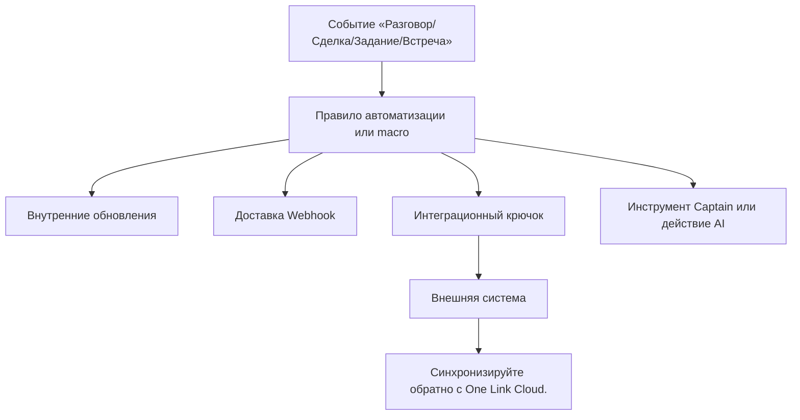

# Автоматизации и интеграции

One Link Cloud использует единый event-driven слой для коммуникаций, CRM, расписания и AI.

Основные строительные блоки:

- `AutomationRule`
- `Macro`
- `Integrations::App`
- `Integrations::Hook`
- `Webhook`
- `Captain::CustomTool`

One Link Cloud обеспечивает один общий уровень автоматизации и управления для всего продукта. Связь, CRM, планирование и AI используют одну и ту же модель event-driven.

## Основные строительные блоки

| Сущность | Роль |
| --- | --- |
| `AutomationRule` | Логика, управляемая событиями, для изменений записей и триггеров рабочего процесса |
| `Macro` | Многоразовые действия оператора |
| `Integrations::App` | Запись в каталоге экспертов |
| `Integrations::Hook` | Подключенный институт предприятий |
| `Webhook` | Исходящие события доставки |
| `Captain::CustomTool` | Вызываемая обработка поверхности для технологических процессов AI |

## выполнение Модель

## Логика проведения

Отделение изделия определяет определение параметров от установленного соединения:

### `Integrations::App`

Это описание на уровне каталога:

- идентификатор предпринимателя
- отображать метаданные
- обязательные поля
- действие соединения
- требования к функциям

### `Integrations::Hook`

Это настоящий подключенный экземпляр:

- принадлежит аккаунту или inbox
- сохранить настройки соединения
- хранит токены или идентификаторы ссылок
- запускает переменный ток, синхронизацию или обратный вызов.

## Практические шаблоны

### Workspace Интеграция уровней

Используется, когда любая учетная запись использует одну и ту же систему, например:

- Синхронизация CRM
- управление проектом
- документация
- инструменты внутренние для совместной работы

### Inbox Интеграция уровней

Используется, когда одной рабочей очереди требуется выделенное внешнее соединение.

### Автоматизация на базе Webhook

Используется, когда ответные системы должны реагировать на события продукта в режиме реального времени.

### Ярлыки операторов на основе Macro

Используется, когда командам нужны повторяющиеся действия, инициируемые человеком, а не фоновая автоматизация.

## Типичные случаи использования

### Внешняя синхронизация CRM или ERP

- события из разговоров, сделок или задач запускают синхронизацию.
- внешние идентификаторы и ссылки сохраняются в пределах учетной записи.

### Оперативные сообщения и уведомления

- перехватчики подключают системы обмена сообщениями или совместную работу
- получать обновления там, где они уже работают

### Синхронизация расписания

- подключенные системы могут создавать или обновлять планирование данных.
- встреча идентична той же части workspace и контекста клиента.

### AI-Вызываемые операции

- Инструменты Captain вызывают внутренние или внешние действия.
- AI соответствует контролируемой конфигурации на уровне учетной записи.

## Принцип проектирования

One Link Cloud следует адаптировать уровни конфигурации и подключения, а не путем создания отдельных интеграционных архитектур для разных типов клиентов.
