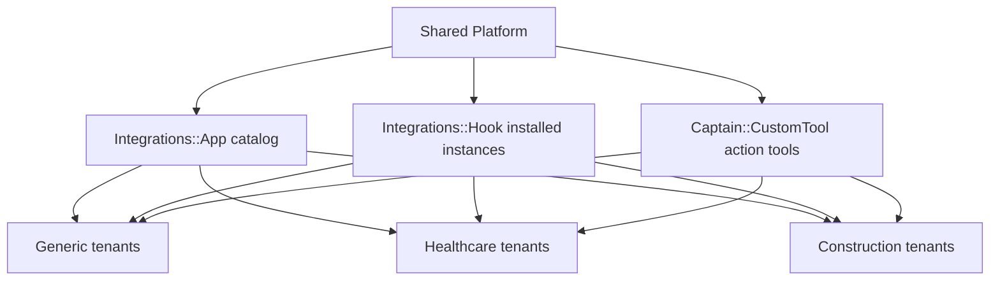

# Integrations Architecture

## Status

- document type: current model plus extension guidance
- source of truth for the implemented model: code
- use this page as a rule for deciding between integration surfaces, not as proof that every domain-specific integration already exists

In Onelink, integrations should be treated as a shared platform capability with domain-aware configuration, not as a separate architecture per vertical.

## The Native Model In This Repo

There are two main integration concepts already present in the codebase.

### `Integrations::App`

`Integrations::App` is the app catalog and capability descriptor.

It defines things like:

- integration id
- display metadata
- connection action URL
- fields
- feature flag requirements
- hook type
- settings schema

Use it as the catalog entry or integration definition layer.

### `Integrations::Hook`

`Integrations::Hook` is the installed integration instance.

It belongs to an `Account` and can optionally belong to an `Inbox`.

Use it as the connected integration layer:

- account-level connection
- inbox-level connection
- stored settings
- access token / reference id
- post-install setup behavior

## Architectural Fit

## How This Fits With Domain Zones

Integrations belong to the shared platform layer because the mechanics are common:

- connection lifecycle
- auth
- settings validation
- account/inbox scoping
- UI installation flow

The domain-specific part should usually be:

- which integrations are relevant
- which settings are required
- what workflows consume the integration
- which Captain tools or automations use the external system

So the rule is:

- integration framework = shared
- integration usage = domain-aware

## Practical Distinction

Use `Integrations::App` and `Integrations::Hook` when:

- you are connecting an external system to the product
- the system has install/auth/config lifecycle
- the connection belongs to account or inbox
- the integration should appear in the integrations UI

Use `Captain::CustomTool` when:

- the external action is primarily an AI tool callable by Captain
- you need an account-scoped HTTP action surface
- the tool is part of assistant behavior rather than a full product integration lifecycle

## Domain Examples

### Generic

- Slack
- Linear
- Shopify
- Notion
- generic CRM/ERP integrations

### Healthcare

- medical scheduling systems
- insurer lookup systems
- clinic knowledge systems
- domain-safe Captain tools for lookup or triage support

### Construction

- project calculators
- estimate systems
- ERP or procurement systems
- domain-safe Captain tools for project or estimate lookup

## Design Rule

Do not build a separate integration architecture for healthcare or construction.

Instead:

- reuse the shared integration framework
- add domain-specific manifests, workflows, settings presets, and tool usage
- introduce a new shared integration only when more than one domain needs the same mechanics

## Recommended Decision Pattern

1. If the need is a standard external app connection, start with `Integrations::App` + `Integrations::Hook`.
2. If the need is an AI-callable external action, start with `Captain::CustomTool`.
3. If the need is domain-specific but the mechanics are still generic, keep the infrastructure shared and move only the configuration into the domain zone.
4. Only add a new domain-specific integration model if the shared installation and hook model is no longer correct.
