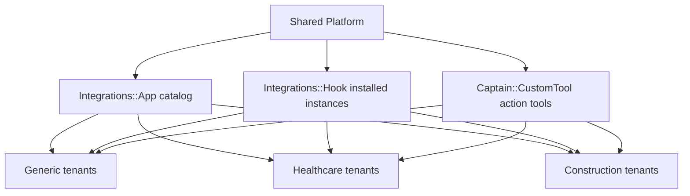

# Integrations Architecture

## Status

- document type: current model plus extension guidance
- source of truth for the implemented model: code
- use this page as a rule for deciding between integration surfaces, not as proof that every domain-specific integration already exists

In Onelink, integrations should be treated as a shared platform capability with domain-aware configuration, not as a separate architecture per vertical.

## The Native Model In This Repo

There are two main integration concepts already present in the codebase.

### `Integrations::App`

`Integrations::App` is the app catalog and capability descriptor.

It defines things like:

- integration id
- display metadata
- connection action URL
- fields
- feature flag requirements
- hook type
- settings schema

Use it as the catalog entry or integration definition layer.

### `Integrations::Hook`

`Integrations::Hook` is the installed integration instance.

It belongs to an `Account` and can optionally belong to an `Inbox`.

Use it as the connected integration layer:

- account-level connection
- inbox-level connection
- stored settings
- access token / reference id
- post-install setup behavior

## Architectural Fit

```mermaid
flowchart TD
    A[Shared Platform] --> B[Integrations::App catalog]
    A --> C[Integrations::Hook installed instances]
    A --> D[Captain::CustomTool action tools]

    B --> E[Generic tenants]
    B --> F[Healthcare tenants]
    B --> G[Construction tenants]

    C --> E
    C --> F
    C --> G

    D --> E
    D --> F
    D --> G
```

## How This Fits With Domain Zones

Integrations belong to the shared platform layer because the mechanics are common:

- connection lifecycle
- auth
- settings validation
- account/inbox scoping
- UI installation flow

The domain-specific part should usually be:

- which integrations are relevant
- which settings are required
- what workflows consume the integration
- which Captain tools or automations use the external system

So the rule is:

- integration framework = shared
- integration usage = domain-aware

## Practical Distinction

Use `Integrations::App` and `Integrations::Hook` when:

- you are connecting an external system to the product
- the system has install/auth/config lifecycle
- the connection belongs to account or inbox
- the integration should appear in the integrations UI

Use `Captain::CustomTool` when:

- the external action is primarily an AI tool callable by Captain
- you need an account-scoped HTTP action surface
- the tool is part of assistant behavior rather than a full product integration lifecycle

## Domain Examples

### Generic

- Slack
- Linear
- Shopify
- Notion
- generic CRM/ERP integrations

### Healthcare

- medical scheduling systems
- insurer lookup systems
- clinic knowledge systems
- domain-safe Captain tools for lookup or triage support

### Construction

- project calculators
- estimate systems
- ERP or procurement systems
- domain-safe Captain tools for project or estimate lookup

## Design Rule

Do not build a separate integration architecture for healthcare or construction.

Instead:

- reuse the shared integration framework
- add domain-specific manifests, workflows, settings presets, and tool usage
- introduce a new shared integration only when more than one domain needs the same mechanics

## Recommended Decision Pattern

1. If the need is a standard external app connection, start with `Integrations::App` + `Integrations::Hook`.
2. If the need is an AI-callable external action, start with `Captain::CustomTool`.
3. If the need is domain-specific but the mechanics are still generic, keep the infrastructure shared and move only the configuration into the domain zone.
4. Only add a new domain-specific integration model if the shared installation and hook model is no longer correct.

## WhatsApp Cloud Usage Reporting

The prepared monthly usage response adds `category_breakdown` alongside the existing totals and estimate. It returns rows in this fixed order: `service`, `utility`, `marketing`, `authentication`, `authentication-international`, `referral_conversion`, and `unknown`. Every deduplicated delivery contributes to one row; each row reports `delivered_count`, `chargeable_count`, `free_count`, and `unknown_billable_count`. The rows sum to the overall delivered count. Meta's actual `pricing.billable` value is authoritative: `true` is chargeable, `false` is free, and a missing or invalid value is unknown. Missing or unrecognized categories map to `unknown`.

Reporting combines the delivery ledger with eligible message history and deduplicates by canonical business phone number and provider message ID. A ledger delivery timestamp determines its UTC reporting month. When a legacy outgoing or template message created during the current UTC month is already confirmed as delivered or read but has no exact delivery timestamp, it may be counted for that month with coverage marked incomplete. Never infer or store an exact delivery time from a message's creation or update time. In coexistence, messages sent from the WhatsApp Business app and supported linked WhatsApp Web remain free and are excluded from OneLink Cloud API counts and estimates.

The reporting window is the UTC calendar month. The observed free-service count includes only deliveries with `pricing.category=service`, `pricing.type=free_customer_service`, and `pricing.billable=false`; the allowance is 1,000 per connected business phone. `free_entry_point` is not included. Meta's allowance period follows the WhatsApp Business Account timezone, so the UTC observation cannot establish the exact remaining Meta quota. The estimate follows Meta's billability flag and does not subtract the free-service allowance a second time.

The estimate uses the versioned Meta USD base-rate catalog effective 1 October 2026, selected by recipient market and category, and converts billable deliveries with an immutable NBK USD/KZT snapshot requested for the first day of the same UTC month. Template deliveries use their Meta category rates; there is no flat KZT 8 template rate. The estimate excludes volume discounts, taxes, and provider markup, and is not an invoice total. Missing rate, recipient market, category, or exchange-rate data leaves the affected amount unavailable or incomplete rather than zero; do not extrapolate rates beyond their effective period.

This describes the prepared implementation; availability is determined by the deployed application revision.
