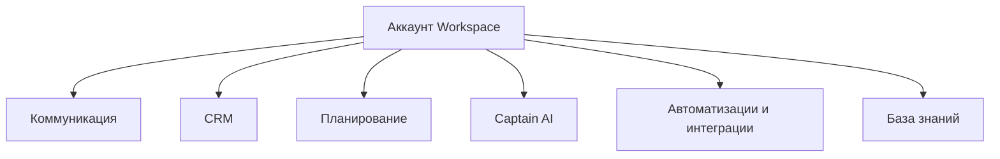

# Обзор One Link Cloud

One Link Cloud — это единая операционная платформа, а не набор отдельных отраслевых продуктов.

Персонализация для клиента строится внутри общего ядра через:

- права доступа
- кастомные поля
- автоматизации
- интеграции
- настройки Captain AI

One Link Cloud — это одна общая операционная платформа. Она не делится на отдельные отраслевые продукты; один и тот же продукт настраивается под клиента через доступы, кастомные поля, автоматизации, интеграции и конфигурацию AI.

## Основные уровни возможностей

## Что включено

### Коммуникация

- inbox-очереди и каналы
- контакты и диалоги
- сообщения, заметки, метки и назначения

### CRM

- контакты и компании
- воронки и этапы
- сделки и задачи
- гибкие определения полей

### Планирование

- ресурсы и услуги
- встречи календаря
- платежи, расходы и касса

### Captain AI

- помощники
- документы
- сценарии
- пользовательские инструменты
- copilot-потоки

### Автоматизации и интеграции

- правила автоматизации
- macros
- webhooks
- интеграция на уровне аккаунта и inbox

### База знаний

- portals
- категории
- папки
- статьи

## Как работает продукт

1. Вся работа начинается внутри workspace.
2. Взаимодействие с клиентами осуществляется на платформе через inbox-очереди и каналы.
3. В одном и том же workspace обслуживают клиента, компанию CRM, расписание и контекст AI.
4. Автоматизации и интеграции реагируют на общие события, а не на изолированные подсистемы.
5. Команды адаптируют один и тот же продукт к своему процессу, не определяя уровень выполнения для каждой отрасли.

## Персонализация без разветвления продукта

Адаптация к потребностям клиента должна происходить следующим образом:

- роли, команды и доступ inbox
- настройки workspace
- метки и заметки
- пользовательские атрибуты для контактов и разговоров
- определение управляемых полей для сделок, задач и встреч
- правила автоматизации и macros
- integrations и hooks
- Captain assistants, scenarios и tools

## Примеры рабочих моделей

| Сценарий | Как One Link Cloud адаптируется |
| --- | --- |
| Поддержка организации | Inbox-очереди, команда, SLA, автоматизация, база знаний |
| Продажи workspace | Воронки, этапы, сделки, задачи, настраиваемые поля, подсказки Captain |
| Сервисный бизнес | Планирование, ресурсы, встречи, платежи, отслеживание разговоров |
| Многопрофильная компания | Один workspace с несколькими командами, inbox-очередями, стандартными маршрутами и интеграциями. |

## Путь чтения

- [Ключевые сущности](/platform/entity-matrix)
- [Рабочее пространство и доступ](/platform/workspace-and-access)
- [Коммуникационные процессы](/platform/communication-workflows)
- [CRM и гибкая структура данных](/platform/crm-architecture)
- [Расписание и оплаты](/platform/scheduling-and-payments)
- [Captain AI](/platform/captain-ai)
- [Автоматизации и интеграции](/platform/integrations-architecture)
