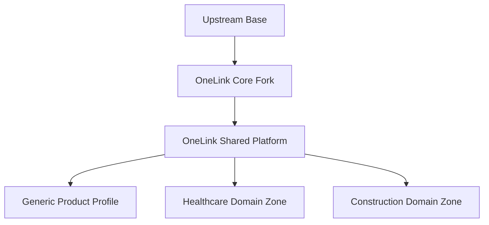

# OneLink Platform Overview

## Status

- document type: mixed overview
- source of truth for current implementation: code plus `/platform/current-architecture`
- source of truth for target direction: this page plus the linked planning docs

## Current Implemented System

Today, OneLink is primarily:

- a Rails monolith with Vue 3/Vite frontend surfaces inherited from the upstream base platform
- an account-scoped omnichannel support platform
- a system organized around `Account`, `Inbox`, `ContactInbox`, `Conversation`, and `Message`
- a product with CRM-adjacent primitives such as `Contact`, `Company`, `Note`, `Label`, and `CustomAttributeDefinition`
- an event-driven application with an inherited `enterprise/` technical split, active Captain/AI, automations, integrations, and help center; for OneLink this split is technical rather than a separate product tier

Read [Current Architecture](/platform/current-architecture) first when the question is "what exists in code now?"
Read [Repository Map](/platform/repository-map) when the question is "where does that surface live in the repos?"

## Target Direction

OneLink is intended to evolve from an upstream fork into a product platform with:

- a shared communication and CRM foundation
- white-label and product-specific capabilities
- isolated domain zones such as healthcare and construction
- controlled compatibility with the upstream base

## Target Layers

## Layer Responsibilities

### Upstream / Core

- keep compatibility with the upstream base where practical
- absorb upstream fixes and product updates
- avoid unnecessary hard forks

### Shared Platform

- branding and product direction
- shared access model
- shared CRM behavior and future CRM entities
- shared integrations
- shared UI shell and patterns

### Domain Zones

- domain-specific fields
- workflows and validations
- specialized screens and reports
- domain-specific vocabulary and lifecycle rules

## Working Rule

- if a capability is needed by multiple domains, move it into the shared platform
- if a capability is needed by one domain only, keep it inside that domain zone
- if a need is specific to one tenant, prefer configuration before new shared code

## Reading Guide

- current codebase structure: [Current Architecture](/platform/current-architecture)
- repository and repo-boundary map: [Repository Map](/platform/repository-map)
- backend execution workflow for AI agents and contributors: [Backend Agent Playbook](/contributing-guide/backend-agent-playbook)
- backend feature blueprint: [Backend Feature Template](/contributing-guide/backend-feature-template)
- frontend stack and component sourcing rules: [Frontend Implementation Guide](/platform/frontend-implementation)
- frontend execution workflow for AI agents and contributors: [Frontend Agent Playbook](/contributing-guide/frontend-agent-playbook)
- frontend dependency rules: [Frontend Dependency Policy](/contributing-guide/frontend-dependency-policy)
- dashboard feature blueprint: [Dashboard Feature Template](/contributing-guide/dashboard-feature-template)
- UI conventions and token usage: [Design Tokens And UI Conventions](/contributing-guide/design-tokens-and-ui-conventions)
- concrete implementation references: [Implementation Examples Map](/contributing-guide/implementation-examples-map)
- verification guidance: [Testing Strategy For Agents](/contributing-guide/testing-strategy-for-agents)
- implementation sequence and build order: [Implementation Roadmap](/platform/implementation-roadmap)
- current access and native entity rules: [Domain Access Architecture](/contributing-guide/domain-access-architecture)
- target CRM shape: [CRM Architecture](/platform/crm-architecture)
- target entity reuse rules: [Entity Matrix](/platform/entity-matrix)
- target decision rules: [Decision Matrix](/platform/decision-matrix)
- target domain profile direction: [Domain Profiles](/domains/overview)

## Key References

- [Domain Access Architecture](/contributing-guide/domain-access-architecture)
- [Current Architecture](/platform/current-architecture)
- [Repository Map](/platform/repository-map)
- [Backend Agent Playbook](/contributing-guide/backend-agent-playbook)
- [Backend Feature Template](/contributing-guide/backend-feature-template)
- [Frontend Implementation Guide](/platform/frontend-implementation)
- [Frontend Agent Playbook](/contributing-guide/frontend-agent-playbook)
- [Frontend Dependency Policy](/contributing-guide/frontend-dependency-policy)
- [Dashboard Feature Template](/contributing-guide/dashboard-feature-template)
- [Design Tokens And UI Conventions](/contributing-guide/design-tokens-and-ui-conventions)
- [Implementation Examples Map](/contributing-guide/implementation-examples-map)
- [Testing Strategy For Agents](/contributing-guide/testing-strategy-for-agents)
- [Implementation Roadmap](/platform/implementation-roadmap)
- [CRM Architecture](/platform/crm-architecture)
- [Entity Matrix](/platform/entity-matrix)
- [Decision Matrix](/platform/decision-matrix)
- [Integrations Architecture](/platform/integrations-architecture)
- [Domain Profiles](/domains/overview)
- [Development Guide](/contributing-guide)
