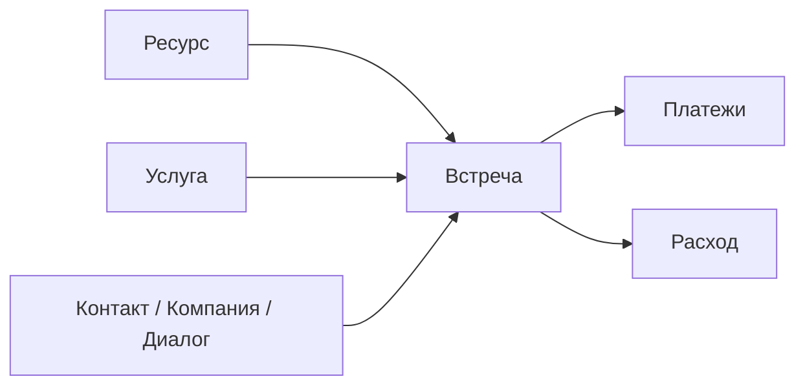

# Расписание и оплаты

В One Link Cloud есть встроенный scheduling-модуль для команд, которым важно вести календарные операции в том же workspace, что и коммуникации и CRM.

Ключевые сущности:

- ресурсы
- услуги
- записи
- оплаты
- расходы

One Link Cloud включает в себя небольшой модульный план для предприятий, который обеспечивает необходимые операции с календарем, отслеживание событий и прозрачность платежей в том же workspace, что и связь, и CRM.

## Модель планирования

## Основные выводы

| Сущность | Роль | Что он контролирует |
| --- | --- | --- |
| `Scheduling::Resource` | Человек, комната или бронируемая единица | Доступность и назначение |
| `Scheduling::Service` | Бронируемая услуга | Продолжительность, цены и метаданные услуги |
| `Scheduling::Appointment` | Запланированное мероприятие | Данные клиента, статус, время, связанный контекст, состояние платежа |
| `Scheduling::Payment` | Деньги, полученные за встречу | Отслеживание предоплат и расчетов |
| `Scheduling::Expense` | Исходящая запись финансовой стороны | Операционная прозрачность денежных средств |
| `Scheduling::WorkRule` / `BreakRule` | Правила обычного календаря | Рабочее время и перерывы |
| `Scheduling::Holiday` / `WorkdayOverride` / `TimeOff` | Исключения | Корректировки расписаний и нестандартные даты |

## Как это работает

1. Настроить ресурсы, которые могут проводить встречи.
2. Составить каталог услуг с указанием долговечности и цены.
3. Определите рабочее время, перерывы, праздники, переопределения и выходные дни.
4. Создавайте встречи, связанные с нужным контекстом клиента.
5. Отслеживайте предоплаты, расчеты и финансовые события.
6. Используйте поверхность календаря и кассы для ежедневных операций.

## Назначение логики

Встреча может иметь как операционный, так и коммерческий контекст:

- связанный контакт
- связанная компания
- связанный разговор
- назначенный ресурс
- выбранная услуга
- данные требуемые, полученные на уровне уровня
- статус и источник
- сумма, способы оплаты и состояние платежа
- настраиваемые поля через определение управляемых полей

Это означает, что уровень планирования не является отключенным календарем. Он может оставаться в отношениях с клиентами, в рамках разговоров, стандартной автоматизации и контекста AI.

## Рабочие поверхности

Текущий модуль уже включает в себя специальные экраны для:

- календарь
- ресурс
- услуги
- исключение
- касса

## Варианты использования

### Сервисный бизнес, ориентированный на назначенную встречу

- оператор фиксирует клиента в ресурсном календаре
- встреча остается связанной с клиентом и разговором
- предоплата и окончательный расчет фиксируются в единой системе

### Передача продаж в сервисное обслуживание

- разговор или сделка происходят в назначенную встречу
- обслуживающий персонал сразу видит контекст клиента
- Последующее наблюдение после приема может продолжаться в рабочих процессах CRM и inbox.

### Настраиваемый впуск

- для внешнего вида включаются поля, специальные для клиента, без разветвления изделия
- одно и то же планирование адаптируется посредством определения полей, правил доступа и интересов.

## Принцип проектирования

Планирование является частью основной платформы One Link Cloud и не является отраслевым дополнением. Он становится индивидуальным благодаря конфигурации, определениям полей и подключенным системам.
