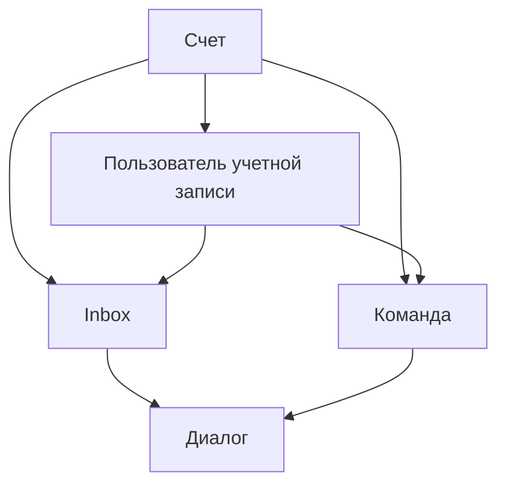

# Рабочее пространство и доступ

В One Link Cloud у всех клиентов одно общее функциональное ядро. Управление различиями происходит через модель доступа.

Ключевые элементы:

- настройки workspace
- роли и права
- membership в inbox-очередях
- команды
- кастомные поля
- автоматизации и интеграции

One Link Cloud использует одно общее ядро ​​продукта для каждой учетной записи клиента. Он не разделяет клиентов на отраслевые среды выполнения. Персонализация происходит внутри одной платформы посредством:

- настройки workspace
- роли и правила доступа
- Членство в inbox
- команды
- произвольные поля
- автоматизация
- интеграции
- Конфигурация Captain

## Модель доступа к ядру

## Основные сущности

| Сущность | Роль в системе | Почему это важно |
| --- | --- | --- |
| `Account` | Клиент workspace и граница арендатора | Изолирует данные, настройки, ограничения, интеграцию, Captain, CRM и планирование |
| `User` | Человеческая личность | Человек может принадлежать одному или нескольким аккаунтам |
| `AccountUser` | Членство пользователя внутри определенной учетной записи | Определяет роль, доступность и поведение для конкретной учетной записи |
| `Team` | Оперативная группа | Помогает маршрутизировать, владеть и создавать отчеты |
| `Inbox` | Операционный канал или очередь | Группирует входящий трафик и назначает элементы управления |
| `InboxMember` | Ссылка доступа между пользователем и inbox | Определяет, кто может работать с беседами inbox |

## Как работает видимость

1. Пользователь входит в систему и вводит определенную учетную запись.
2. Платформа определяет членство пользователя в `AccountUser`.
3. Доступ к работе ограничен ролью, членством в inbox, членством в команде и дополнительными расширенными политиками.
4. Диалоги, сделки, задачи и встречи затем обрабатываются в пределах этой границы workspace.

## Операционная логика

### Workspace Первый

Все важное в One Link Cloud относится к учетной записи:

- каналы и inbox-очереди
- контакты и компании
- диалоги и сообщения
- воронки, сделки и задачи
- назначения, платежи и расходы
- автоматика и macros
- Captain помощники, знания и инструменты
- подключенные интеграции

### Команды организуют ответственность

Команды полезны, когда workspace имеет несколько рабочих групп, например:

- поддержка
- продажи
- адаптация
- удержание
- служба поддержки

Команды могут контролировать работу, упрощать назначения и поддерживать отчетность без фрагментации модели данных.

### Inbox-очереди Определение операционных точек входа

inbox — это практическая граница маршрутизации входящей связи. Обычно оно представляет собой:

- канал
- бренд или направление
- отдел
- очередь

Примеры:

- поддержка сайта inbox
- WhatsApp продажи inbox
- Instagram маркетинг inbox
- сервисное обслуживание inbox

## Типичные случаи использования

### Служба поддержки клиентов Workspace

- администраторы настраивают inbox-очереди для каждого канала
- агенты получают доступ только к тем очередям, с которыми они работают
- команды разделяют линии поддержки по языку, продукту или бизнес-подразделению.

### Операции по продажам и обслуживанию

- один workspace хранит всю информацию о клиентах в одном месте
- менеджеры по продажам работают со сделками и задачами
- работа обслуживающего персонала с записью и оплатами
- диалоги остаются общим контекстом на протяжении всего жизненного цикла

### Многоотраслевая организация

- компания может вести один аккаунт с несколькими командами
- каждая команда получает свои inbox-очереди и правила работы
- настраиваемые поля и интеграции адаптируют общее ядро к организации

## Принцип проектирования

One Link Cloud настроен, а не разделен на отдельные вертикальные продукты. Одно и то же функциональное ядро ​​обслуживает разные предприятия, а доступ, структура данных и подключенные системы формируют окончательную операционную модель для каждого клиента.
