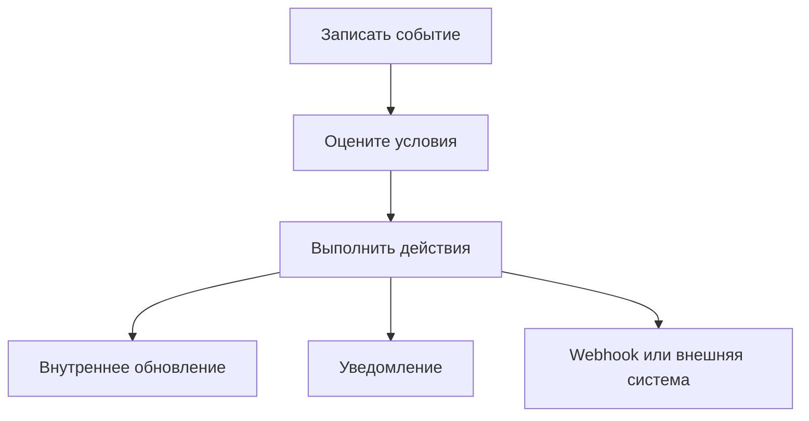

# Автоматизации и макросы

В One Link Cloud есть три базовых инструмента стандартизации процессов:

- automation rules для фоновой event-driven логики
- touch plans для переиспользуемых многошаговых касаний
- macros для быстрых действий оператора

Они решают разные классы задач и часто используются вместе.

One Link Cloud предлагает три взаимодополняющих инструмента для стандартизации процессов:

- правила автоматизации для фоновой логики event-driven
- этапы касаний для готовых последовательностей follow-up и напоминаний
- macros для быстрых действий по команде оператора

## Чем они отличаются

| Инструмент | Триггер | Лучшее для |
| --- | --- | --- |
| Правило автоматизации | Системное событие | Фоновая маршрутизация, изменение статуса, доставка webhook |
| Этап касаний | Применение из автоматизации или карточки записи | Повторно используемые многошаговые follow-up сценарии |
| Macro | Человеческие действия | Шаблоны повторяющихся ответов и действия пакетного оператора |

## Покрытие автоматизации

Механизм автоматизации работает с несколькими типами записей:

- диалоги
- сделки
- задачи
- встречи

## Где находятся этапы касаний

Этапы касаний находятся в разделе рассылок. Автоматизация использует их как готовые многошаговые сценарии, но сама не является их основным местом настройки.

Используйте их, когда нужна не разовая отправка, а переиспользуемая последовательность шагов:

- отправить сообщение через заданное время
- создать follow-up до или после события
- повторять напоминания по расписанию
- применять один и тот же сценарий к диалогам, сделкам, задачам и встречам

Обычно правило автоматизации запускает событие, а этап касаний определяет саму последовательность действий после этого события.

## Модель, управляемая событиями

## Типичные действия по автоматизации

Примеры включают в себя:

- назначение команды или владельца
- изменение статуса или приоритета
- перевод сделки на другую стадию
- изменение статуса задачи
- обновление состояния встречи
- отправка события webhook
- добавление заметок или меток в рабочие процессы разговора

## Типичные действия Macro

Macros полезны, когда операторы часто повторяют одну и ту же последовательность:

- отправить сообщение
- добавлять или удалять ярлыки
- назначить команду или агента
- изменить статус
- добавить личную заметку
- отправить стенограмму
- вызвать webhook

## Когда использовать автоматизацию

Используйте автоматизацию, когда логика должна запускаться каждый раз, когда происходит известное событие.

Примеры:

- каждый новый лид должен быть помечен и маршрутизирован
- о каждой завершенной встрече следует уведомлять другую систему
- каждое изменение этапа сделки должно запускать внешнюю синхронизацию

## Когда использовать Macros

Используйте macros, когда оператор еще принимает решение, но хочет выполнить его быстро и последовательно.

Примеры:

- стандартное сообщение о передаче обслуживания
- пакет эскалации
- рабочий процесс с последующим напоминанием

## Совет по внедрению

1. Начните с наименьшего набора повторяющихся случаев.
2. Автоматизируйте только то, что имеет стабильное бизнес-правило.
3. Сохраняйте одобрение людей там, где есть исключения.
4. Просмотрите отчеты и результаты webhook после развертывания.

## Похожие руководства

- [Автоматизации и интеграции](/platform/integrations-architecture)
- [Inbox-очереди и каналы](/user-guide/inboxes-and-channels)
- [CRM и гибкая структура данных](/platform/crm-architecture)
