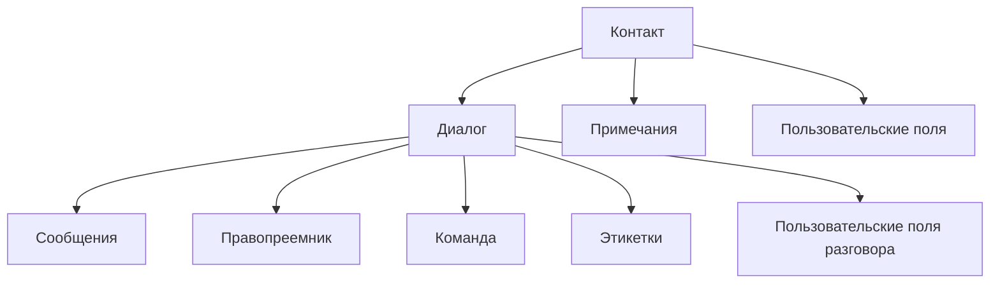

# Контакты и диалоги

Контакты и диалоги — это ежедневная рабочая поверхность большинства команд.

На этой странице описана логика работы с:

- карточкой контакта
- тредом диалога
- сообщениями
- назначением на агента или команду
- заметками и метками

Контакты и диалоги — это ежедневная рабочая поверхность для большинства команд One Link Cloud.

## Операционная модель

## Записи контактов

Контакт — это запись на уровне человека, используемая во всем workspace. Он может включать в себя:

- имя
- номер телефона
- электронная почта
- идентификатор
- компания
- заметки
- этикетки
- пользовательские атрибуты

Контакт должен стать стабильным идентификатором клиента, используемым при общении, CRM, планировании и AI.

## Записи разговоров

Разговор — это тема, в которой на самом деле работает команда. Он может включать в себя:

- inbox
- контакт
- правопреемник
- команда
- статус
- приоритет
- этикетки
- сообщения
- пользовательские атрибуты

## Статусы разговоров

Стандартный жизненный цикл:

- `open` для активной работы
- `pending` для делегированной или заблокированной работы.
- `snoozed` для отслеживания по времени
- `resolved` для завершенных взаимодействий.

## Что обычно делают операторы

### Во время живого взаимодействия

- отвечать на входящие сообщения
- назначить разговор
- добавить метки
- добавлять личные заметки
- установить приоритет
- собирать недостающую информацию о клиенте

### После квалификации

- обновить контактные данные
- прикрепить информацию о компании
- создать продолжение CRM
- при необходимости подключить дело к планированию

## Ярлыки, заметки и поля

| Инструмент | Лучшее для | Не идеально подходит для |
| --- | --- | --- |
| Этикетки | Быстрая классификация и обработка очередей | Подробный контекст или структурированные бизнес-данные |
| Заметки | Внутренний человеческий контекст | Состояние рабочего процесса с возможностью поиска |
| Пользовательские поля | Многоразовые структурированные метаданные | Замена основных отношений или статусов |

## Варианты использования

### Обработка поддержки

- клиент отправляет сообщение
- оператор классифицирует, назначает, разрешает и записывает примечания

### Квалификация продавца

- лид поступает через inbox
- команда дополняет контактные данные и создает сделку

### Постоянные отношения с клиентами

- тот же контакт возвращается позже
- история остается видимой в нескольких разговорах

## Лучшие практики

- сохранять контактные данные чистыми и пригодными для повторного использования
- используйте метки для быстрой сегментации, а не как единственный источник истины
- использовать заметки только для человеческого контекста
- используйте структурированные поля для повторяемой бизнес-информации

## Похожие руководства

- [Коммуникационные процессы](/platform/communication-workflows)
- [CRM и гибкая структура данных](/platform/crm-architecture)
- [Captain AI](/platform/captain-ai)
