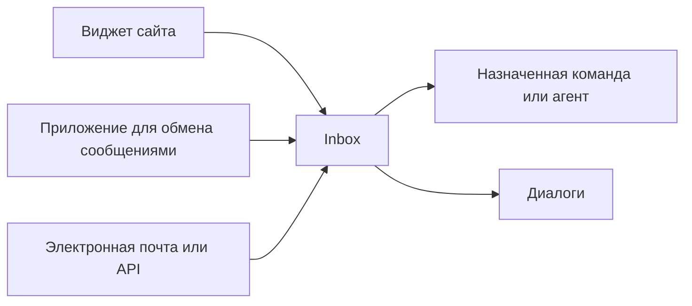

# Inbox-очереди и каналы

Inbox — это основная операционная точка входа в One Link Cloud.

Практическая логика:

- канал является источником коммуникации
- inbox определяет операционную очередь
- команда и правила маршрутизации управляют обработкой

Inbox-очереди — основные рабочие точки входа в One Link Cloud. Канал — это источник связи; inbox — это место, где команда получает, маршрутизирует и управляет этим трафиком.

## Канал для модели Inbox

## Что контролирует Inbox

- подключение каналов
- граница маршрутизации
- участники с доступом
- правила назначения
- приветствие и поведение вне офиса
- деловой часовой пояс и рабочая конфигурация
- сопутствующие интеграции

## Когда создавать отдельный Inbox-очереди

Создайте отдельный inbox-очереди, если вам нужно другое:

- владельцы
- очереди
- правила ответа
- деловые направления
- бренды
- языки
- интеграции

Не создавайте лишние inbox-очереди, если команда может работать внутри одной очереди с метками и назначениями.

## Общие стратегии Inbox

### По каналу

- один inbox для сайта
- один inbox для электронной почты
- один inbox для WhatsApp

Лучше всего, когда каждый источник ведет себя по-разному.

### От команды

- поддержка inbox
- продажи inbox
- удержание inbox

Лучше всего, когда право собственности имеет большее значение, чем источник канала.

### По бренду или линейке продуктов

- марка А inbox
- марка Б inbox
- счета предприятий inbox

Лучше всего, когда общение должно оставаться разделенным по бизнес-подразделениям.

## Доступ агента

Доступ к inbox-очереди настраивается через членство в inbox. Это определяет, кто может активно работать внутри очереди.

Используйте членство inbox, когда:

- разные команды не должны видеть одну и ту же очередь
- только определенные агенты могут обрабатывать определенный трафик
- балансировка нагрузки должна происходить внутри контролируемой группы

## Контрольный список настройки

1. Определите операционную модель для каждой очереди.
2. Подключите правый канал к inbox.
3. Добавьте ответственных агентов.
4. Настройте часы работы и правила отправки сообщений.
5. Прикрепите нужные интеграции или webhooks.
6. Перед запуском протестируйте поток входящих и исходящих сообщений.

## Варианты использования

### Очередь поддержки

- веб-сайт и адрес электронной почты передаются в службу поддержки inbox.
- назначенная команда решает проблемы и отслеживает качество ответов

### Очередь продаж

- лиды поступают в отдел продаж inbox
- квалификация начинается с разговора и продолжается до CRM

### Очередь обслуживания

- диалоги после продажи или встречи перенаправляются на специализированный inbox.
- команда сразу видит расписание и контекст клиента

## Похожие руководства

- [Контакты и диалоги](/user-guide/contacts-and-conversations)
- [Рабочее пространство и доступ](/platform/workspace-and-access)
- [Автоматизации и интеграции](/platform/integrations-architecture)
