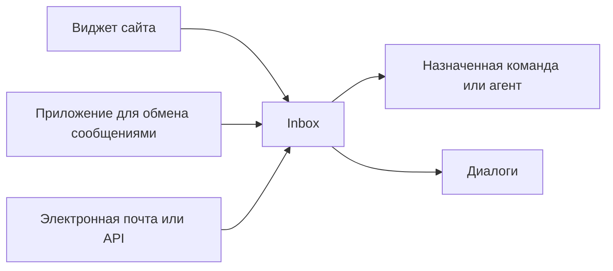

# Inbox-очереди и каналы

Inbox — это основная операционная точка входа в One Link Cloud.

Практическая логика:

- канал является источником коммуникации
- inbox определяет операционную очередь
- команда и правила маршрутизации управляют обработкой

Inbox-очереди — основные рабочие точки входа в One Link Cloud. Канал — это источник связи; inbox — это место, где команда получает, маршрутизирует и управляет этим трафиком.

## Канал для модели Inbox

```mermaid
flowchart LR
    A[Виджет сайта] --> D[Inbox]
    B[Приложение для обмена сообщениями] --> D
    C[Электронная почта или API] --> D
    D --> E[Назначенная команда или агент]
    D --> F[Диалоги]
```

## Что контролирует Inbox

- подключение каналов
- граница маршрутизации
- участники с доступом
- правила назначения
- приветствие и поведение вне офиса
- деловой часовой пояс и рабочая конфигурация
- сопутствующие интеграции

## Когда создавать отдельный Inbox-очереди

Создайте отдельный inbox-очереди, если вам нужно другое:

- владельцы
- очереди
- правила ответа
- деловые направления
- бренды
- языки
- интеграции

Не создавайте лишние inbox-очереди, если команда может работать внутри одной очереди с метками и назначениями.

## Общие стратегии Inbox

### По каналу

- один inbox для сайта
- один inbox для электронной почты
- один inbox для WhatsApp

Лучше всего, когда каждый источник ведет себя по-разному.

### От команды

- поддержка inbox
- продажи inbox
- удержание inbox

Лучше всего, когда право собственности имеет большее значение, чем источник канала.

### По бренду или линейке продуктов

- марка А inbox
- марка Б inbox
- счета предприятий inbox

Лучше всего, когда общение должно оставаться разделенным по бизнес-подразделениям.

## Доступ агента

Доступ к inbox-очереди настраивается через членство в inbox. Это определяет, кто может активно работать внутри очереди.

Используйте членство inbox, когда:

- разные команды не должны видеть одну и ту же очередь
- только определенные агенты могут обрабатывать определенный трафик
- балансировка нагрузки должна происходить внутри контролируемой группы

## Повторная авторизация WhatsApp

Если канал WhatsApp требует повторной авторизации, откройте его настройки и пройдите подключение через Meta для того же номера и бизнеса.

При восстановлении существующего подключения сохраняются inbox, переписка и участники. Если Meta изменила внутренние реквизиты номера, OneLink может обновить их после проверки принадлежности тому же номеру и бизнесу, сохранив также выбранное название канала. Неоднозначный выбор или другой номер требуют уточнения; такое подключение не заменяет существующий канал автоматически.

После успешной авторизации проверьте входящее сообщение и ответ из OneLink. Прежняя ошибка импорта истории может требовать отдельного разбора.

## Неудачное удаление WhatsApp

Если снятие подписки WhatsApp Cloud завершилось ошибкой до очистки локальных данных, канал возвращается в список с предупреждением. Переписка остаётся сохранённой. Предупреждение означает, что удаление не завершено; состояние соединения с Meta может требовать проверки.

Повторяйте удаление только если действительно хотите удалить этот канал. Для восстановления связи используйте повторную авторизацию существующего канала.

## Счётчик WhatsApp Cloud

Администраторы workspace с официальным подключением WhatsApp Cloud видят сверху компактную красную плашку с количеством доставленных исходящих сообщений за текущий месяц UTC и приблизительной стоимостью в тенге. Месяц начинается первого числа в 00:00 UTC. Плашку можно закрыть крестиком; закрытие хранится в браузере для текущего аккаунта и месяца и сбрасывается в следующем месяце.

Оценка использует официальную ставку Meta в USD для страны получателя и категории доставки: `service`, `utility`, `marketing`, `authentication` или `authentication_international`. В расчёт входят платные доставки соответствующих категорий, включая шаблонные сообщения. Сумма учитывает только доставки, для которых Meta указала `pricing.billable=true`; `pricing.billable=false` не добавляет стоимость. Бесплатный лимит сервисных сообщений повторно не вычитается: платность каждой доставки уже определяет Meta.

Стоимость в USD переводится в тенге по официальному курсу USD/KZT Национального Банка Казахстана (НБК), выбранному на первое число того же месяца UTC. Один общий для аккаунтов неизменный снимок курса применяется весь месяц. Ставки Meta хранятся как каталог для периода с 1 октября по 31 декабря 2026 года; для будущего периода или отсутствующей страны, категории, ставки либо курса сумма остаётся недоступной или помечается как неполная, а не как нулевая. Неполная история доставок также отмечается явно.

Для примера, каталог Meta, действующий с 1 октября 2026 года, указывает для Казахстана цену за сообщение: `service`, `utility` и `authentication` — USD 0,018; `marketing` — USD 0,0604; `authentication_international` — USD 0,16. Это долларовые ставки, а не фиксированные цены в тенге. Оценка по базовым ставкам не включает скидки Meta за объём, налоги или наценку провайдера и поэтому не является суммой счёта Meta.

Это описание отражает подготовленное изменение; оно пока не доступно в действующей версии OneLink Cloud.

В режиме coexistence отправки из приложения WhatsApp Business и поддерживаемого связанного WhatsApp Web остаются бесплатными и не входят в счётчик отправок OneLink. Отправки из OneLink через Cloud API учитываются по правилам Meta. Неофициальное подключение WhatsApp Web не включает эту плашку.

Подробнее о тарифах: [Meta — расценки WhatsApp](https://developers.facebook.com/documentation/business-messaging/whatsapp/pricing/) и [coexistence](https://developers.facebook.com/documentation/business-messaging/whatsapp/embedded-signup/onboarding-business-app-users/).

## Контрольный список настройки

1. Определите операционную модель для каждой очереди.
2. Подключите правый канал к inbox.
3. Добавьте ответственных агентов.
4. Настройте часы работы и правила отправки сообщений.
5. Прикрепите нужные интеграции или webhooks.
6. Перед запуском протестируйте поток входящих и исходящих сообщений.

## Варианты использования

### Очередь поддержки

- веб-сайт и адрес электронной почты передаются в службу поддержки inbox.
- назначенная команда решает проблемы и отслеживает качество ответов

### Очередь продаж

- лиды поступают в отдел продаж inbox
- квалификация начинается с разговора и продолжается до CRM

### Очередь обслуживания

- диалоги после продажи или встречи перенаправляются на специализированный inbox.
- команда сразу видит расписание и контекст клиента

## Похожие руководства

- [Контакты и диалоги](/user-guide/contacts-and-conversations)
- [Рабочее пространство и доступ](/platform/workspace-and-access)
- [Автоматизации и интеграции](/platform/integrations-architecture)
