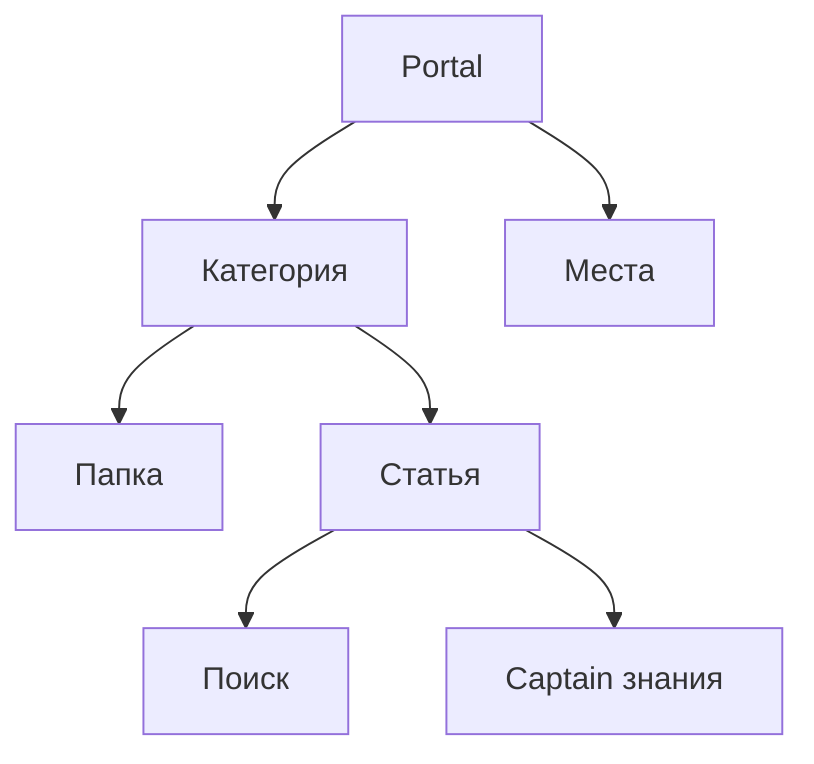

# База знаний

База знаний позволяет публиковать структурированный контент для клиентов, операторов и Captain.

Основная модель включает:

- портал
- категории и папки
- статьи
- локали
- поиск и AI-использование контента

База знаний позволяет командам публиковать структурированный контент, который могут использовать клиенты, операторы и Captain.

## Модель знаний

## Основные объекты

| Объект | Цель |
| --- | --- |
| Portal | Пространство знаний высшего уровня |
| Категория | Группировка тем |
| Папка | Дополнительная организация внутри категории |
| Статья | Опубликованный элемент контента |

## Что вы можете настроить

- Брендинг portal
- слаг и заголовок страницы
- структура категорий
- содержание и статус статьи
- разрешенные локали
- черновые локали
- Связь portal с виджетом

## Жизненный цикл статьи

Статьи обычно проходят через:

- черновик
- опубликовано
- в архиве

Это дает возможность подготовить контент перед публикацией и сохранить старый материал, не удаляя его.

## Типичные случаи использования

### Самообслуживание клиентов

- публиковать часто задаваемые вопросы и инструкции по обработке
- сократить повторяющиеся диалоги

### Внутренние знания для операторов

- предоставить агентам надежный источник ответов
- ссылаться на один и тот же контент во время обработки в реальном времени

### Captain База знаний

- использовать статьи и документы в качестве контекста AI
- сохраняйте соответствие между человеческими ответами и ответами AI.

## Рекомендации по управлению

- назначить владельцев контента
- определить частоту просмотра
- сохраняйте категории простыми
- публиковать только поддерживаемый контент
- сознательно используйте управление локалью

## Похожие руководства

- [Captain AI](/platform/captain-ai)
- [Отчёты и аналитика](/user-guide/reports-and-analytics)
- [Паттерны интеграции](/integrators/integration-patterns)
