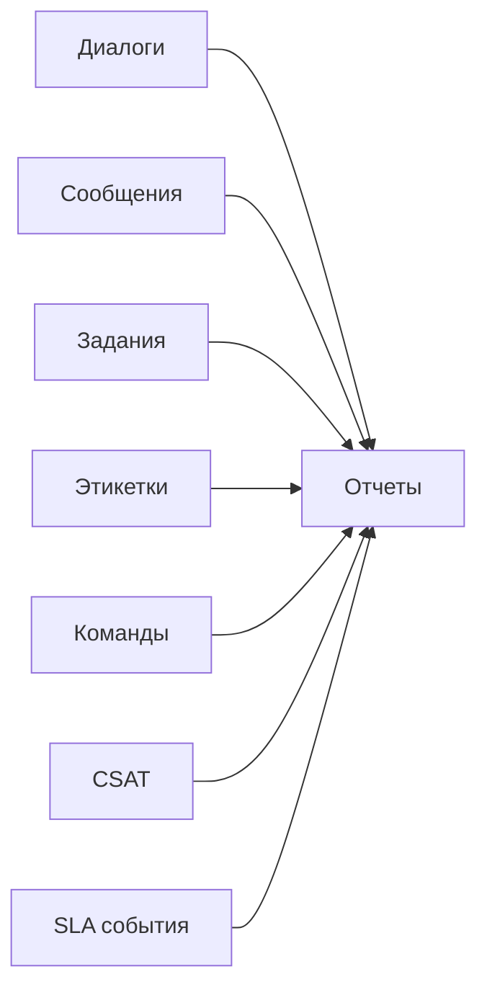

# Отчёты и аналитика

Отчёты помогают администраторам и тимлидам понимать, что происходит в workspace и где нужны улучшения.

Обычно анализируются:

- коммуникации
- агенты и команды
- inbox-очереди
- SLA и CSAT
- операционные результаты

Отчеты помогают администраторам и руководителям групп понять, что происходит внутри workspace и где необходимы улучшения.

## Поверхности отчетов

One Link Cloud включает представления отчетов для:

- обзор аккаунта
- диалоги
- агенты
- inbox-очереди
- команды
- этикетки
- SLA
- CSAT
- активность бота и AI

## Модель отчетности

## Кто использует отчеты

### Администраторы

- Здоровье уровня workspace
- очередь и производительность пользователя
- оперативные узкие места

### Руководители команд

- скорость реакции
- распределение нагрузки
- качество разрешения
- тенденции меток и очередей

### Операционные менеджеры

- соблюдение процесса
- удовлетворенность клиентов
- результаты автоматизации

## Общие вопросы Отчеты Ответы

- какие inbox-очереди имеют самую большую нагрузку
- какие команды реагируют быстрее всего
- где разрешение замедляется
- как лейблы и сегменты находятся в тренде
- достигнуты ли цели SLA
- как клиенты оценивают качество обслуживания

## Лучшие практики

- просматривать отчеты о регулярной каденции
- сравнивать показатели inbox и команды, не только на уровне workspace
- связывать данные отчетов с решениями по маршрутизации, кадровому обеспечению и автоматизации.
- последовательно используйте метки, если отчетность на основе меток имеет значение.

## Похожие руководства

- [Настройка workspace](/getting-started/workspace-setup)
- [Автоматизация и макросы](/user-guide/automation-and-macros)
- [Контакты и диалоги](/user-guide/contacts-and-conversations)
